<audio controls preload="none" style="width:100%" src="assets/hero-deephouse-lora.mp3"></audio>

_Generated on my own GPU with ACE-Step 1.5 and a LoRA trained on 2 h 45 min of a focus-music channel. One minute from a 3-minute track._

There is a YouTube channel I keep on while I work: melodic deep house with no vocals, hours of it. The music on it is AI-generated too. I wanted to know how close I could get with open models, on my own machine, without paying for Suno.

The answer is the track above. It took an open model (ACE-Step 1.5), a LoRA trained on about three hours of the channel, and a lot of listening. Most of the work went into finding why it sounded wrong, and almost every cause turned out to be in my data or in a silent failure.

**tl;dr**: ACE-Step 1.5 turbo, LoRA rank 32 on its DiT, trained on 55 tracks cut from 9 YouTube mixes, on an RX 6900 XT (ROCm). Prompts alone gave a 6/10. 79 minutes of data gave a LoRA I could barely hear, partly because it never loaded. 3 h 18 min gave "not bad at all", and removing the DJ crossfades from the dataset removed a ghost rhythm in the background. A 3-minute track takes 154 s to generate.

## The Short Version

1. **Pick the mixes**: recent ones, cut into tracks with their YouTube chapters.
2. **Remove the DJ crossfades**: the first seconds of each cut still play the previous track.
3. **Caption every track**: Gemini 3.1 Pro listens and describes it, librosa measures BPM and key.
4. **Train a LoRA** on the ACE-Step DiT with Side-Step, the trainer that ships with it.
5. **Listen at checkpoints**: same prompt, same seed, with and without the LoRA.
6. **Prompt with typical captions**: reuse the captions of normal tracks from the dataset.

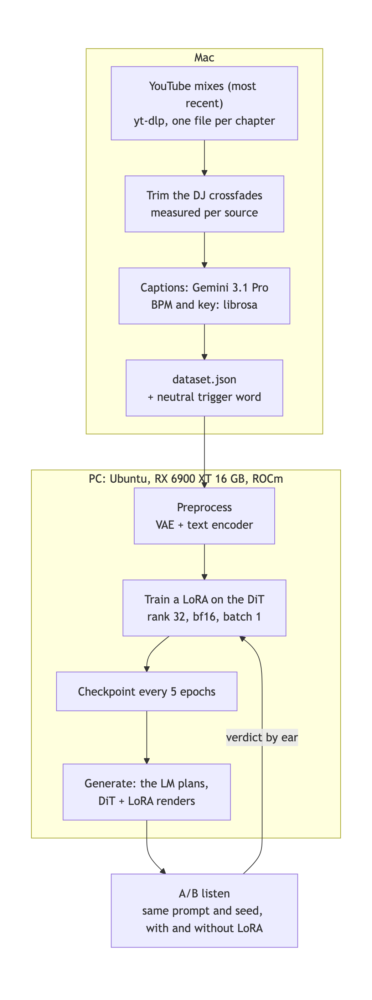

_The pipeline: the Mac builds the dataset, the PC trains the LoRA and generates the tracks._

## Listen First

Every clip is the same 30 seconds (0:45 to 1:15) at the same loudness, so only the method changes.

**Prompt only.** 6/10, "badly compressed", thin, no bass line:

<audio controls preload="none" style="width:100%" src="assets/01-prompt-only.mp3"></audio>

**Prompt only, then mastered against a track of the channel.** Less shrill, still thin:

<audio controls preload="none" style="width:100%" src="assets/02-prompt-only-mastered.mp3"></audio>

**A richer caption, plus song structure in the lyrics field.** Better arrangement:

<audio controls preload="none" style="width:100%" src="assets/03-rich-caption-structure.mp3"></audio>

**LoRA on 79 minutes of the channel.** The best of five variants at that point, still "compressed":

<audio controls preload="none" style="width:100%" src="assets/04-lora-79min.mp3"></audio>

**LoRA on 3 h 18 min, epoch 25.** The first one I called "not bad at all":

<audio controls preload="none" style="width:100%" src="assets/05-lora-3h-epoch25.mp3"></audio>

**LoRA on 2 h 45 min with the crossfades removed, epoch 10.** "Really not bad at all":

<audio controls preload="none" style="width:100%" src="assets/07-lora-clean-epoch10.mp3"></audio>

And the same prompt and seed with the LoRA off, for comparison:

<audio controls preload="none" style="width:100%" src="assets/08-same-prompt-no-lora.mp3"></audio>

## Step 1: Pick the Mixes

The channel posts 1 to 3 hour mixes, but the hours repeat. The tracklist of the most watched mix ends like this:

```
0:31:36 Earn It
0:36:59 🔃
```

8 tracks in 37 minutes, then the loop. So "hours and hours" of music is about 8 unique tracks per mix. Across 16 mixes with chapters I counted 118 track titles and no title appeared twice, so the channel has plenty of unique material.

I first picked the three most viewed mixes. They were from May to August. The recent ones sounded better, and they have fewer views only because they are recent. I switched to the 9 most recent mixes: 55 tracks, 3 h 18 min.

Downloading the whole mix is faster than downloading parts of it. `--download-sections` goes through ffmpeg and took about 10 minutes for 37 minutes of audio; the full 2-hour mix took 30 seconds. Then one FLAC per chapter:

```python
for n, ch in enumerate(chapters(video_id)[:-1], start=1):  # the last chapter runs into the loop
    subprocess.run(["ffmpeg", "-y", "-ss", str(ch["start_time"]), "-to", str(ch["end_time"]),
                    "-i", str(mix), "-ar", "48000", "-ac", "2", str(out / f"{video_id}_{n:02d}.flac")])
```

## Step 2: Run ACE-Step 1.5 on an AMD GPU

My training machine is a gaming PC: RX 6900 XT 16 GB, Ubuntu 26.04. ACE-Step 1.5 says it supports ROCm. It does, after four fixes:

- **`pyproject.toml` pins CUDA PyTorch on Linux** (`torch==2.10.0+cu128`), so `uv sync` installs the wrong build. I install `torch==2.10.0` from the `rocm7.0` index first, then ACE-Step with `--no-deps`.
- **The ROCm launch script sets `HSA_OVERRIDE_GFX_VERSION=11.0.0`.** That value is for RX 7000 cards. The 6900 XT is gfx1030 and needs no override.
- **On ROCm the default dtype is float32.** The first generation died with `HIP out of memory` at 15.6 GB. The code says float32 avoids crashes on some AMD iGPUs; bfloat16 works on this card:

```bash
export ACESTEP_ROCM_DTYPE=bfloat16 ACESTEP_LM_BACKEND=pt MIOPEN_FIND_MODE=FAST
```

- **LoRA preprocessing needs `torchcodec`**, which the ROCm requirements comment out. Without it, `torchaudio.load` fails on every file. `uv pip install --no-deps "torchcodec==0.10.*"` decodes on the CPU with the system FFmpeg and leaves the ROCm build alone.

The model is two parts. A 1.7B language model plans the song and rewrites the caption, then a 2B diffusion transformer (the DiT) renders the audio. I used the turbo DiT, 8 diffusion steps.

## Step 3: Try Prompts Before Training

Before collecting data I tried prompts alone. Gemini described the channel ("melodic deep house, ~120 BPM, minor keys, rolling bass, pads, plucks"), librosa measured it (123 BPM, 7 of 8 tracks in a minor key), and ACE-Step generated 10 minutes from that. My verdict: 6/10, "the sound is super badly compressed, it's weird."

The spectrograms showed it. The channel keeps most of its energy below 4 kHz; the generated track has a dense haze from 5 to 20 kHz:

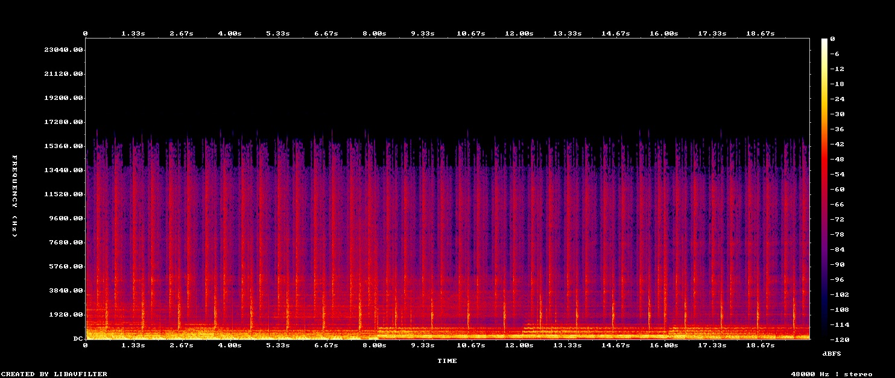

_The channel: energy below 4 kHz, quiet highs._

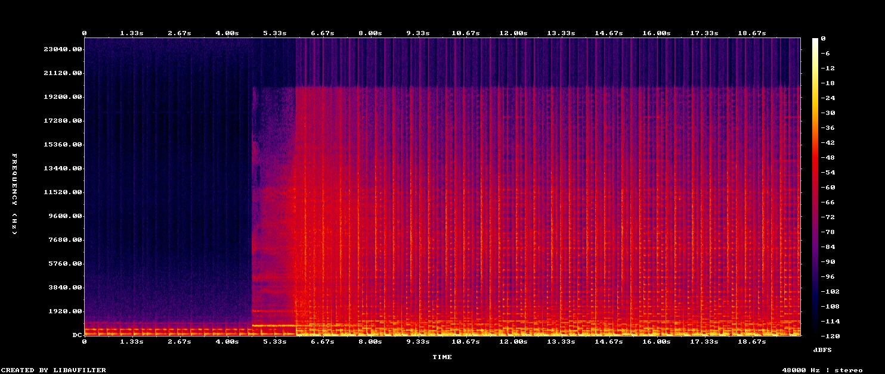

_Prompt only: a haze from 5 to 20 kHz._

I measured the share of energy per band. The generated track had 2 to 7 dB less in the low mids and 3.5 to 4.4 dB more in the 4-8 kHz presence band, the part that sounds shrill:

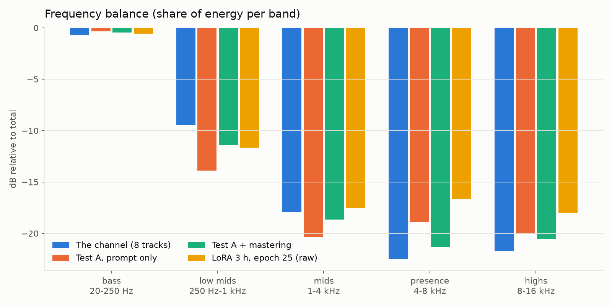

_Frequency balance of the channel, the prompt-only track, the mastered version and the LoRA._

Before blaming the frequencies I ruled out four other causes with A/B tests: my MP3 export, the VAE decoding in bfloat16 (the bf16 and fp32 decodes of the same latents differ by 42 dB), the DiT in bfloat16, and the model size (turbo, the 50-step sft, and the 4B XL all sounded the same). Mastering with [Matchering](https://github.com/sergree/matchering) against a track of the channel fixed the balance. It didn't fix the real complaint, which was "much less rich, less harmony, no bass line".

Two prompt changes helped. The lyrics field accepts structure tags even for instrumentals, and I had only sent `[Instrumental]`:

```
[Intro - deep kick and filtered warm pads]
[Build - rising arpeggio, bassline enters]
[Drop - full groove, rolling bassline, lush chords]
[Breakdown - warm pads and Rhodes chords, no kick]
```

And a caption that names the harmony and the bass line beat a list of tags. ACE-Step can also caption a track itself, but its caption for a channel track was generic ("an energetic, driving progressive house track") and gave weaker results.

## Step 4: Caption the Dataset

ACE-Step learns the link between a caption and a sound, so every track needs a caption. Without one, Side-Step uses the file name. Gemini 3.1 Pro listened to each track and wrote 60 to 90 words. One of them:

```
This is a melodic deep house track with an atmospheric and hypnotic mood. It features a warm,
pulsing bassline beneath a thumpy four-on-the-floor kick drum. Crisp off-beat hi-hats and tight
claps drive the steady rhythm. A rhythmic, plucky synth arpeggio provides the main melodic hook...
```

Every caption also starts with a trigger word. I use a neutral one (`deephousefocus`) and never the name of the channel. Side-Step prepends it before encoding:

```python
if tag_position == "prepend":
    text = f"{tag}, {text}" if text else tag
```

### Error: 167 BPM for Deep House

Five tracks from one mix came out at 167 BPM. They have shuffled hi-hats, and librosa locked onto a triplet subdivision: 83.4 BPM, which is 2/3 of 125. My rule "double it if it's under 90" turned that into 167, and a wrong BPM in the metadata teaches the LoRA a wrong link between text and sound. I now fold the tempo into the genre's range with musical ratios only (2, 1/2, 3/2, 2/3, 4/3, 3/4).

### Error: librosa Reads Tempo From a Grid

Later, on drum and bass, one track read 185 BPM. librosa's tempo estimate comes from a fixed grid, and at 22.05 kHz with hop 512 the neighbours around 175 BPM are 172.3 and 184.6. A 178 BPM track reads as one or the other. (Around 120 the grid steps are 117.5 and 123.0, which is why every deep house track read "123".) The fix is a line fit through the detected beat times:

```python
_, beats = librosa.beat.beat_track(onset_envelope=onset, sr=sr, hop_length=128,
                                   start_bpm=target, units="time")
slope = np.polyfit(np.arange(len(beats)), beats, 1)[0]
bpm = 60.0 / slope
```

A synthetic click track at 178 BPM now reads 178 ± 1, and the triplet trap goes away without any folding.

## Step 5: Train the LoRA

Side-Step runs from the command line, so I didn't need the Gradio UI:

```bash
python train.py fixed --checkpoint-dir ./checkpoints --model-variant turbo \
  --preprocess --audio-dir "$DATA" --dataset-json "$DATA/dataset.json" \
  --tensor-output "$TENSORS" --max-duration 240 --dataset-dir "$TENSORS" --output-dir "$OUT"

python train.py --plain --yes fixed --checkpoint-dir ./checkpoints --model-variant turbo \
  --dataset-dir "$TENSORS" --output-dir "$OUT" --precision bf16 --batch-size 1 \
  --offload-encoder --rank 32 --alpha 32 --epochs 600 --save-every 5
```

Rank 32, batch 1, encoders on the CPU, bfloat16. Peak VRAM was 7.1 GB, and an epoch took 165 s with 24 tracks and about 6.6 minutes with 55. I save a checkpoint every 5 epochs so I can listen early and stop whenever it's good.

Three things in this command cost me a run each:

- `--dataset-dir` and `--output-dir` are required even in `--preprocess` mode. The docs don't show them.
- Without `--yes`, Side-Step asks `Start training? [Y/n]`. Under `nohup` stdin is empty, so it answers no and prints `Aborted.`
- Side-Step only accepts paths under its working directory (`Path escapes safe root`), so the tensors and the LoRAs live in `ACE-Step-1.5/work/`.

And one cost me nothing because I checked for it. With `torchcodec` missing, preprocessing printed `Preprocessing complete: 0/24 processed, 24 failed` and exited with code 0. My script now counts the `.pt` files and requires a `final/` adapter before it calls a run done.

## Error: The Resume That Reloaded Nothing

To listen to a checkpoint I pause the training (it holds about 15 GB of VRAM with PyTorch's cache), generate, and resume. After the first pause the log said this:

```
[OK] Resumed from epoch 25, step 150, optimizer OK, scheduler OK
```

The loss said otherwise:

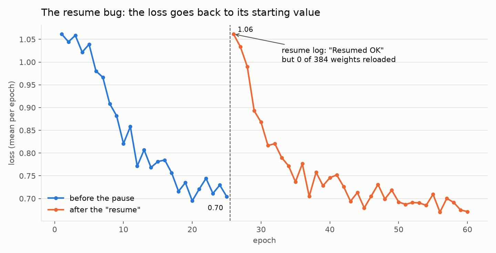

_The loss goes back to its starting value after the resume._

`resume_checkpoint()` loads the adapter with `decoder.load_state_dict(state_dict, strict=False)`. PEFT saves keys without the adapter name (`...k_proj.lora_A.weight`), while the live model calls them `...k_proj.lora_A.default.weight`. With `strict=False` all 384 keys are skipped and nothing complains. The LoRA restarted from zero while the epoch counter and the optimizer carried on. My patch loads the weights with `peft.set_peft_model_state_dict` and raises if any key doesn't match. After it, the log shows `LoRA resume: 384 adapter tensors loaded` and the loss carries on from where it stopped.

## Error: Three Listening Rounds Without the LoRA

I generated listening tests from the epoch 25 and epoch 200 checkpoints, with the LoRA and without. I heard almost no difference. I even measured one, and wrote that the LoRA had learned the channel's frequency balance. Then I read the generation log:

```
load_lora: ❌ Failed to load LoRA: 'module name can't contain ".", got: epoch_200_loss_0.6194'
```

ACE-Step uses the folder name as the PEFT adapter name, PEFT refuses dots, and Side-Step names checkpoints after their loss. My script printed the error and kept generating with the base model, so three rounds of listening compared the base model with itself. The difference I had measured was noise between runs. The loader now copies the adapter into a folder without dots and stops unless every call returns ✅.

`set_lora_scale` has a similar habit: it clamps the scale to [0, 1] without a warning, so "1.5" is 1.0.

## Is the Model the Limit?

The next complaint was dirty cymbals. ACE-Step never writes audio directly: the DiT produces latents and a VAE decodes them. If the VAE couldn't render clean cymbals, no LoRA would fix it. So I encoded 30 seconds of a channel track and decoded it back, with no generation in between:

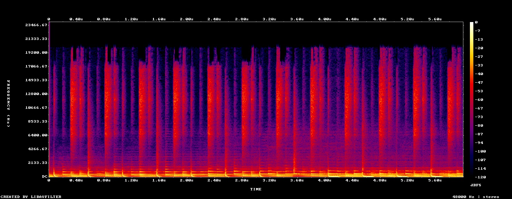

_30 seconds of a channel track._

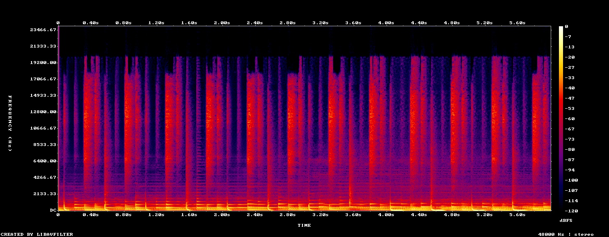

_The same 30 seconds after the VAE round trip._

Every band stayed within 1.5 dB (8-12 kHz went from -25.1 to -26.6 dB). The VAE wasn't the limit, so the problem was in the generation, and more data could help.

## More Data Helped

| LoRA | Data | Verdict |
|---|---|---|
| 24 tracks | 79 min, 4 mixes | best of five variants, still "compressed" |
| 55 tracks, epoch 25 | 3 h 18 min, 9 mixes | "not bad at all", the first good one |
| 55 tracks, epoch 150 | same | good, with a click in the background |

Going from 79 minutes to 3 h 18 min made the first real difference. More epochs did not help in the same way: epoch 150 was worse than epoch 25.

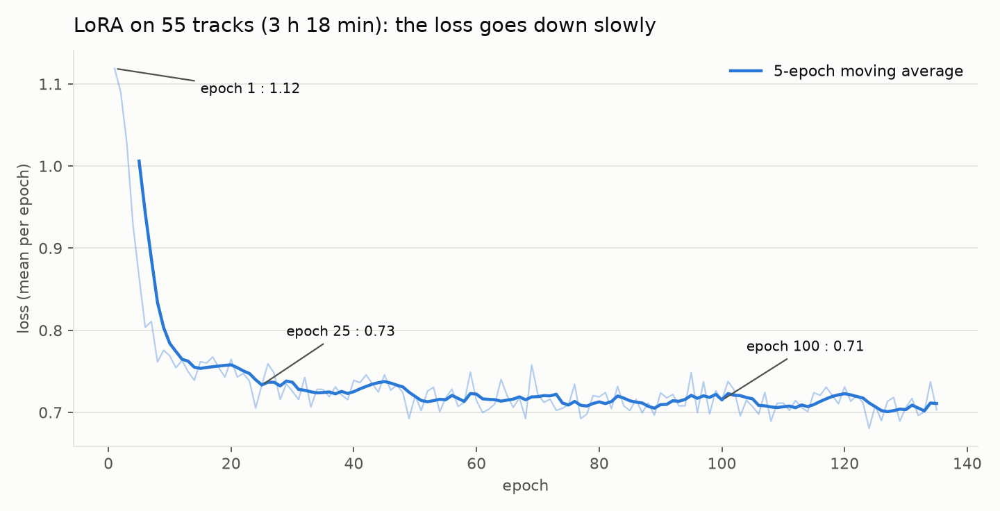

_Loss of the 3-hour LoRA: most of the drop is in the first 15 epochs._

## Error: A Ghost Rhythm From the DJ Crossfades

At epoch 150 I heard a faint "click click" in the background, a second rhythm that wasn't part of the track. It sounded like the model had learned an instrument that isn't there.

<audio controls preload="none" style="width:100%" src="assets/06-lora-3h-epoch150-click.mp3"></audio>

In the 2-20 kHz band, the LoRA track fills the space between the hi-hat hits, and the base model leaves it dark:

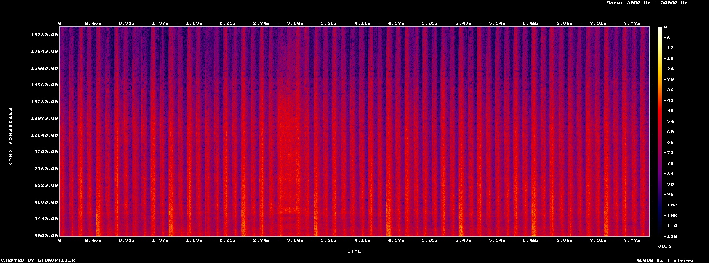

_With the LoRA: the gaps between the hits are filled._

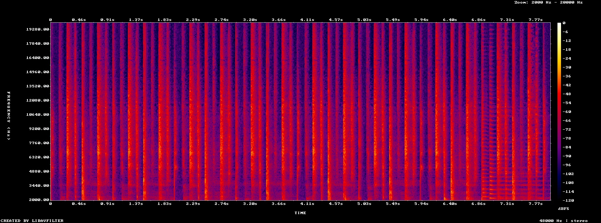

_Without the LoRA: dark gaps between the hits._

To measure it, I take the 6-16 kHz band and compute the gap between the hits and the floor (90th minus 10th percentile of the frame energy, over 2-second windows). Low means a filled floor. The LoRA tracks went from 24-35 dB at epoch 25 to 19-25 dB at epoch 150, so the click grew with training. Then I ran the same measure on the dataset itself:

| Where in the dataset tracks | Contrast |
|---|---|
| First 20 s | 19.4 dB |
| Middle | 26.2 dB |
| End | 24.6 dB |

The mixes chain tracks with DJ crossfades. A chapter cut starts while the previous track is still playing, so the first seconds of every training clip have two rhythms on top of each other. The contrast only gets back to the middle level after about 36 seconds, so I cut the first 36 s of every track and retrained. The other channel I'm working on (drum and bass) has a different profile, 18 s at the start and 6 s at the end, so this has to be measured per source:

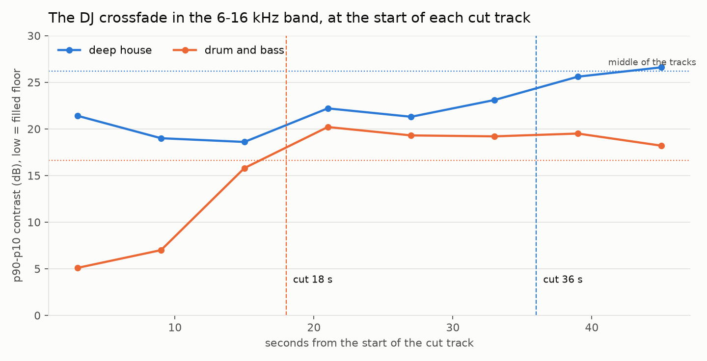

_Contrast at the start of the cut tracks, deep house and drum and bass._

After the cut, the start of the tracks measures 26.2 dB, the same as the middle. Epoch 10 of the new LoRA is the clip at the top of this post.

## How I Prompt It

The model never sees a track name. It gets a caption, a BPM, a key, a duration and a seed:

```python
params = GenerationParams(
    task_type="text2music",
    caption=f"deephousefocus, {meta['caption']}",   # a caption Gemini wrote for a dataset track
    lyrics="[Instrumental]", instrumental=True,
    bpm=meta["bpm"], keyscale=meta["keyscale"], duration=180, seed=1001,
)
```

I reuse captions from the dataset because the LoRA learned text in that style. A test with five variants settled the rest: LoRA on, with the language model planning the song and rewriting the caption (the default), beat turning the planner off.

One prompt failed badly, "a busted guitar, sounds like AI":

<audio controls preload="none" style="width:100%" src="assets/09-atypical-prompt-guitar.mp3"></audio>

Its caption came from the one track of the channel with a classical acoustic guitar. Only 2 of the 55 captions mention a guitar, so the LoRA renders it badly. I now prompt only with captions of typical tracks.

## The Numbers

| What | Value |
|---|---|
| Base model | ACE-Step 1.5 turbo (2B DiT, 8 steps) + 1.7B planner LM |
| LoRA | rank 32, alpha 32, 22 M trainable parameters, 42 MB |
| Dataset | 55 tracks, 2 h 45 min after crossfade removal |
| Training | RX 6900 XT 16 GB, 7.1 GB peak VRAM, ~5.5 min per epoch |
| Best checkpoints so far | epoch 10 to 25 |
| Generation | 154 s for a 180 s track |
| Model cost | $0, everything runs locally (the Gemini captions are the only API calls) |

## What's Next

The same pipeline is running on a drum and bass channel: 53 tracks, 2 h 49 min after trimming, 171 to 186 BPM. Then lofi. Each new style needs its own tempo range and its own crossfade measure, and both are now parameters instead of deep house constants.

## The Scripts

```
music-gen/
├── build_dataset.py      # mixes -> one FLAC per chapter
├── hf_floor.py           # high-band contrast: finds the DJ crossfades
├── trim_dataset.py       # cuts them, start and end
├── annotate_dataset.py   # Gemini captions, BPM (line fit) and key (librosa)
├── make_dataset_json.py  # dataset.json + neutral trigger word
├── make_mix.py           # chains generated tracks with crossfades
└── pc/
    ├── install_acestep_rocm.sh   # ROCm PyTorch, torchcodec, resume patch
    ├── train_lora.sh             # preprocess + Side-Step, fails loudly
    ├── sample_checkpoint.sh      # pause, generate with and without LoRA, resume
    └── lora_loading.py           # dot-free adapter folder, stop unless ✅
```

## References

- [ACE-Step 1.5 on GitHub](https://github.com/ACE-Step/ACE-Step-1.5) and [its technical report](https://arxiv.org/abs/2602.00744)
- [Side-Step, the LoRA trainer bundled with ACE-Step](https://github.com/koda-dernet/Side-Step)
- [Matchering, reference-based mastering](https://github.com/sergree/matchering)
- [librosa](https://librosa.org/)
- [PEFT `set_peft_model_state_dict`](https://huggingface.co/docs/peft/package_reference/peft_model)
