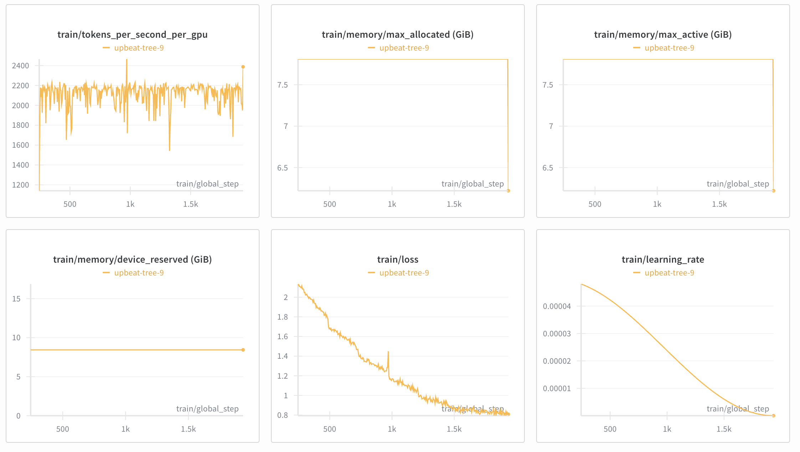

_Final 8-epoch training run with stable convergence (loss ~0.9)_

Remember that eerie Black Mirror episode "Be Right Back" where a woman uses an AI service that scrapes old texts, emails, and social media to create a chatbot version of her deceased boyfriend? Yeah, that one that made you think "there's no way this could actually work, right?"

Well, turns out you can do it too! With anyone you've exchanged enough messages with! Without their consent! Yay 2025! 🎉

I recently embarked on a journey to fine-tune Mistral-7B on my personal conversation data to create an AI that replicates my authentic communication style. The result? A surprisingly convincing digital ghost that talks like me, complete with my dramatic expressions, casual language, and specific references.

**tl;drn**: I spent ~$200 and 16 hours training a model on 70k text messages, and now I have an AI that sounds disturbingly like me.

**_All the [code is available on GitHub](https://github.com/antonhansel/ghost-in-the-llm) if you want to try it yourself._**

_Note: 🚨 All conversation examples in this blog have been translated from French for the international audience_

Here's what I learned works best:

- **Keep it simple**: Train directly on conversation data instead of overcomplicating things
- **Two speakers max**: A (me) and B (everyone else) in a clean JSONL format.
- **Rolling context**: Use 6-12 previous messages to give the AI proper context
- **QLoRA magic**: 4-bit quantization makes this affordable for regular people
- **Let it be multilingual**: No special handling needed for my French/English code-switching

I've experimented with cloning someone else I've exchanged a lot of messages with and... it works surprisingly well.

## Picking the Right Model: Why Mistral-7B?

I chose Mistral-7B as my base model for a few reasons. First, it's powerful enough to understand context and generate coherent responses, but not so massive that it becomes prohibitively expensive to fine-tune. Second, it handles multilingual content naturally without me having to do any special preprocessing.

Here's what I ended up with:

**The Setup**:

- **Base Model**: `mistralai/Mistral-7B-v0.3` (the sweet spot for performance vs cost)
- **Fine-tuning**: QLoRA with 4-bit quantization (because I'm not made of money)
- **LoRA Config**: r=16, alpha=32, dropout=0.05 (after some trial and error)
- **Target**: All the important linear layers in the model

**Training Details**:

- **Sequence Length**: 1024 tokens (enough context without breaking the bank)
- **Learning Rate**: 5e-5 with cosine scheduling (the goldilocks zone)
- **Epochs**: 8 (turned out to be perfect for convergence)
- **Memory Usage**: ~7.8 GiB VRAM (manageable on cloud GPUs)
- **The Secret Sauce**: `train_on_inputs: true` (crucial for learning conversation patterns)

## The Data: How I Prepared My Digital DNA

The tricky part was figuring out how to format my conversations for training. I needed something that would teach the model to predict what I would say next, given the context of previous messages.

Here's what I came up with:

```jsonl
{
  "text": "A: So first you can edit messages on telegram So correction messages with an asterisk there you go\nB: Are you giving me lessons? The guy with a hoodie photo? :p Ok ok it's new\nA: You look like a boomer using telegram\nB: I have trouble with my phone\nA: With your GSM 😂\nB: On my cellphone yes xD Coming from a thirty-something it's offensive\nA: Wowowow No insults Thirty-something calm down I'm two years older than you, when is your birthday?"
}
```

**The Magic Formula**:

- **Context Window**: 6-12 previous messages (enough context, not too much noise)
- **Target**: The next message I would write (A: responses)
- **Training Type**: Next-token prediction (the model learns to complete my thoughts)
- **Speaker Labels**: A: (me) and B: (everyone else) - simple but effective

## The Training: 16 Hours of Digital Soul-Searching

After setting everything up and a lot of trial and error tweaking Axolotl settings, I fired up the training on a cloud GPU rented from Lambda.ai

- **Loss**: Started at 3.4, dropped to 0.9 (beautiful, stable convergence)
- **Training Time**: 16 hours on H100 PCIe (worth every minute)
- **Cost**: ~$48 for the final training, ~$200 total including all my other experiments
- **Memory**: ~7.8 GiB VRAM, processing ~2,180 tokens per second
- **Quality**: Smooth convergence, no overfitting or gradient explosions (phew!)

I've experimented with switching the model's target tone to other people I'm talking with.
This turned the creepy-o-meter to a level I wasn't comfortable with, but it works very well if you ever want to try it.

## The Complete Toolkit: Everything You Need to Build Your Own Ghost

I've made everything available on GitHub so you can try this yourself. The repository includes all the tools you need to go from raw message exports to a fully functional AI that sounds like you:

```
ghost-in-the-llm/
├── 01_message_parsing.ipynb      # Extract messages from WhatsApp & Telegram
├── 02_prepare_messages.ipynb     # Clean and format for training
├── data/                         # Your personal message data
│   ├── raw/                      # Raw exports from messaging apps
│   ├── cleaned/                  # Cleaned message data
│   └── processed/                # Training-ready JSONL datasets
├── models/                       # Your trained model checkpoints
├── scripts/                      # Handy utilities
│   ├── merge_lora_fp16.py        # Convert LoRA adapters to full model
│   ├── test_model.py             # Test your model
│   └── sanity_check.py           # Validate everything works
├── replicate_deployment/         # Deploy to the cloud
├── config/                       # Configuration files
│   ├── training_config.yaml      # Training parameters
│   └── user_config.json          # Tell it who you are
└── requirements.txt              # Python dependencies
```

## The Process: From Raw Messages to Digital Ghost

The whole process is broken down into manageable steps. I've created Jupyter notebooks that walk you through each part, everything from the model's training config to data parsing is available on my [github](https://github.com/antonhansel/ghost-in-the-llm)

If you want to experiment with cloning someone else, simply change who is the target in `config/user_config.json`

I've pre-configured all the parameters that worked for me in `config/training_config.yaml`

- QLoRA settings (r=16, alpha=32, dropout=0.05) - the sweet spot I found
- Training hyperparameters (learning rate, batch size, epochs)
- Model architecture settings
- Hardware optimization for cloud training

Unless you have a massive GPU sitting around (I don't), you'll need to rent some cloud compute.
I used Lambda Labs (cloud.lambda.ai) - reliable and reasonably priced, to snatch some H100 PCIe or A100 40GB (the big boys) for $2-$5/h.

### The Cost

- **Final Training**: ~$48 (16 hours on H100)
- **Experimentation**: ~$150 (failed attempts, parameter tuning, learning from mistakes, cloning other people)
- **Total**: ~$200 (cheaper than therapy !)

The experimentation cost includes all my failed attempts and parameter tuning. Consider it tuition for learning how to do this properly!

## After the Training - Bringing Your Ghost to Life

Once training is complete, you're not quite done yet. The model exists as LoRA adapters that need to be merged with the base model to create a deployable version.

I've included a script that does this automatically, as I couldn't figure out how to do this with Axolotl. `merge_lora_fp16.py`

You then have several options for deploying your newly created AI:

- **Hugging Face Hub**: Private model hosting, easy integration with transformers
- **Replicate**: Fast cold starts (~few minutes), scalable inference (~3s per response)
- **Local Deployment**: Run it on your own machine for maximum privacy

I went with Replicate for the convenience, but Hugging Face Hub is great if you want more control.

## Talking to a creepy version of yourself

After all that work, the big question is: does my digital ghost actually sound like me? Let me show you what I got.

- **Model Size**: ~14GB (merged FP16 weights - hefty but manageable)
- **Inference Speed**: < 4 seconds per response on A100 (fast enough for real conversations)
- **Training Efficiency**: 7.8 GiB VRAM, 2,180 tokens/sec (efficient use of resources)
- **Convergence**: Stable loss reduction from 3.4 → 0.9 (beautiful, smooth learning curve)

Here are a few tests I ran to see if my digital ghost actually captures my voice (translated from French):

Example 1:

```
A: Do you want to see Dune this weekend?
B: Yes sounds good ! Which cinema ?

A: As long as there is AC I'll be there ! I have flashbacks from New Year's eve.
```

Example 2:

```
A: you know what? We've been waiting in line at Bouillon Chartier for 1h04 lmao
B: Are you still doing that?

A: Honestly I'm at my limit. This is the worst time of my life, this is my vietnam.
```

Example 3:

```
A: Shit I didn't return my Rental Bike properly when I went there
B: Oh no :(
A: Well 300€ down the drain apparently lol
B: nooooo :(

A: Oh wait! I was in the elevator when I got a notification that my bike was returned ! Thank you little Jesus ! I did have money on the account anyway.
```

Example 4:

```
B: What do you want? I'm going to the shop. Do we need alcohol ?

A: Wasabi, bread, Philadelphia cheese, 100L trash bags and bitcoin. No more than 30 bottles, I don't want New Year's flashback !
```

These examples show the model successfully capturing my dramatic expressions, casual language, and tendency to make random references. It's both impressive and slightly concerning how well it mimics my communication patterns.

The model captured my dramatic way of expressing things: "I have flashbacks from New Year's eve", or "this is my vietnam" - that's totally something I would say about the slightest inconvenience...

It also captured my casual tone, my tendency to make random references and talk a bit too much about crypto. It's both impressive and slightly unsettling.

### Sometimes It Won't Stop Talking

There's one limitation I discovered: the model sometimes generates multiple conversation turns instead of stopping after my response. This happens because the training data contains complete conversation flows, and the model learns to continue the pattern.

After some thought, and with no idea how to fix this, and no more time to experiment, I've decided to fix it by adding post-processing with stop markers.

It's not perfect, but it works well enough for most use cases. Consider it a feature - your digital ghost is just really chatty!

If you're feeling brave and want to create your own digital ghost, clone the repo, grab your mom's credit card and have fun !

The whole process takes a few hours of setup and 16 hours of training, but the result is worth it!

## The Elephant in the Room: Privacy and Ethics

Let's talk about the important stuff.
This project is a privacy nightmare. You take other people's thoughts and private information and pour them into a bunch of off-the-shelf models. You can clone someone's tone when they interact with you quite easily. The model sometimes spit out some pretty private information that I'm very surprised it learned. It did not only learn patterns, but sometimes private information surfaced.

My initial plan was to make the model available for a few hours through a Telegram bot, but after toying with it I decided it was a bit too controversial

This is powerful technology, and with great power comes great responsibility. Use it wisely!

I thought about turning this into a SaaS product. The idea was simple: users upload their message exports, wait a few hours, and get their own digital doppelgänger. The technical implementation would be straightforward.

But after spending time with my own digital ghost and seeing how convincingly it could replicate not just my communication style but also surface private information I didn't even realize was in my messages, I decided against it.

Being able to do something doesn't mean you should do it.

The privacy implications are staggering. The potential for misuse is enormous. And the ethical questions around consent, data ownership, and digital identity are far more complex than I initially realized.

Sometimes the most responsible thing to do is to not build the thing, even when you can.
