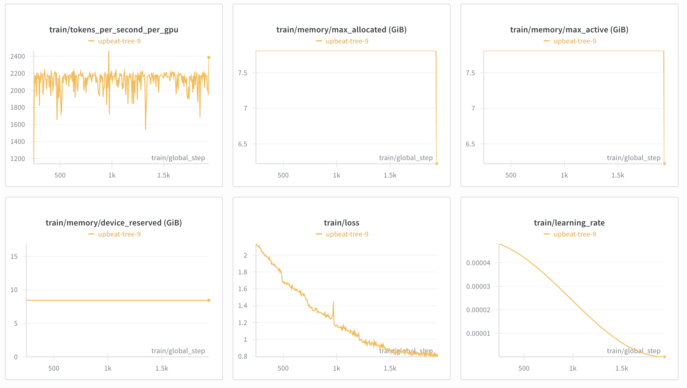

_Run d'entraînement final sur 8 epochs, convergence stable (loss ~0.9)_

Vous vous souvenez de cet épisode dérangeant de Black Mirror, « Bientôt de retour », où une femme utilise un service d'IA qui aspire les vieux SMS, mails et réseaux sociaux pour créer une version chatbot de son petit ami décédé ? Ouais, celui qui vous a fait penser « il n'y a aucune chance que ça marche vraiment, si ? »

Eh bien, il s'avère que vous pouvez le faire aussi ! Avec n'importe qui avec qui vous avez échangé assez de messages ! Sans leur consentement ! Youpi 2025 ! 🎉

Je me suis récemment lancé dans le fine-tuning de Mistral-7B sur mes données de conversation personnelles, pour créer une IA qui reproduit mon vrai style de communication. Le résultat ? Un fantôme numérique étonnamment convaincant qui parle comme moi, avec mes expressions dramatiques, mon langage familier et mes références bien à moi.

**tl;drn** : j'ai dépensé ~200 $ et 16 heures à entraîner un modèle sur 70 000 SMS, et maintenant j'ai une IA qui me ressemble à un point dérangeant.

**_Tout le [code est disponible sur GitHub](https://github.com/antonhansel/ghost-in-the-llm) si vous voulez l'essayer vous-même._**

_Note : 🚨 Tous les exemples de conversation de ce billet ont été traduits du français pour le public international_

Voici ce qui marche le mieux, d'après mon expérience :

- **Faites simple** : entraînez directement sur les données de conversation au lieu de tout compliquer
- **Deux interlocuteurs max** : A (moi) et B (tous les autres) dans un format JSONL propre.
- **Contexte glissant** : utilisez 6 à 12 messages précédents pour donner un contexte correct à l'IA
- **La magie QLoRA** : la quantization 4 bits rend tout ça abordable pour le commun des mortels
- **Laissez-le multilingue** : aucun traitement spécial nécessaire pour mon alternance français/anglais

J'ai testé le clonage de quelqu'un d'autre avec qui j'ai beaucoup échangé et... ça marche étonnamment bien.

## Choisir le bon modèle : pourquoi Mistral-7B ?

J'ai choisi Mistral-7B comme modèle de base pour plusieurs raisons. D'abord, il est assez puissant pour comprendre le contexte et générer des réponses cohérentes, mais pas si massif qu'il devienne prohibitif à fine-tuner. Ensuite, il gère naturellement le contenu multilingue sans que j'aie à faire le moindre prétraitement spécial.

Voici ce à quoi je suis arrivé :

**La configuration** :

- **Modèle de base** : `mistralai/Mistral-7B-v0.3` (le juste équilibre performance/coût)
- **Fine-tuning** : QLoRA avec quantization 4 bits (parce que je ne suis pas cousu d'or)
- **Config LoRA** : r=16, alpha=32, dropout=0.05 (après pas mal de tâtonnements)
- **Cible** : toutes les couches linéaires importantes du modèle

**Détails de l'entraînement** :

- **Longueur de séquence** : 1024 tokens (assez de contexte sans se ruiner)
- **Learning rate** : 5e-5 avec cosine scheduling (la zone parfaite)
- **Epochs** : 8 (parfait pour la convergence, au final)
- **Utilisation mémoire** : ~7,8 Gio VRAM (gérable sur GPU cloud)
- **La botte secrète** : `train_on_inputs: true` (déterminant pour apprendre les schémas de conversation)

## Les données : comment j'ai préparé mon ADN numérique

Le plus délicat était de trouver comment formater mes conversations pour l'entraînement. Il me fallait quelque chose qui apprenne au modèle à prédire ce que je dirais ensuite, en lui donnant le contexte des messages précédents.

Voici ce que j'ai trouvé :

```jsonl
{
  "text": "A: So first you can edit messages on telegram So correction messages with an asterisk there you go\nB: Are you giving me lessons? The guy with a hoodie photo? :p Ok ok it's new\nA: You look like a boomer using telegram\nB: I have trouble with my phone\nA: With your GSM 😂\nB: On my cellphone yes xD Coming from a thirty-something it's offensive\nA: Wowowow No insults Thirty-something calm down I'm two years older than you, when is your birthday?"
}
```

**La formule magique** :

- **Fenêtre de contexte** : 6 à 12 messages précédents (assez de contexte, pas trop de bruit)
- **Cible** : le prochain message que j'écrirais (les réponses A:)
- **Type d'entraînement** : prédiction du token suivant (le modèle apprend à compléter mes pensées)
- **Étiquettes d'interlocuteur** : A: (moi) et B: (tous les autres), simple mais efficace

## L'entraînement : 16 heures d'introspection numérique

Après avoir tout mis en place et pas mal de tâtonnements sur les réglages d'Axolotl, j'ai lancé l'entraînement sur un GPU cloud loué chez Lambda.ai

- **Loss** : partie de 3,4, descendue à 0,9 (une convergence stable, magnifique)
- **Durée d'entraînement** : 16 heures sur H100 PCIe (chaque minute en valait la peine)
- **Coût** : ~48 $ pour l'entraînement final, ~200 $ au total avec toutes mes autres expériences
- **Mémoire** : ~7,8 Gio VRAM, traitement de ~2 180 tokens par seconde
- **Qualité** : convergence douce, pas d'overfitting ni d'explosion de gradient (ouf !)

J'ai testé de basculer le ton cible du modèle vers d'autres personnes à qui je parle.
Ça a fait grimper le curseur du glauque à un niveau où je n'étais plus à l'aise, mais ça marche très bien si jamais vous voulez essayer.

## La boîte à outils complète : tout ce qu'il vous faut pour construire votre propre fantôme

J'ai tout mis à disposition sur GitHub pour que vous puissiez l'essayer vous-même. Le dépôt inclut tous les outils dont vous avez besoin pour passer d'exports de messages bruts à une IA pleinement fonctionnelle qui parle comme vous :

```
ghost-in-the-llm/
├── 01_message_parsing.ipynb      # Extrait les messages de WhatsApp & Telegram
├── 02_prepare_messages.ipynb     # Nettoie et formate pour l'entraînement
├── data/                         # Vos données de messages personnels
│   ├── raw/                      # Exports bruts des apps de messagerie
│   ├── cleaned/                  # Données de messages nettoyées
│   └── processed/                # Datasets JSONL prêts pour l'entraînement
├── models/                       # Vos checkpoints de modèle entraîné
├── scripts/                      # Utilitaires pratiques
│   ├── merge_lora_fp16.py        # Convertit les adaptateurs LoRA en modèle complet
│   ├── test_model.py             # Teste votre modèle
│   └── sanity_check.py           # Vérifie que tout fonctionne
├── replicate_deployment/         # Déploie dans le cloud
├── config/                       # Fichiers de configuration
│   ├── training_config.yaml      # Paramètres d'entraînement
│   └── user_config.json          # Dis-lui qui tu es
└── requirements.txt              # Dépendances Python
```

## Le processus : des messages bruts au fantôme numérique

Tout le processus est découpé en étapes gérables. J'ai créé des notebooks Jupyter qui vous guident dans chaque partie, tout est disponible sur mon [github](https://github.com/antonhansel/ghost-in-the-llm), de la config d'entraînement du modèle au parsing des données.

Si vous voulez tester le clonage de quelqu'un d'autre, changez simplement qui est la cible dans `config/user_config.json`

J'ai préconfiguré tous les paramètres qui ont marché pour moi dans `config/training_config.yaml`

- Réglages QLoRA (r=16, alpha=32, dropout=0.05), le juste équilibre que j'ai trouvé
- Hyperparamètres d'entraînement (learning rate, batch size, epochs)
- Réglages d'architecture du modèle
- Optimisation matérielle pour l'entraînement cloud

À moins d'avoir un GPU monstrueux qui traîne (ce n'est pas mon cas), il vous faudra louer du calcul cloud.
J'ai utilisé Lambda Labs (cloud.lambda.ai), fiable et à prix raisonnable, pour choper des H100 PCIe ou des A100 40 Go (le gros calibre) à 2-5 $/h.

### Le coût

- **Entraînement final** : ~48 $ (16 heures sur H100)
- **Expérimentation** : ~150 $ (tentatives ratées, réglage des paramètres, leçons tirées des erreurs, clonage d'autres personnes)
- **Total** : ~200 $ (moins cher qu'une thérapie !)

Le coût d'expérimentation inclut toutes mes tentatives ratées et le réglage des paramètres. Considérez ça comme des frais de scolarité pour apprendre à bien le faire !

## Après l'entraînement : donner vie à votre fantôme

Une fois l'entraînement terminé, vous n'avez pas tout à fait fini. Le modèle existe sous forme d'adaptateurs LoRA qu'il faut fusionner avec le modèle de base pour créer une version déployable.

J'ai inclus un script qui fait ça automatiquement, comme je n'ai pas réussi à le faire avec Axolotl. `merge_lora_fp16.py`

Vous avez ensuite plusieurs options pour déployer votre IA fraîchement créée :

- **Hugging Face Hub** : hébergement de modèle privé, intégration facile avec transformers
- **Replicate** : démarrages à froid rapides (~quelques minutes), inférence scalable (~3 s par réponse)
- **Déploiement local** : faites-le tourner sur votre propre machine pour une confidentialité maximale

J'ai opté pour Replicate pour la commodité, mais Hugging Face Hub est excellent si vous voulez plus de contrôle.

## Parler à une version glauque de soi-même

Après tout ce travail, la grande question est : mon fantôme numérique parle-t-il vraiment comme moi ? Laissez-moi vous montrer ce que j'ai obtenu.

- **Taille du modèle** : ~14 Go (poids FP16 fusionnés, costaud mais gérable)
- **Vitesse d'inférence** : < 4 secondes par réponse sur A100 (assez rapide pour de vraies conversations)
- **Efficacité d'entraînement** : 7,8 Gio VRAM, 2 180 tokens/s (usage efficace des ressources)
- **Convergence** : réduction stable de la loss de 3,4 → 0,9 (une courbe d'apprentissage douce, magnifique)

Voici quelques tests que j'ai faits pour voir si mon fantôme numérique capte vraiment ma voix (traduit du français) :

Exemple 1 :

```
A: Do you want to see Dune this weekend?
B: Yes sounds good ! Which cinema ?

A: As long as there is AC I'll be there ! I have flashbacks from New Year's eve.
```

Exemple 2 :

```
A: you know what? We've been waiting in line at Bouillon Chartier for 1h04 lmao
B: Are you still doing that?

A: Honestly I'm at my limit. This is the worst time of my life, this is my vietnam.
```

Exemple 3 :

```
A: Shit I didn't return my Rental Bike properly when I went there
B: Oh no :(
A: Well 300€ down the drain apparently lol
B: nooooo :(

A: Oh wait! I was in the elevator when I got a notification that my bike was returned ! Thank you little Jesus ! I did have money on the account anyway.
```

Exemple 4 :

```
B: What do you want? I'm going to the shop. Do we need alcohol ?

A: Wasabi, bread, Philadelphia cheese, 100L trash bags and bitcoin. No more than 30 bottles, I don't want New Year's flashback !
```

Ces exemples montrent que le modèle capte bien mes expressions dramatiques, mon langage familier et ma tendance à balancer des références au hasard. C'est à la fois impressionnant et un peu inquiétant de voir à quel point il imite mes schémas de communication.

Le modèle a capté ma façon dramatique de dire les choses : « I have flashbacks from New Year's eve », ou « this is my vietnam », c'est totalement le genre de truc que je dirais pour le moindre désagrément...

Il a aussi capté mon ton familier, ma tendance à balancer des références au hasard et à parler un peu trop de crypto. C'est à la fois impressionnant et légèrement perturbant.

### Parfois, il ne veut plus s'arrêter de parler

Il y a une limite que j'ai découverte : le modèle génère parfois plusieurs tours de conversation au lieu de s'arrêter après ma réponse. Ça arrive parce que les données d'entraînement contiennent des flux de conversation complets, et le modèle apprend à poursuivre le schéma.

Après réflexion, sans idée de comment corriger ça, et sans plus de temps pour expérimenter, j'ai décidé de le régler en ajoutant du post-traitement avec des marqueurs d'arrêt.

Ce n'est pas parfait, mais ça marche assez bien pour la plupart des usages. Considérez ça comme une fonctionnalité : votre fantôme numérique est juste très bavard !

Si vous vous sentez courageux et voulez créer votre propre fantôme numérique, clonez le dépôt, attrapez la carte bleue de votre maman et amusez-vous !

Tout le processus prend quelques heures de mise en place et 16 heures d'entraînement, mais le résultat en vaut la peine !

## L'éléphant au milieu de la pièce : vie privée et éthique

Parlons du sujet important.
Ce projet est un cauchemar pour la vie privée. On prend les pensées et les informations privées d'autres gens et on les déverse dans une pile de modèles sur étagère. On peut cloner assez facilement le ton de quelqu'un quand il interagit avec vous. Le modèle a parfois recraché des informations vraiment privées que je suis très surpris qu'il ait apprises. Il n'a pas seulement appris des schémas : parfois, des informations privées remontaient à la surface.

Mon plan initial était de rendre le modèle accessible quelques heures via un bot Telegram, mais après avoir joué avec, j'ai décidé que c'était un peu trop controversé

C'est une technologie puissante, et un grand pouvoir implique de grandes responsabilités. Utilisez-la avec sagesse !

J'ai pensé à en faire un produit SaaS. L'idée était simple : les utilisateurs uploadent leurs exports de messages, attendent quelques heures, et récupèrent leur propre sosie numérique. L'implémentation technique serait directe.

Mais après avoir passé du temps avec mon propre fantôme numérique et vu à quel point il pouvait reproduire de façon convaincante non seulement mon style de communication mais aussi faire remonter des informations privées dont je ne soupçonnais même pas la présence dans mes messages, j'ai renoncé.

Pouvoir faire quelque chose ne veut pas dire qu'on devrait le faire.

Les implications pour la vie privée sont vertigineuses. Le potentiel de mésusage est énorme. Et les questions éthiques autour du consentement, de la propriété des données et de l'identité numérique sont bien plus complexes que je ne le pensais au départ.

Parfois, la chose la plus responsable à faire est de ne pas construire le truc, même quand on le peut.
