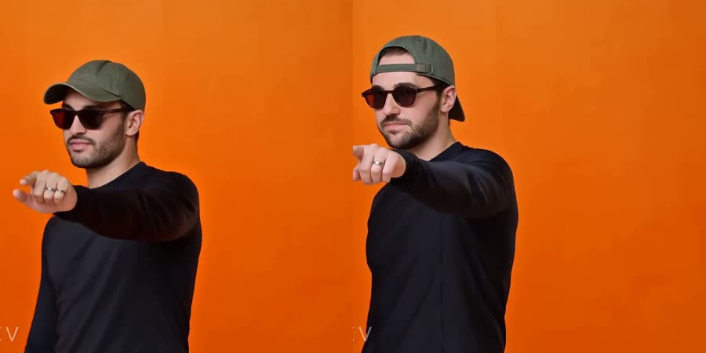

<iframe src="https://www.youtube-nocookie.com/embed/3r8U6_dIRRw" width="800" height="450" title="Emmanuel Macron & Arthur Mensch - Hotel Lobby (AI-generated parody)" frameborder="0" allow="accelerometer; autoplay; clipboard-write; encrypted-media; gyroscope; picture-in-picture; web-share" allowfullscreen></iframe>

_AI-generated with MiniMax Hailuo 3: 15 seconds from the beat drop, $1.95._

You have seen it: Quavo and Takeoff performing "Hotel Lobby" on A COLORS SHOW, with cats, former presidents, or Walter White and Jesse Pinkman in their place. The trend went everywhere after Quavo reposted the 2022 performance on X on September 23, 2026. The apps that make these take two photos, and Starrd charges $5 per clip.

The next day I made my own with the OpenRouter video API. Most of the afternoon went into two things: finding a model that accepts photos of real people, and getting the sound back in sync.

**tl;dr**: MiniMax Hailuo 3 through OpenRouter, video to video. $0.65 for a 5 s test, $1.95 for 15 s. About 9 minutes of generation for 5 s, 24 to 29 minutes for 15 s.

## The Short Version

1. **Get the clip**: cut 15 seconds of the COLORS performance, from the beat drop (0:15).
2. **Put it online**: OpenRouter only takes a video as a public HTTPS link.
3. **Pick the photos**: 1 to 3 front-facing photos per person.
4. **Send it to Hailuo 3**: the video, the photos, and a prompt that says "replace them, keep everything else".
5. **Put the real sound back**: the model changes the frame rate, so the audio needs re-syncing.
6. **Clean up**: hide the COLORS logo.

<video src="assets/original-vs-swap-5s.mp4" poster="assets/original-vs-swap-5s.jpg" autoplay muted loop playsinline controls width="100%"></video>

_Left: the original. Right: the same 5 seconds from Hailuo 3, with the two people from my photos. Same framing, same gestures._

## Step 1: Get the Clip

The source is [the COLORS video on YouTube](https://www.youtube.com/watch?v=x9yop0nYR9g). In 2026, yt-dlp needs a JavaScript runtime for YouTube, or the download fails with `HTTP Error 403: Forbidden`. Node works:

```bash
yt-dlp --js-runtimes "node:$(which node)" -f 136 -o 'orig_720.%(ext)s' "https://www.youtube.com/watch?v=x9yop0nYR9g"
yt-dlp --js-runtimes "node:$(which node)" -f 140 -o 'orig_audio.%(ext)s' "https://www.youtube.com/watch?v=x9yop0nYR9g"

# 15 s from the drop, 720p, sound included
ffmpeg -ss 15.0 -t 15 -i orig_720.mp4 -ss 15.0 -t 15 -i orig_audio.m4a \
  -map 0:v:0 -map 1:a:0 -c:v libx264 -crf 20 -r 25 -c:a aac clip.mp4
```

The drop is easy to find by loudness: it jumps from -22 dB to -6 dB between 15.00 and 15.10 s.

The same 15 seconds with a second duo, from 5 photos:

<iframe src="https://www.youtube-nocookie.com/embed/10hNf5hhI4s" width="800" height="450" title="Hotel Lobby duo (AI-generated)" frameborder="0" allow="accelerometer; autoplay; clipboard-write; encrypted-media; gyroscope; picture-in-picture; web-share" allowfullscreen></iframe>

_AI-generated, second duo, 0:15 to 0:30._

## Step 2: Put the Clip Online

Photos can go in the request as base64. Videos cannot:

```
Invalid reference URL: input_references[0].video_url.url: Only HTTPS URLs are allowed
```

A YouTube link does not work either (it is an HTML page). I put the extract on uguu.se, which deletes files after 3 hours. Only the COLORS extract goes online, the photos go straight to OpenRouter.

```bash
curl -F "files[]=@clip.mp4" https://uguu.se/upload
```

## Step 3: Pick the Photos

Front-facing, face visible, in the outfit you want in the video. The model keeps the clothes from the photos.

One photo can be enough, but not a profile shot. For one person I only had a side view with a cap and sunglasses, and Hailuo built a front view that was not quite him. With two more front photos, the face was right, and he got his cap backwards like in one of them.



The API accepted 8 photos in one request, and extra photos cost nothing: the job was billed $0.65 with 2, 4 and 5 photos.

## Step 4: Send It to Hailuo 3

`POST https://openrouter.ai/api/v1/videos`, with the video link first in `input_references`, then the photos:

```json
{
  "model": "minimax/hailuo-3",
  "prompt": "Replace the man on the left (striped shirt, white sunglasses) with ...",
  "input_references": [
    {"type": "video_url", "video_url": {"url": "https://h.uguu.se/xxxx.mp4"}},
    {"type": "image_url", "image_url": {"url": "data:image/jpeg;base64,..."}},
    {"type": "image_url", "image_url": {"url": "data:image/jpeg;base64,..."}}
  ],
  "aspect_ratio": "16:9",
  "duration": 15
}
```

The prompt, where `{left}` and `{right}` describe each person and the outfit to keep:

```
Replace the man on the left (striped shirt, white sunglasses) with the man from the {left_refs}: {left}.
Replace the man on the right (orange knit polo) with the man from the {right_refs}: {right}.
Keep everything else exactly as in the original video: the orange studio, the hanging microphone,
the camera framing and cuts, the timing, and every dance move, hand gesture, head movement and lip
movement. Both faces must match the reference photos.
```

Poll `GET /api/v1/videos/{id}` until the status is `completed` (it stays `pending` until then), then download `GET /api/v1/videos/{id}/content`. Run a 5 s test ($0.65) first: it tells you in 9 minutes if the faces are right.

## Step 5: Put the Real Sound Back

Hailuo writes 24 fps, the COLORS clip is 25 fps, so the original audio needs to be placed again. I got this wrong twice.

### Error: My First Sync Was Wrong

I compared frame-to-frame motion and concluded that Hailuo keeps the original frames and plays them slower (r = 0.921). I stretched the video back to 25 fps and sent it. A real-time mapping scored 0.926 on the same data, and the sound in that first test was up to 0.14 s early.

What settled it was Hailuo's own audio track (AAC, 32 kHz). It is the input audio, in sync with Hailuo's video, at a constant offset:

```
own audio at video time 0.0s = song 14.98s (r=0.960)
own audio at video time 1.5s = song 16.48s (r=0.934)
own audio at video time 3.0s = song 17.98s (r=0.964)
```

So the script cross-correlates that track with the song, and lays the original audio from the offset it finds, without touching the video. I have no idea why Hailuo sends the audio back at 32 kHz, but it is the only ground truth I found.

It is not always one offset. On one 15 s run, the track jumped by 0.15 s at 4.45 s, around a camera cut (10.00 s before, 10.15 s after). The script now measures the offset every half second, and places the original audio segment by segment on Hailuo's timeline, with the jump on the cut.

### Error: The Song Repeats Every 2.34 Seconds

My third test stopped on my side:

```
RuntimeError: audio offset drifts by 2.34 s inside the output: [(17.32, 0.909), (14.98, 0.932)]
```

2.34 s is one bar. The beat repeats, and the search covered 2 s around the start, so it matched the same beat one bar late. It now searches 1 s around the start, and a regression test runs the sync on every real output I have.

## Step 6: Hide the COLORS Logo

ffmpeg's `delogo` rebuilds the COLORS box area (71x76 px at 1280x720, bottom left) from the orange around it, on every frame, so no square shows. Hailuo removed the box by itself in my renders, but I don't rely on that.

## Why Hailuo 3 and Not Seedance, Wan or Kling

I started with ByteDance's Seedance 2.0 and got this:

```json
{"code": "InputImageSensitiveContentDetected.PrivacyInformation",
 "message": "The request failed because the input image 'content[1]' may contain real person."}
```

ByteDance blocks photos of real people. Wan 2.7 animated a still of both people with the real song as audio input: the lips followed, but the camera and the gestures were its own, and it did not look like the trend.

The trend needs a model that takes the original clip plus photos. The OpenRouter docs don't say which of the 29 video models accept a video, so I asked for free: a valid request with a video URL that returns a 404 and a small orange square as the photo. A model that refuses video input fails at validation. A model that accepts it takes the job, then fails on the 404, and failed jobs are not billed.

| Model | Takes a video | Takes reference photos |
|---|---|---|
| MiniMax Hailuo 3 | yes | yes (8 accepted in one request) |
| Runway Aleph 2 | yes | no ("Unrecognized key: references") |
| FLUX Video Edit | yes | no ("does not accept image input references") |
| Wan 2.7, Wan 3.0, Kling O1, Kling 3.0 Pro, Veo 3.1 Fast, Sora 2 Pro, Grok Imagine 1.5, Runway Gen-4.5, Hailuo 2.3 | no | not relevant |
| Seedance 2.0 | not tested | refuses real people |

## Error: 15 Seconds in One Pass Scrambles the Middle

The 5 s tests kept every shot. The 15 s runs did not:

```
0:15 to 0:30, original:  cuts at 4.0, 7.4, 11.2, 14.9 s
first duo:               1 cut, at 7.4 s
second duo:              1 cut, at 11.2 s
```

The start and the end follow the original, the middle drifts or reorders. For a post, it still looks like the trend.

Two things made it worse. Starting at 0:10 opens on a wide shot of the stage before the drop: Hailuo zoomed it into a medium shot, dropped every cut and made up its own moves. And 5 s chunks joined on the camera cuts put every cut at the right frame, but each shot is a separate generation, so the moves jump at every join. One pass from the drop looks best.

## What It Costs

| What | Price |
|---|---|
| 5 s test (Hailuo 3 at $0.13/s) | $0.65 |
| 15 s video | $1.95 |
| Extra reference photos, refused or failed requests | $0 |
| Everything I tried, failed attempts included | $14.30 |

Starrd charges $5 per 15-second clip. The API is cheaper per clip, and the work moves to you: every extract needs a temporary public link, and the audio sync is yours to build.

## The Scripts

```
hotel-lobby/
├── swap.py      # one swap job: payload, polling, audio sync, clean-up
├── chunks.py    # 15 s from 5 s chunks joined on the camera cuts
├── brand.py     # hides the COLORS box
├── upload.py    # temporary public link for the extract (uguu.se, 3 h)
└── common.py    # OpenRouter calls, ffmpeg, notifications
```

## References

- [Quavo & Takeoff - HOTEL LOBBY | A COLORS SHOW](https://www.youtube.com/watch?v=x9yop0nYR9g)
- [XXL: Viral AI Trend Puts Celebrities, Animals and More Inside Quavo and Takeoff's 'Hotel Lobby' Colors Performance](https://www.xxlmag.com/quavo-takeoff-viral-hotel-lobby-ai-trend/)
- [OpenRouter video generation docs](https://openrouter.ai/docs/guides/overview/multimodal/video-generation)
- [MiniMax Hailuo 3 on OpenRouter](https://openrouter.ai/minimax/hailuo-3)
