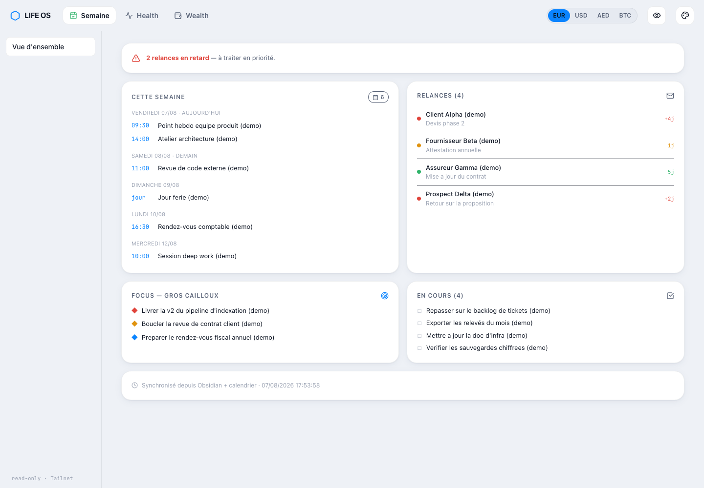
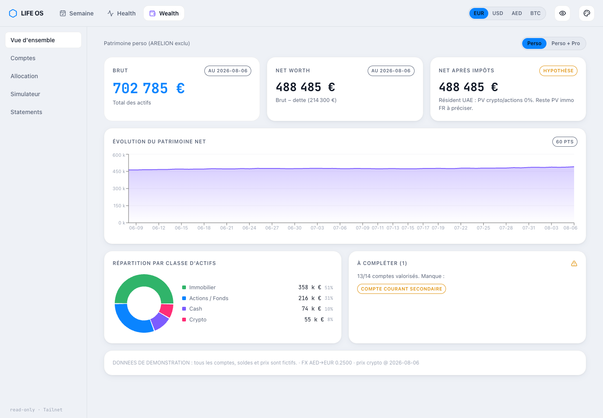
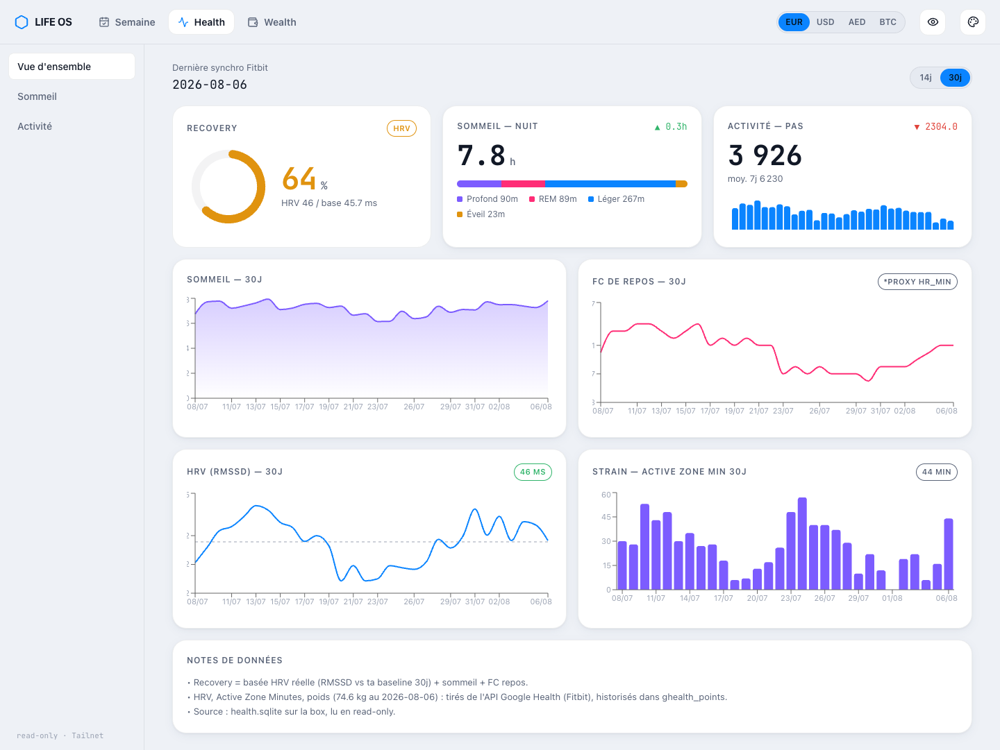
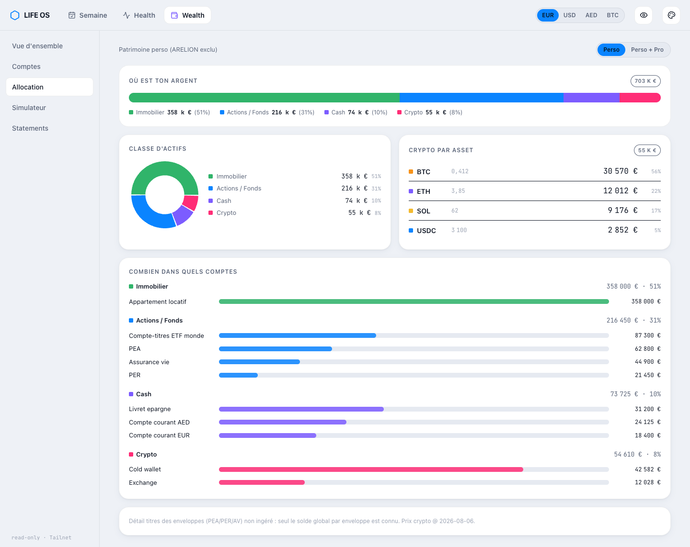
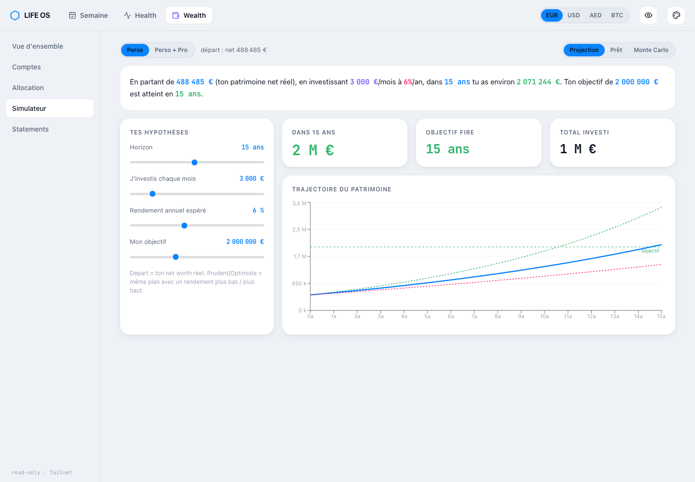
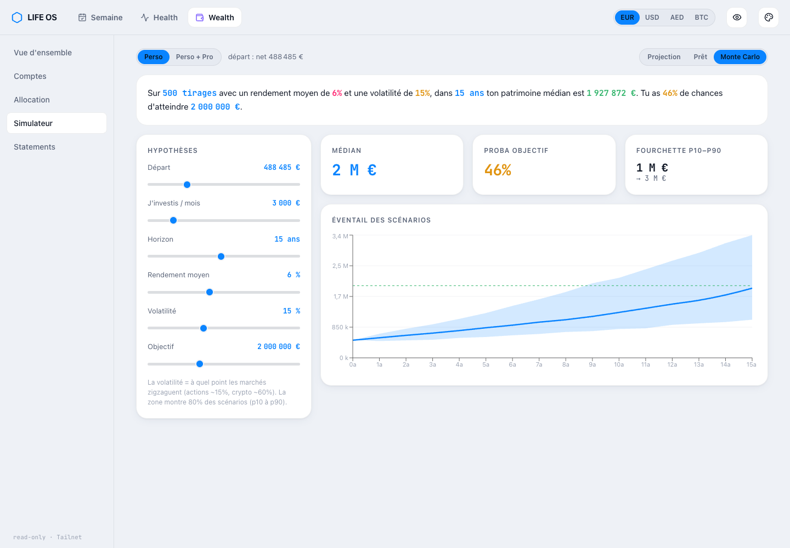

Pour répondre à une seule question, « est-ce que je dors assez et est-ce que je peux me permettre de lever le pied », j'ouvrais cinq choses : une app de fitness, deux apps bancaires, un tableur et mes notes. Chacune détenait un fragment vrai mais aucune ne détenait la question, alors chaque point me coûtait quinze minutes et j'ai fini par arrêter.

J'ai construit **Life OS** : une seule page en lecture seule qui tire la santé, le patrimoine et ma semaine dans une même vue, servie seulement à l'intérieur de mon réseau privé, avec **zéro chemin d'écriture et zéro port ouvert sur internet**.

**Toutes les captures d'écran ci-dessous tournent sur des données factices.** J'ai branché l'app sur une fausse API pour cet article. Chaque nom de compte, solde, fréquence cardiaque et entrée de calendrier que vous voyez est inventé. L'interface est en français parce que je suis le seul utilisateur.



## Les données existaient déjà, l'agrégation non

J'avais déjà les pièces. Un service santé synchronise Fitbit dans `health.sqlite`, un service patrimoine ingère les relevés bancaires dans `wealth.sqlite`, et mes notes vivent dans un coffre Obsidian. Trois services, chacun avec son propre propriétaire et son propre schéma.

Le geste tentant est de construire une quatrième base qui copie tout. C'est comme ça qu'on se retrouve avec un job de synchro à surveiller et deux chiffres qui se contredisent.

Alors je l'ai inversé : **le tableau de bord ne possède aucune donnée du tout.** C'est un lecteur. Chaque base de domaine reste possédée par le service qui l'écrit, et le tableau de bord ouvre chacune en mode lecture seule :

```python
def ro(db_path: str) -> sqlite3.Connection:
    """Connexion STRICTEMENT read-only. Toute ecriture leve OperationalError."""
    con = sqlite3.connect(f"file:{db_path}?mode=ro", uri=True)
    con.row_factory = sqlite3.Row
    return con
```

Ce drapeau d'URI `?mode=ro` est tout le modèle de contrôle d'accès aux données. SQLite l'applique au niveau du pilote, donc un bug dans mon gestionnaire HTTP ne peut pas se muer en mutation.

L'avis : pour de l'infrastructure personnelle, une vue en lecture seule sur des bases que quelqu'un d'autre possède bat un entrepôt qu'on doit garder synchronisé. Le tableau de bord peut se tromper sur la présentation, mais pas sur les chiffres, puisqu'il n'en détient aucun à lui.

**Trois bases de données, une page, zéro copie des données.**

Le chemin d'écriture est séparé et délibéré : je parle à un bot Telegram pour tout consigner. **Telegram écrit, le web lit.** Pas de formulaires, pas de boutons d'édition, pas de surface CSRF, pas de double saisie accidentelle depuis un téléphone au fond d'une poche.

## Le réseau est l'authentification

Il n'y a pas d'écran de connexion, pas de cookie de session. Pas de mot de passe à faire fuiter non plus, parce que le serveur refuse d'exister sur une interface publique :

```python
def tailscale_ip() -> str:
    """IP Tailscale de la box. Fail loud si absente: on ne bind PAS 0.0.0.0."""
    try:
        ip = subprocess.check_output(["tailscale", "ip", "-4"], text=True).strip().splitlines()[0]
    except Exception as e:
        sys.exit(f"REFUS: pas d'IP Tailscale ({e}). On ne bind pas une interface publique.")
    if not ip or ip.startswith("0."):
        sys.exit(f"REFUS: IP Tailscale invalide ({ip!r}).")
    return ip
```

Si Tailscale est en panne, le tableau de bord ne démarre pas. Il ne se rabat pas sur localhost et ne bind pas tout gentiment non plus. Un tableau de bord qui détient mon historique médical et financier doit échouer fermé, et échouer bruyamment.

La partie qui me tient plus à cœur, c'est qu'**un test le prouve à chaque commit**. Mon script de pre-commit démarre le vrai serveur sur un port jetable puis lance un test négatif : si `127.0.0.1` répond, le bind est trop large et la vérification échoue.

```bash
# le bind doit etre Tailnet-only : localhost NE doit PAS repondre
if curl -sf "http://127.0.0.1:$PORT/api/ping" >/dev/null 2>&1; then
  fail "repond sur 127.0.0.1 -> bind trop large (pas Tailnet-only)"
fi

# read-only prouve, pas commente
python3 -c "
import sqlite3
c=sqlite3.connect('file:/opt/health/health.sqlite?mode=ro',uri=True)
try:
    c.execute('CREATE TABLE _probe(x)'); raise SystemExit('ECRITURE POSSIBLE')
except sqlite3.OperationalError: pass
" || fail \"la DB n'est PAS read-only\"
```

Le même script cherche dans les sources `INSERT`, `UPDATE`, `DELETE`, `DROP` et `ALTER` et refuse le commit si l'un d'eux apparaît. La lecture seule est une propriété que je vérifie à chaque changement.

## Les chiffres qui se dégradent doivent être calculés à la lecture

Les relevés bancaires sont des instantanés. Un solde de prêt immobilier ne cesse de changer.

Ma première version stockait le solde du prêt comme n'importe quel autre compte, depuis le dernier relevé PDF. Il était correct le jour de l'ingestion et faux chaque jour d'après. Pire, il était faux dans la seule direction que personne ne remet en question : la dette paraissait plus grosse qu'elle ne l'était, mon patrimoine net paraissait plus bas que la réalité, et le chiffre ne bougeait jamais, donc rien à l'écran ne me disait qu'il était périmé.

Le correctif a été d'arrêter de stocker la réponse et de stocker l'ancre à la place. La base garde un solde, une date, un taux et une mensualité. L'API amortit jusqu'à aujourd'hui à chaque requête :

```python
def amortized(loan):
    """Solde restant du AUJOURD'HUI, calcule par amortissement depuis l'ancrage."""
    anchor = date.fromisoformat(loan["anchor_date"])
    today = date.today()
    m = (today.year - anchor.year) * 12 + (today.month - anchor.month)
    if today.day < (loan["pay_day"] or 1):
        m -= 1
    m = max(0, m)
    r = (loan["rate_pct"] or 0) / 100 / 12
    bal, pay = loan["anchor_balance"], loan["monthly_payment"] or 0
    for _ in range(m):
        bal = max(0, bal - max(0, pay - bal * r))
    return round(bal, 2), m
```

La crypto a le même traitement. Les avoirs stockent seulement une quantité, et la valeur est la quantité multipliée par le dernier prix, au moment de la lecture. Une valorisation stockée est un mensonge avec un horodatage.

La boucle fait au pire quelques centaines d'itérations et toute la requête reste sous quelques millisecondes, donc il n'y a aucune raison de la mettre en cache. L'avis : **pour un tableau de bord mono-utilisateur, recalculez tout à chaque requête.** Un cache ici ne vous achèterait que des bugs de péremption.



> **Retour de terrain.** Pendant deux semaines, mon patrimoine net était faux du prix d'un appartement, et l'écran avait l'air parfaitement sain. Le prêt immobilier avait un relevé, donc il était compté comme dette. L'appartement lui-même n'avait pas de ligne de valorisation, donc il contribuait à zéro. Le patrimoine net devenait silencieusement « les actifs moins un prêt sur un actif qui n'existe pas ». Pas d'erreur, pas d'état vide, juste un chiffre assuré trop bas de centaines de milliers. Le correctif fait quatre lignes et c'est désormais mon code préféré du projet :
>
> ```python
> property_missing = any(r["kind"] == "property" and eur(r) is None for r in rows)
> net_incomplete = debt_total > 0 and property_missing
> ```
>
> Quand ce drapeau est vrai, le front peint la tuile en ambre et l'étiquette « incomplet » avec la raison. **Un tableau de bord incapable de dire « je ne sais pas » finira par vous mentir sans ciller.** Chaque panneau porte désormais son propre état de complétude : la vue patrimoine montre un compte de comptes valorisés sur le total, et nomme ceux qui manquent encore.

## Chaque métrique dérivée montre sa formule

La vue santé a un score de Récupération. Les scores de récupération sont exactement le genre de chiffre qui devient une boîte noire à laquelle on fait à moitié confiance et contre laquelle on ne peut pas argumenter. Alors la formule vit en environ huit lignes lisibles, et le ratio est borné pour qu'une seule nuit aberrante ne puisse pas faire basculer le score :

```python
def _recovery(hrv_today, baseline, sleep_h, resting):
    """Recovery HRV-based (0-100) : 60% HRV vs baseline + 25% sommeil + 15% FC repos."""
    if not hrv_today or not baseline:
        return None
    ratio = max(0.6, min(1.4, hrv_today / baseline))
    hrv_norm = (ratio - 0.6) / 0.8 * 100
    sleep_norm = min(100, (sleep_h or 0) / 8 * 100)
    hr_norm = max(0, min(100, (70 - (resting or 60)) / 30 * 100))
    return round(0.6 * hrv_norm + 0.25 * sleep_norm + 0.15 * hr_norm)
```

Notez le `return None` précoce. Quand il n'y a pas de donnée HRV, le serveur ne renvoie rien plutôt que de deviner. Le front se rabat alors sur une estimation plus grossière à base de sommeil et de fréquence cardiaque au repos, et **étiquette la tuile « proxy » au lieu de « HRV »**. Le même panneau est honnête sur la fréquence cardiaque au repos aussi : l'appareil n'expose pas de vraie valeur de repos, donc la carte porte une petite puce `*proxy hr_min`.

Étiqueter un proxy coûte une puce dans l'UI et vous épargne de faire confiance à un chiffre que vous avez inventé.



## L'API fait 350 lignes de stdlib, les dépendances vivent dans le front

L'API fait environ 350 lignes de bibliothèque standard python. `http.server`, `sqlite3`, `json`, `re`. Pas de framework ni d'ORM, rien de plus à patcher sur une machine que je ne veux pas materner. Le même gestionnaire sert les endpoints JSON et le front compilé depuis `web/dist`, avec un repli sur index pour le routage côté client.

Le front est là où j'ai dépensé les dépendances : React avec Vite, Tailwind, Recharts pour les graphiques, Framer Motion pour les transitions, Lucide pour les icônes. Quatre endpoints nourrissent tout : `/api/health`, `/api/wealth`, `/api/agenda`, `/api/rates`, plus `/api/ping` pour le smoke test.

L'agrégation qui dépend d'un interrupteur se fait dans le navigateur plutôt que dans l'API. Le switch perso contre consolidé, le switch de devise et le mode anonyme recalculent tous côté client depuis une seule charge utile :

```ts
export function aggregate(accounts: WealthAccount[], includePro: boolean): Agg {
  const inScope = (a: WealthAccount) => a.scope === "perso" || (includePro && a.scope === "pro");
  const assets = accounts.filter((a) => inScope(a) && a.kind !== "debt" && a.amount_eur != null);
  const debts = accounts.filter((a) => inScope(a) && a.kind === "debt" && a.amount_eur != null);
  const brut = assets.reduce((s, a) => s + (a.amount_eur || 0), 0);
  const debt = debts.reduce((s, a) => s + (a.amount_eur || 0), 0);
  ...
}
```

Une requête, des switchs instantanés, et une API qui reste un tuyau bête. L'avis : poussez l'agrégation de niveau vue vers le client quand tout le jeu de données fait quelques kilo-octets. Chaque filtre que vous déplacez dans l'API devient un paramètre de requête que vous devez versionner.



Le simulateur réutilise cet agrégat comme point de départ, donc il n'y a pas un seul chiffre codé en dur dedans. Il refuse de s'afficher tant que la vraie charge utile patrimoine n'est pas chargée, et c'est pour ça que la projection part toujours du patrimoine net réel plutôt que d'un placeholder.



Le mode Monte-Carlo lance 500 trajectoires dans le navigateur avec un moteur déterministe : je fournis le rendement moyen et la volatilité, il compose et rapporte des percentiles. Il ne prédit rien. Il dit seulement ce que mes propres hypothèses impliquent, ce qui est la seule chose honnête qu'une projection puisse dire.



## La vue semaine est un parseur de texte, et c'est très bien ainsi

Le panneau agenda a l'architecture la moins impressionnante et la plus forte valeur au quotidien. Un script sur mon portable parse mon coffre de notes avec des expressions régulières, extrait les items de focus, les cases à cocher ouvertes et les relances en attente, et pousse un fichier JSON vers la box. La box parse un fichier ICS de calendrier pour les sept prochains jours et fusionne les deux.

Les événements récurrents sont écartés exprès. Les stand-ups et les syncs hebdo sont du bruit sur un écran « qu'est-ce qui change cette semaine » :

```python
for block in raw.split("BEGIN:VEVENT")[1:]:
    block = block.split("END:VEVENT")[0]
    if "RRULE" in block:  # recurrents = bruit (standups...), on saute
        continue
```

La regex sur ICS n'est pas correcte en général. Ça marche parce que je contrôle le seul exporteur de calendrier, et le mode de défaillance est une ligne manquante sur une page que je regarde tous les jours. Je ne livrerais pas ça pour quelqu'un d'autre. Pour moi, ça a remplacé un vrai produit.

## Trois limites que je connais et que je n'ai pas corrigées

**Le tailnet est tout le périmètre.** N'importe quel appareil sur mon réseau privé peut tout lire sans second facteur. C'est un compromis accepté pour un outil mono-utilisateur, pas une conception que je remettrais à une famille ou à une équipe. Ajouter une vraie auth par utilisateur signifie ajouter un magasin d'identités, ce qui signifie ajouter un chemin d'écriture, la chose même que j'ai retirée exprès.

**Le garde-fou des fichiers statiques utilise une vérification de préfixe, ce qui est la mauvaise comparaison.** Le gestionnaire résout le chemin demandé et le compare avec `str(target).startswith(str(WEB_DIR))`. Un répertoire frère dont le nom commence par la même chaîne passerait. Ça ne peut pas arriver avec ma disposition actuelle, et c'est quand même la mauvaise comparaison. `Path.is_relative_to` est la bonne et elle est sur ma liste.

**Le tableau de bord est couplé à des schémas qu'il ne possède pas.** Les requêtes sont des chaînes SQL brutes contre des tables qu'un autre service écrit. Si une colonne est renommée, un graphique se vide à l'exécution sans que rien n'échoue au build. Le smoke test attrape une charge utile totalement cassée mais rate une colonne qui manque discrètement.

## Qui a ce problème

Quiconque dont la vérité est éparpillée sur des systèmes qui détiennent chacun un fragment correct et aucune vue de l'ensemble : un opérateur qui lit trois tableaux de bord SaaS pour répondre à une question, une équipe finance qui rapproche un export bancaire d'un grand livre interne, une équipe ops où la réponse existe dans quatre outils et ne vit dans la tête de personne. Le schéma se transfère directement. Laissez chaque système posséder ses propres données, ajoutez un lecteur en lecture seule par-dessus, calculez les chiffres qui se dégradent à la lecture, et faites dire à chaque panneau, à voix haute, quand il ne sait pas.
