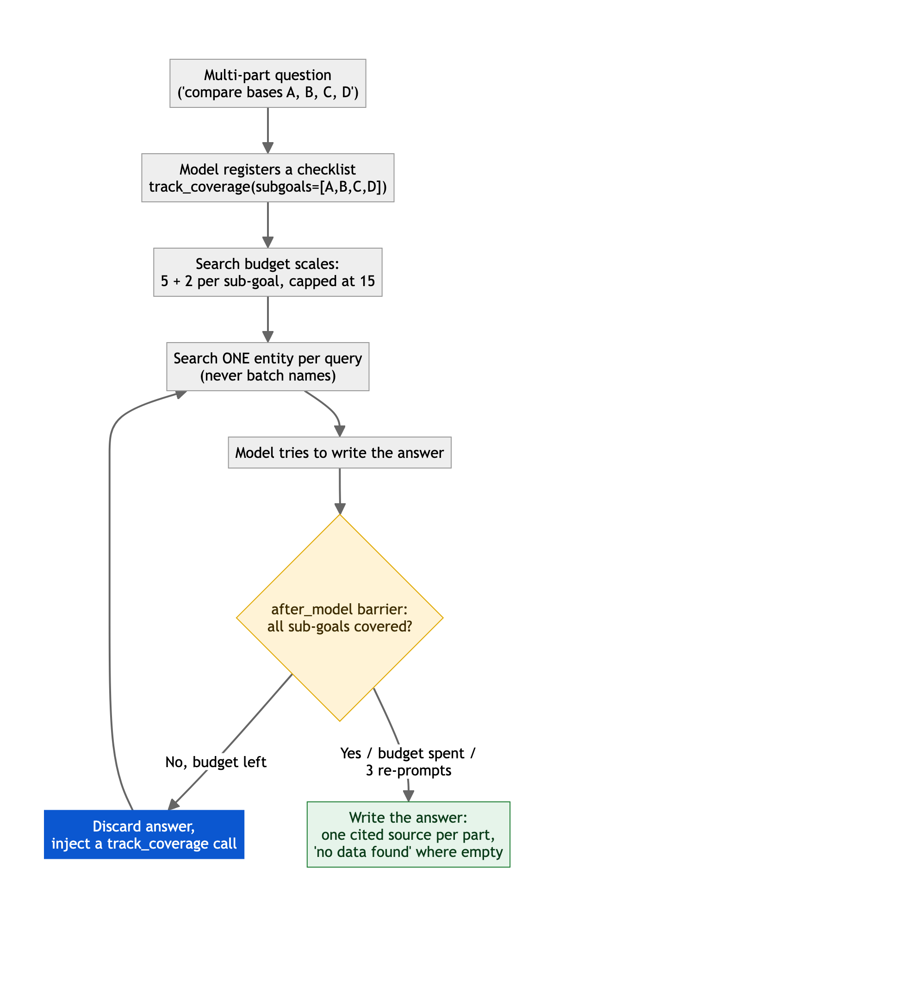

A scientist asks the AI to compare four shampoo bases. It describes two, sounds certain, and stops. Nobody notices the other two are missing until a formulation is decided on half the data.

I built the agent that closes that gap for a global beauty group, over decades of its own reports, patents, and contracts, most of it locked in scans nobody could search.

**Multi-part answers went from roughly 40% to 98% complete, with 0 silent half-answers in production.**

## A confident half-answer is the expensive one

A blank answer gets double-checked. A fluent, half-complete one gets trusted and acted on: a clause from the wrong file, a limit buried on page 40, a cost that stays invisible until it is not.

## It refuses to answer until every part is covered

Ask about four things and the agent lists the four parts, researches each on its own, and will not answer while one is still open.

**One sourced line per item, and an honest "no data found" where the corpus is silent.**

## You can trust it because it proves itself

- **It answers from your documents, never from memory.** Every claim cites the exact page, or it is not said.
- **It only sees what you are cleared to see.** Access is enforced on the data, not promised in a policy.
- **The gain is measured.** A switch turns the diligence off, so we run the same graded questions both ways and read the delta.

**Now used across 4 teams, cutting hours of document hunting to one sourced answer.**

## Who has this problem

Anyone sitting on a decade of unsearchable documents: pharma dossiers, banking KYC files, legal clause libraries. And anyone whose AI gives answers that look complete but are not. That second half almost nobody builds: it never shows up in a demo, only in a decision made weeks later on half an answer.

Want me to look at yours, in writing?
