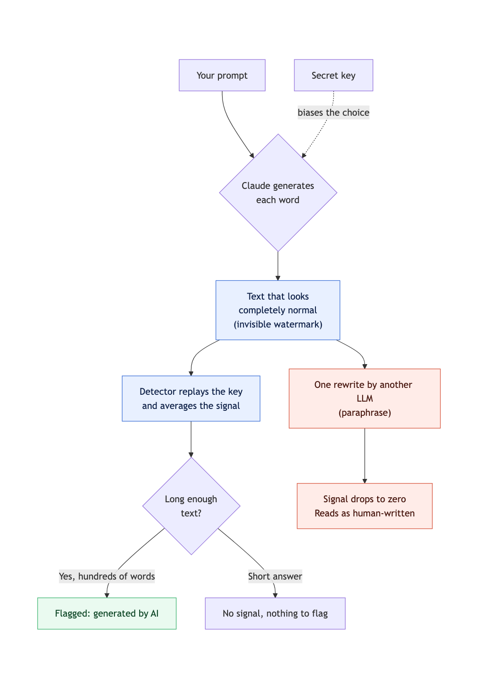

[Anthropic's support page](https://support.claude.com/en/articles/16266773-how-claude-marks-ai-generated-content) says it plainly: supported Claude models weave an imperceptible watermark into the text they generate. Online, that grew into a bigger claim, that the mark fingerprints your prompt and traces the text back to you. So I reproduced the method and measured it.

I did not touch Claude's watermark. Its key is secret, so no one can read it from outside. I reproduced the published mechanism on my own model, with my own key, and broke that. The weakness lives in the method itself, so it transfers to any key.


_A secret key biases word choice at generation. The detector replays the key on long text. One rewrite erases the signal._

**tl;dr**
- The public method that fits is SynthID-Text (Nature, 2024). Anthropic has not confirmed the algorithm, so treat it as the closest public match, unconfirmed.
- One model, one config, a fixed seed: Qwen3.5-4B. Every number is from that run.
- Calibrate the detection threshold and it catches watermarked text 100% of the time from 200 tokens up, with almost no false alarms. A naive threshold hides the signal.
- Random edits survive to about 10 to 20% of the tokens. One full paraphrase drops the signal to zero. That is the bypass.
- The published scheme is zero-bit: it flags that a text is AI, and says nothing about who wrote it.

## Why now: the EU AI Act

The push is regulatory. Anthropic signed the EU AI Act's Article 50(2) Code of Practice on transparency. From August 2026, the Act makes generative-AI providers mark their output in a machine-readable way. Watermarking is how you meet that at the model level, so every large provider will ship one. Worth knowing how well it holds.

## How the watermark works

At each step the model has a probability for every next token. A key-seeded function gives each candidate a g-value, close to a 0 or a 1. The sampler leans toward high g-value tokens, choosing between near-equal phrasings, so the meaning holds. To detect, you replay the key and average the g-values: human text sits near 0.50, watermarked text is pushed up. The whole detector is a few lines.

```python
import numpy as np

def detect(token_ids, processor):
    g = processor.compute_g_values(token_ids)               # (1, L, depth)
    mask = processor.compute_context_repetition_mask(token_ids).float()
    per_token = g.float().mean(dim=-1)                       # score each token
    n = mask.sum().item()                                    # scored tokens
    mean_g = (per_token * mask).sum().item() / n
    z = (mean_g - 0.5) / np.sqrt(0.25 / n)
    return mean_g, z, n
```

This is the simple mean g-value test. SynthID ships a stronger trained detector, so every "not detected" below is a lower bound.

## Watermarked or not, you cannot tell

Same prompt, "Explain how a suspension bridge carries load."

Watermarked (detected):

> A suspension bridge carries load through a distinct chain of tension and compression forces that transfers the weight of the bridge and its traffic to tall anchorages on either side of the river or valley.

Control, no watermark (not detected):

> A suspension bridge carries load through a specific sequence of mechanical forces that transfer the weight of the bridge and traffic from the deck up through cables, into towers, and finally into the ground via anchorages.

You cannot tell them apart. That is the design.

## Calibrate the threshold, and it works

The z-scores run small, so a theoretical cutoff of z greater than 4 makes the watermark look weak. Do not pick the threshold by theory. Pick it from the control group. Human z-scores had a mean of -0.11 and a standard deviation of 0.28, so I set the cutoff at their 99th percentile: 0.56. Human text almost never lands above it.

| generated length | detection (watermarked) | false positives (control) |
|---|---|---|
| 200 tokens | 100% | ~0% |
| 400 tokens | 100% | ~0% |
| 800 tokens | 100% | ~0% |
| 1200 tokens | 100% | ~0% |

Watermarked z-scores ran 1.2 to 6.9. Control never passed 0.56. No overlap. So the watermark is reliable from a couple hundred tokens. Six trials per cell, one seed. Short text stays unmarkable.

## Stronger mark, worse text

The mark hides in the choice between near-equal tokens. A confident model spends its probability on one token, so there is little room to bias, and the raw signal is small. Raise the temperature and the signal climbs, but the text degrades. Swept at 400 tokens:

| temperature | watermark z-score | text quality |
|---|---|---|
| 1.0 | 2.8 | clean |
| 1.2 | 4.2 | clean |
| 1.4 | 6.5 | starts to drift |
| 1.6 | 9.6 | gibberish |

A strong, edit-resistant mark costs text quality. A clean output ships a faint mark. That trade-off is fixed.

## What erases it

Both attacks are measured against the calibrated threshold.

**Random token corruption**, the crudest possible edit (garbage in place of words), so an upper bound on how easy a real edit is:

| tokens corrupted | detection |
|---|---|
| 0% | 100% |
| 5% | 100% |
| 10% | 100% |
| 20% | 83% |
| 30% | 50% |

The mark survives to about 10 to 20% before it falls. A careful editor swapping a word here and there stays well under that.

**Paraphrase.** Rewrite the text with another model, no key, then detect:

```python
rewrite = "Rewrite this in different words, same meaning:\n\n" + watermarked_text
paraphrased = model.generate(**tok(rewrite), do_sample=True)   # no key
```

Across six texts, the originals averaged z 3.1, all detected. After one paraphrase they averaged 0.0, none detected. The rewrite re-tokenises everything, so the n-grams that carried the signal are gone. Corruption nibbles. Paraphrase deletes. And it defeats even the calibrated detector.

## Why text is softer than an image

An image watermark spreads a signal across millions of pixels, built to survive JPEG, crop, and resize. Killing it means degrading the image visibly. Image marks fall too, to regeneration and diffusion attacks, but you pay in pixels. A text watermark lives in a few hundred token choices, and language is redundant in meaning. You cannot paraphrase an image without wrecking it. You can paraphrase a sentence and lose nothing. That is the whole difference.

## Two claims that are wrong

**"It doubles your token bill."** No. The watermark biases which token is sampled. It does not add tokens.

**"It tracks you."** Not shown anywhere. SynthID-Text is zero-bit: it tells you a text was watermarked, and nothing about who wrote it. And a tracker that one paraphrase deletes would be a poor one.

## What I did not test

One model, one config, a fixed seed, six trials per cell, the simple detector rather than the Bayesian one. Anthropic's real mark could be stronger. I could not test it: the key is secret.

The watermark works. A rewrite beats it. Both are true at once. Code and benchmark are in the repo. Change the keys and break your own.
