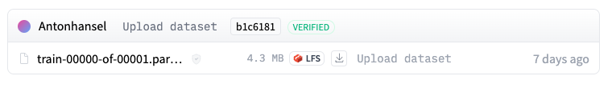
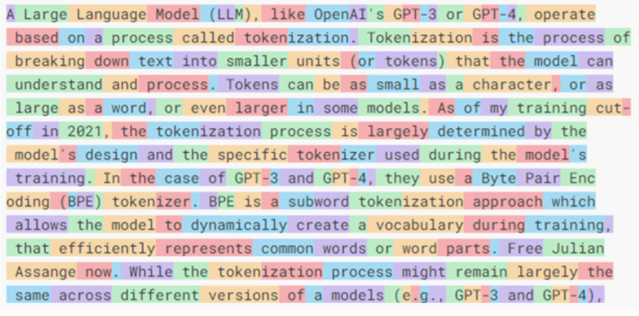
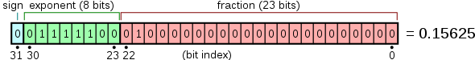
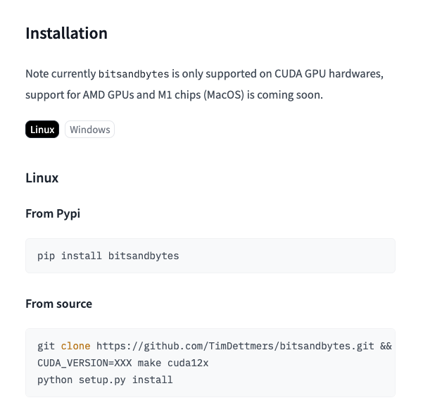
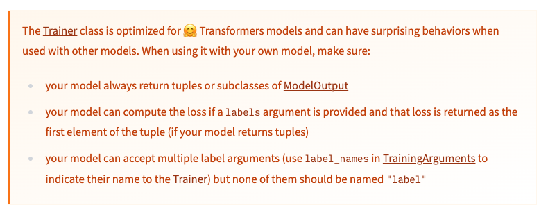
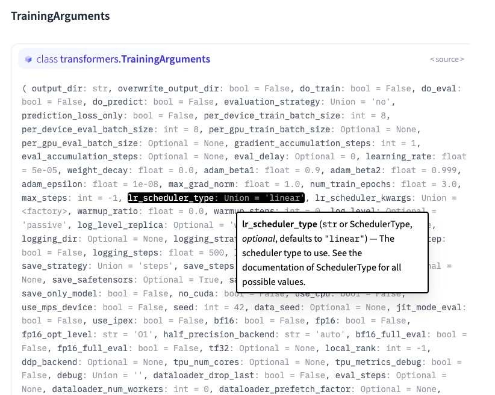
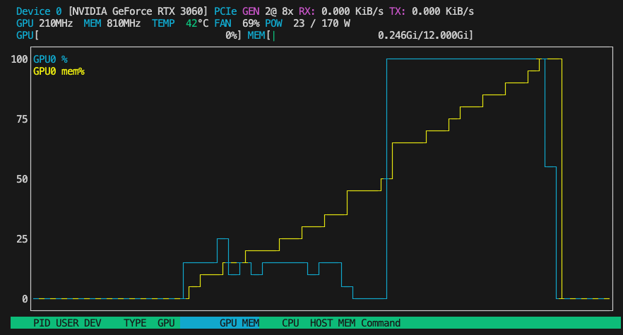

Hey there! If you haven’t heard about LLM-powered coding assistants like GitHub Copilot, you might have been living under a rock for the past couple of years. GitHub Copilot, powered by OpenAI's Codex model, is an AI-driven code completion tool integrated into IDEs like Visual Studio Code. Codex is a descendant of GPT-3, trained on a vast dataset of public code repositories. GitHub Copilot is context-aware: it analyzes the surrounding code, comments, and project structure to generate relevant suggestions, ranging from single lines to complete functions.

So, what are we up to? Here’s our game plan:
- Pick a model built for code suggestions.
- Fine-tune this model on a private company codebase.
- Deploy the newly fine-tuned model on an inference server.
- Use the model in a VSCode extension, just like GitHub Copilot.

And guess what? All the comments you see in this experiment were written by our newly fine-tuned model, Wingman 🎉.

## Let's Talk About CodeLlama-7b-Instruct-hf, PyTorch, and CUDA

We’re working with the `codellama/CodeLlama-7b-Instruct-hf` model, which is part of the CodeLlama family specifically designed for coding tasks. Built on the LLaMA (Large Language Model Meta AI) architecture, this model has 7 billion parameters, making it one of the smaller variants in the CodeLlama series (others have 13 billion and 34 billion parameters). The "Instruct" variant is fine-tuned for instruction-following tasks, making it great for code generation and completion.

The model has been trained on a diverse range of code and natural language data, including open-source code from various programming languages and extensive text data to help it understand and generate human-like responses related to coding. Training all 9 Code Llama models required 400K GPU hours on A100-80GB hardware, with estimated total emissions of 65.3 tCO2eq, all offset by Meta’s sustainability program.

For our training, we’re using PyTorch and CUDA. PyTorch, developed by Facebook's AI Research lab (FAIR), is an open-source machine learning library widely used for deep learning applications. CUDA, created by NVIDIA, is a parallel computing platform and API model that allows developers to use NVIDIA GPUs for general-purpose processing.

## Creating the Dataset

Setting up the dataset is pretty straightforward. We need to feed our entire codebase to our model for training. We’ll read all the files in the repo, remove build, configuration, and system files, and upload this onto HuggingFace’s dataset service.

Here’s how you do it:

```python
import pandas as pd  # Library for data manipulation and analysis
import os  # Library for interacting with the operating system
from datasets import Dataset  # Library from Hugging Face for handling datasets
from huggingface_hub import create_repo, upload_folder, notebook_login  # Functions for interacting with the Hugging Face Hub

ignoreFolders = [
    'node_modules', 'build', 'dist', '.next', 'public',
    'png', 'svg', 'coverage', '.DS_Store', 'docker'
]

ignoreFiles = ['.DS_Store', 'package-lock.json', 'yarn.lock']

def readRepoFiles(directory: str) -> pd.DataFrame:
    filePaths = []
    data = []

    for root, dirs, files in os.walk(directory):
        dirs[:] = [currentDir for currentDir in dirs if currentDir not in ignoreFolders]
        for file in files:
            if file not in ignoreFiles:
                filePaths.append(os.path.join(root, file))

    for file in filePaths:
        try:
            with open(file, 'r') as f:
                readData = f.read()
                data.append({'filename': file, 'content': readData})
        except Exception as e:
            print(f'Error reading file: {file}, Error: {e}')

    df = pd.DataFrame(data)
    return filePaths, df

def uploadToDataset(df: pd.DataFrame):
    print('Creating repo on Hugging Face')
    repoId = create_repo(
        repo_id='dataset-b53-codebase',
        repo_type='dataset',
        exist_ok=True,
        private=True
    )
    print('Converting dataframe to dataset')
    dataset = Dataset.from_pandas(df)
    print('Uploading to dataset')
    dataset.push_to_hub('dataset-b53-codebase')

def main():
    filePaths, df = readRepoFiles('../repos')
    print(f'Files: {len(filePaths)}, total elements: {df.size}')
    uploadToDataset(df)

if __name__ == '__main__':
    main()
```




## Training the Model Against the Dataset

Now that the dataset is uploaded to HuggingFace, our goal is to load it, prepare it, and use it for our training.

```python
set_seed(seed)
tokenizer = AutoTokenizer.from_pretrained(model_path)

dataset = load_dataset(dataset_name, split='train')
dataset = dataset.train_test_split(test_size=0.1, seed=seed, shuffle=True)

train_data = dataset["train"]
print(f"Length of the training dataset: {len(train_data)}")
test_data = dataset["test"]

max_length = 510

if (tokenizer.pad_token is None):
    tokenizer.pad_token = tokenizer.eos_token

def tokenize_and_prepare_labels(examples):
    tokenized_inputs = tokenizer(examples['content'], truncation=True, padding='max_length', max_length=max_length)
    labels = [row[1:] + [-100] for row in tokenized_inputs["input_ids"]]
    tokenized_inputs["labels"] = labels
    return tokenized_inputs

tokenized_train_data = train_data.map(tokenize_and_prepare_labels, batched=True, remove_columns=train_data.column_names)
tokenized_test_data = test_data.map(tokenize_and_prepare_labels, batched=True, remove_columns=test_data.column_names)
```

In this code, I start a text dataset for training a language model using the Hugging Face Transformers library. First, I ensure reproducibility by setting a random seed with `set_seed(seed)`. This makes sure that any random processes yield the same results every time the code runs. Then, I load the tokenizer from a pretrained model specified by `model_path` using `AutoTokenizer.from_pretrained(model_path)`. This tokenizer is essential for converting text into tokens that the model can understand.

Next, I load the dataset with `load_dataset(dataset_name, split='train')` and split it into training and testing sets. I achieve a 90-10 split ratio using `dataset.train_test_split(test_size=0.1, seed=seed, shuffle=True)`. The seed ensures that this split is reproducible, and `shuffle=True` randomizes the data before splitting. After splitting, I assign the training and testing subsets to `train_data` and `test_data` respectively. The maximum token length for sequences is set to 510 tokens.

I then tokenize the input text and prepare the labels for training, using `tokenizer(examples['content'], truncation=True, padding='max_length', max_length=max_length)`, ensuring that sequences are padded and truncated to a maximum length of 510 tokens. I also prepare the labels by shifting the input IDs to the left and setting the last element to -100, which serves as an ignore index during training: `labels = [row[1:] + [-100] for row in tokenized_inputs["input_ids"]]`. Finally, I apply this function to both the training and testing datasets, processing the data in batches (`batched=True`) and removing the original columns after tokenization (`remove_columns=train_data.column_names`). This prevents warning messages when training the model. The results are stored in `tokenized_train_data` and `tokenized_test_data`.

### Side Note: Estimating the Number of Characters per Token

In the context of LLMs, a token is some sort of a `unit` of text processing. It's not necessarily a word; it can be part of a word, a couple of words, including punctuation or spaces, etc.




Understanding the average characters per token is particularly useful in settings where you need to manage memory efficiently, especially when dealing with large texts or needing to buffer token sequences for neural network inputs.

To do so, you can do:

```python
total_chars = 0
total_tokens = 0

for example in train_data:
    total_chars += len(example["content"])
    total_tokens += len(tokenizer(example["content"]).tokens())

chars_per_token = total_chars / total_tokens
print(f"Average number of characters per token: {chars_per_token:.2f}")
```

It produces the following output:

```
Length of the training dataset: 2168
Average number of characters per token: 2.30
```

Tokenizers convert text into tokens, which are the basic units processed by the model. The number of characters per token can indicate how efficiently the tokenizer is working. If there are very few characters per token, it means the tokenizer might be splitting words or subwords too finely.

Also, language models such as transformers have a maximum context window size, usually defined in terms of tokens (e.g., 512, 1024, or more tokens). Knowing the average number of characters per token helps in estimating how much actual text (in characters) fits into the context window. This is essential for understanding how much information the model can consider at

 once and optimizing input data to make the most of the available context.

The number of tokens also directly affects the memory and computational resources required during training and inference. Models process data token by token, so more tokens mean more memory and computational load. By understanding characters per token, you can infer the potential computational demands and manage resources accordingly.

### Side Note: Fixed-Length Input Training Data for the LLM

LLMs require a fixed-length input. This is mainly because of the architecture of neural networks, especially those based on the Transformer architecture. The layers in the models expect a fixed content length input for matrix multiplications. Also, processing fixed-size batches of data allows for more efficient computation. `Attention Mechanisms` in Transformer models such as BERT and GPT compare every token in an input sequence with every other token. Having fixed-length inputs makes this process more efficient.

Nevertheless, having fixed-length input isn't required for all LLMs. I'm no expert, but I've read that RNNs (Recurrent Neural Networks) are designed to handle variable-length sequences, processing one token at a time. Maybe I'll explore this next time :)

Good to know: if you can't produce fixed-length inputs, you can always use padding (adding dummy tokens to make all sequences the same length) and then indicate to the model which part of the input is real and which part is just padding and can be safely ignored.

I've also read about some advanced models employing techniques that adapt the computation to the actual length of the input, so there is that if you're curious :)

### Data Augmentation in LLMs with Feature Importance Mixing (FIM)

During my research, FIM was a recurring concept. I couldn't find a lot of resources regarding this, but here’s what I gathered from my readings (see sources at the end).

FIM is a data augmentation technique used in machine learning to increase the diversity of data available for training a model, without collecting new data. A crucial concept in our case when the codebase used as a dataset is relatively small.

The idea is to slightly change the training data and examples, helping the model to learn and not to rely too heavily on specific patterns.

The first step in FIM is to select which features (tokens) need to be changed. Since our training dataset is a Javascript/Typescript codebase, this can be tricky. Changing variables, function names, literal values, or even operators can produce syntactically incorrect code. Since, contrary to Python, named parameters aren't a thing for Javascript, we can't do argument shuffling either, unless we are dealing with a spread object. It's a real challenge I haven't really figured out yet, maybe I'll give it a try in another project.

To implement this, I would use an AST Parser and then define "safe" permutations that can be done in this tree, without breaking the whole thing, then convert back from AST to code. Definitely out of scope for today :p.

Back to the matter at hand: preparing our dataset for our model.

## Loading and Preparing the Model

We need to set up a language model with various configurations for optimization and low-rank adaptation.

### Step 1: Configuration for Loading the Model in 4-bit Precision

```python
bnb_config = BitsAndBytesConfig(
    load_in_4bit=True,
    bnb_4bit_quant_type="fp4",
    bnb_4bit_compute_dtype="bfloat16",
    bnb_4bit_use_double_quant=False,
)
```

Here, I'm setting up a configuration for quantizing the model to 4-bit precision using a library or tool that supports this. The `BitsAndBytesConfig` class is used to specify various parameters:
- `load_in_4bit=True` tells the model to load in 4-bit precision.
- `bnb_4bit_quant_type="fp4"` specifies the quantization type as FP4 (a format for representing 4-bit precision).
- `bnb_4bit_compute_dtype="bfloat16"` means the computations will use BFloat16 precision, a 16-bit floating-point format.
- `bnb_4bit_use_double_quant=False` indicates that double quantization isn't used, simplifying the setup.

This comes with the obvious tradeoff of losing precision and range.

32 bits = 7 digits precision
16 bits = 3 to 4 decimal digits precision (depending on the implementation)
8 bits = In TensorFlow (implementation varies), about 3 decimal digits
4 bits = Lower than 3 decimal digits, so... I'm not sure how useful this is in any real-world applications

By the way, do you remember from your CS101 days how a 32-bit number is constructed? We get:
- 1 sign bit to tell if it's - or +
- 8 exponent bits, to apply power of 2
- 23 mantissa bits

More about this on [wiki](https://en.wikipedia.org/wiki/Single-precision_floating-point_format).

Good things to read as well: [Understanding what matters for LLM ingestion and preprocessing](https://unstructured.io/blog/understanding-what-matters-for-llm-ingestion-and-preprocessing).



Alright, back to our moutons (if you don't get this, learn French, idk).

### Step 2: Load the Pre-trained Model with Quantization

```python
model = AutoModelForCausalLM.from_pretrained(
    pretrained_model_name_or_path=model_path,
    load_in_8bit=False,
    quantization_config=bnb_config,
    trust_remote_code=True,
    attn_implementation="flash_attention_2",
    low_cpu_mem_usage=True
)
```

Next, I load the pre-trained model using the `AutoModelForCausalLM` class. This is a transformer-based model suited for causal language modeling tasks. The parameters here include:
- `pretrained_model_name_or_path=model_path` specifies the path to the pre-trained model.
- `load_in_8bit=False` ensures the model is not loaded in 8-bit precision since we're using 4-bit.
- `quantization_config=bnb_config` applies the previously defined 4-bit quantization settings.
- `trust_remote_code=True` allows the use of custom model architectures from remote sources.
- `attn_implementation="flash_attention_2"` selects a specific attention mechanism that is optimized for performance.
- `low_cpu_mem_usage=True` optimizes the model loading to use less CPU memory.

Regarding the `AutoModelForCausalLM.from_pretrained`, only the `attn_implementation` is important: We are using `flash_attention_2`.


### Step 3: Prepare the Model for k-bit Training with Gradient Checkpointing

```python
model = prepare_model_for_kbit_training(
    model,
    use_gradient_checkpointing=True,
    gradient_checkpointing_kwargs={"use_reentrant": True}
)
```

Here, I prepare the model for k-bit training using gradient checkpointing, which helps in saving memory during training. The function `prepare_model_for_kbit_training` is used to set this up:
- `use_gradient_checkpointing=True` enables gradient checkpointing, a technique to reduce memory usage by saving intermediate states during the backward pass.
- `gradient_checkpointing_kwargs={"use_reentrant": True}` provides additional arguments for gradient checkpointing, specifying that the reentrant strategy should be used.

### Step 4: Configuration for LoRA (Low-Rank Adaptation)

```python
peft_config = LoraConfig(
    lora_alpha=64,
    lora_dropout=0.1,
    r=32,
    bias="none",
    task_type="CAUSAL_LM",
    target_modules="all-linear"
)
model = get_peft_model(model, peft_config)
```

Finally, I configure and apply LoRA (Low-Rank Adaptation) to the model. LoRA is used to adapt pre-trained models efficiently. The `LoraConfig` class sets up the configuration:
- `lora_alpha=64` is the scaling factor for LoRA.
- `lora_dropout=0.1` specifies the dropout rate, helping to prevent overfitting.
- `r=32` sets the rank for the low-rank matrices used in adaptation.
- `bias="none"` indicates that no bias terms are added.
- `task_type="CAUSAL_LM` defines the task type as causal language modeling.
- `target_modules="all-linear"` ensures LoRA is applied to all linear layers of the model.

Then, `get_peft_model(model, peft_config)` applies this LoRA configuration to the model, modifying it for efficient adaptation. And we now have a model ready for training with all the specified optimizations and adaptations.

I quickly ran into the following error:

```
(venv) ➜  train_llm python3 NOPAINNOGAIN.py
None of PyTorch, TensorFlow >= 2.0, or Flax have been found. Models won't be available and only tokenizers, configuration and file/data utilities can be used.
Length of the training dataset: 2168
Average number of characters per token: 2.30
Traceback (most recent call last):
  File "/Users/anton/Documents/wingman/train_llm/NOPAINNOGAIN.py", line 58, in <module>
    main()
  File "/Users/anton/Documents/wingman/train_llm/NOPAINNOGAIN.py", line 55, in main
    create_and_prepare_model()
  File "/Users/anton/Documents/wingman/train_llm/NOPAINNOGAIN.py", line 14, in create_and_prepare_model
    b

nb_config = BitsAndBytesConfig(
                 ^^^^^^^^^^^^^^^^^^^
  File "/Users/anton/Documents/wingman/train_llm/venv/lib/python3.11/site-packages/transformers/utils/quantization_config.py", line 266, in __init__
    self.bnb_4bit_compute_dtype = getattr(torch, bnb_4bit_compute_dtype)
                                          ^^^^^
NameError: name 'torch' is not defined
```

After digging around for a while, I realized that M1 support isn't available yet for BitsAndBytesConfig.




## Enter Vast.ai

https://www.reddit.com/r/GameUpscale/comments/bf7jk6/preliminary_guide_to_renting_gpus_via_vastai_may/

We need a GPU with an x86 CPU running alongside. Renting a GPU on vast.ai is quite straightforward. Select a GPU, select a template, add your ssh key, lezgow.

After trying out a bunch of different datacenters, I got to work.

```
root@C.10658491:~/wingman/train_llm$ python NOPAINNOGAIN.py
Length of the training dataset: 2168
Average number of characters per token: 2.30
`low_cpu_mem_usage` was None, now set to True since model is quantized.
model.safetensors.index.json: 100%|█████████████████████████████████████████████████████████████████████████████████████████████████████████████████████████████████████████████| 25.1k/25.1k [00:00<00:00, 105MB/s]
Downloading shards:   0%|                                                                                                                                                                     | 0/2 [00:00<?, ?it/s]^[
model-00001-of-00002.safetensors:  84%|██████████████████████████████████████████████████████████████████████████████████████████████████████████████████▏                     | 8.38G/9.98G [02:47<00:32, 49.9MB/s]
```

## Training the Model

Huggingface's `Trainer` is a core utility of the `Transformers` library. It takes a model, a dataset, does some magic, and makes the process of training an LLM (or other models) easier. It abstracts away a ton of logic like setting up the training loop, handling CPU and multiple GPUs, etc. It also implements various optimization techniques like gradient accumulation and mixed precision training.



I have no idea what this means though.

When initializing the `Trainer` class, you need to pass it a bunch of `args` derived from a `TrainingArguments` class.

Let's open the "documentation".




Hold back your tears, close the documentation, act as if nothing happened.

Here are the options I came up with:

### Step 1: Define Training Arguments

```python
training_args = TrainingArguments(
    num_train_epochs=3,
    per_device_train_batch_size=16,
    per_device_eval_batch_size=64,
    warmup_steps=500,
    logging_dir='./logs',
    logging_steps=25,
    save_steps=100,
    eval_steps=100,
    log_level="info",
    max_steps=1000,
    evaluation_strategy="steps",
    save_strategy="steps",
    save_total_limit=2,
    load_best_model_at_end=True,
    metric_for_best_model="loss",
    learning_rate=1e-4,
    lr_scheduler_type="cosine",
    weight_decay=0.1,
    warmup_ratio=0.1,
    max_grad_norm=1.0,
    output_dir="./codelama-with-b53",
    gradient_accumulation_steps=4,
    gradient_checkpointing=True,
    resume_from_checkpoint=True
)
```

Here, I'm setting up the `TrainingArguments`, which is a configuration class for all the parameters required during training. Let’s go through some of these parameters:

### `num_train_epochs=3`

An epoch refers to one complete pass through the entire training dataset. Setting `num_train_epochs=3` means the model will see each training sample three times during training. The number of epochs influences both the training time and the model's performance. More epochs can lead to better performance but also increase the risk of overfitting. With fewer epochs, the model might underfit, meaning it hasn't learned enough from the data.

### `metric_for_best_model="loss"`

The metric used to determine the best model is "loss". During training, the model's performance is evaluated based on a specified metric. Here, "loss" is used, which typically refers to the training loss or validation loss. By using loss as the metric for selecting the best model, the model with the lowest loss during training or validation will be saved as the best model. Loss is a direct measure of how well the model's predictions match the actual values, making it a good indicator of performance.

### `learning_rate=1e-4`

The learning rate for the optimizer is set to 0.0001. The learning rate is a hyperparameter that controls how much to change the model's weights during each update. A learning rate of `1e-4` means the weights are updated by 0.0001 times the gradient. A smaller learning rate can lead to more stable convergence but may require more epochs to train. A larger learning rate might speed up training but risks overshooting the optimal solution or causing instability in training.

### `lr_scheduler_type="cosine"`

The learning rate scheduler type is set to cosine. A learning rate scheduler adjusts the learning rate during training. The "cosine" scheduler decreases the learning rate following a cosine curve, starting high and gradually decreasing to a lower bound. Using a cosine learning rate scheduler helps in reducing the learning rate smoothly, which can lead to better convergence and help avoid oscillations in the loss.

### `weight_decay=0.1`

Weight decay is set to 0.1 for regularization. Weight decay (also known as L2 regularization) adds a penalty to the loss function proportional to the square of the weights. This encourages the model to keep weights small. Regularization helps in preventing overfitting by penalizing large weights, leading to a more generalized model. A weight decay of 0.1 means the penalty is relatively strong, which can help in reducing overfitting but may also make training slower.

### `warmup_ratio=0.1`

Warmup is a technique where the learning rate starts small and gradually increases to the initial learning rate over a few iterations. Here, `warmup_ratio=0.1` means that for the first 10% of the total training steps, the learning rate will increase from zero to its initial value. Warmup helps in stabilizing the training process, especially at the beginning, and can lead to better convergence. It prevents large weight updates initially, which can cause instability.

### `max_grad_norm=1.0`

Gradient clipping is used to prevent the gradients from becoming too large during training, which can cause the model parameters to explode. Here, any gradient with a norm larger than 1.0 will be scaled down. Clipping gradients helps in stabilizing training by preventing extreme updates. It ensures that the updates to the model parameters remain within a reasonable range, which is especially useful when training deep neural networks.

### `gradient_accumulation_steps=4`

Gradient accumulation is a technique where gradients are accumulated over multiple steps before updating the model weights. With `gradient_accumulation_steps=4`, gradients are accumulated for 4 steps before performing an update. This effectively increases the batch size without requiring more memory, as the updates happen less frequently. It can be useful when the batch size is limited by memory constraints but larger batch sizes are desired for more stable updates.

### `gradient_checkpointing=True`

Gradient checkpointing reduces memory usage during training by not storing intermediate activations needed for the backward pass. Instead, these activations are recomputed during the backward pass. Enabling gradient checkpointing allows for training larger models or using larger batch sizes without running out of memory. However, it increases the computational cost due to the need to recompute activations.

### Step 2: Initialize the Trainer

```python
trainer = Trainer(
    model=model,
    args=training_args,
    train_dataset=tokenized_train_data,
    eval_dataset=tokenized_test_data
)
```

I initialize the `Trainer` class, which is a higher-level API for managing the training and evaluation loop. It takes the following parameters:
- `model=model`: The model to be trained.
- `args=training_args`: The training arguments defined earlier.
- `train_dataset=tokenized_train_data`: The dataset to be used for training.
- `eval_dataset=tokenized_test_data`: The dataset to be used for evaluation.

### Step 3: Start the Training Process, Wait... and Save the Model!

```python
trainer.train()
trainer.save_model()
```

I start the training process by calling the `train` method of the `Trainer` class. This method handles the training loop, including forward and backward passes, optimization steps, and logging.

So, this code snippet sets up the training configuration, initializes the trainer, resumes from a checkpoint if available, prints model details, starts the training process, and finally saves the trained model.

## Full Code

Here's the full code to get everything up and running:

```python
from transformers import (
    set_seed,                    # Sets the random seed for reproducibility
    AutoTokenizer,               # Tokenizer class for encoding the text data
    AutoModelForCausalLM,        # Class for loading the causal language model
    BitsAndBytesConfig,          # Configuration class for 4-bit and 8-bit quantization
    Trainer,                     # Trainer class to handle the training loop
    TrainingArguments            # Arguments class to set up training configurations
)
from datasets import load_dataset  # Library for loading and processing datasets
from peft import prepare_model_for_kbit_training, LoraConfig, get_peft_model
# Helper functions and classes for parameter-efficient fine-tuning (PEFT) with LoRA (Low-Rank Adaptation)

import torch
torch.cuda.empty_cache()  # Frees up the GPU memory cache

# Define model and dataset paths, and a seed for reproducibility
model_path = 'codellama/CodeLlama-7b-Instruct-hf'
dataset_name = 'Antonhansel/dataset-b53-codebase'
seed = 0

def create_and_prepare_model():
    # Configuration for loading the model in 4-bit precision
    bnb_config = BitsAndBytesConfig(
        load_in_4bit=True,                 # Load the model in 4-bit precision
        bnb_4bit_quant_type="fp4",         # Use FP4 quantization type
        bnb_4bit_compute_dtype="bfloat16", # Compute in BFloat16 precision
        bnb_4bit_use_double_quant=False,   # Do not use double quantization
    )

    # Load the pre-trained model with the specified quantization configuration
    model = AutoModelForCausalLM.from_pretrained(
        pretrained_model_name_or_path=model_path,
        load_in_8bit=False,
        quantization_config=bnb_config,
        trust_remote_code=True,            # Trust the remote code to allow custom model architectures
        attn_implementation="flash_attention_2",  # Use flash attention implementation
        low_cpu_mem_usage=True             # Reduce CPU memory usage
    )

    # Prepare the model for k-bit training with gradient checkpointing
    model = prepare_model_for_kbit_training(
        model,
        use_gradient_checkpointing=True,  # Enable gradient checkpointing to save memory
        gradient_checkpointing_kwargs={"use_reentrant": True}  # Additional arguments for gradient checkpointing
    )

    # Configuration for LoRA (Low-Rank Adaptation)
    peft_config = LoraConfig(
        lora_alpha=64,         # Scaling factor for LoRA
        lora_dropout=0.1,      # Dropout rate for LoRA
        r=32,                  # Rank of the low-rank matrices
        bias="none",           # Do not add bias terms
        task_type="CAUSAL_LM", # Specify the task type as causal language modeling
        target_modules="all-linear"  # Apply LoRA to all linear layers
    )
    model = get_peft_model(model, peft_config)  # Apply the LoRA configuration to the model

    return model

def main():
    # Set the random seed for reproducibility
    set_seed(seed)
    # Load the tokenizer for the model
    tokenizer = AutoTokenizer.from_pretrained(model_path)

    # Load and split the dataset into training and testing sets
    dataset = load_dataset(dataset_name, split='train')
    dataset = dataset.train_test_split(test_size=0.1, seed=seed, shuffle=True)

    train_data = dataset["train"]
    print(f"Length of the training dataset: {len(train_data)}")
    test_data = dataset["test"]

    max_length = 510  # Maximum token length for sequences
    
    # Ensure the tokenizer has a pad token
    if (tokenizer.pad_token is None):
        tokenizer.pad_token = tokenizer.eos_token

    # Function to tokenize the input text and prepare labels for training
    def tokenize_and_prepare_labels(examples):
        # Tokenize the input text with padding and truncation
        tokenized_inputs = tokenizer(examples['content'], truncation=True, padding='max_length', max_length=max_length)
        
        # Create labels by shifting input_ids to the left and setting the last element to -100 (ignore index)
        labels = [row[1:] + [-100] for row in tokenized_inputs["input_ids"]]
        tokenized_inputs["labels"] = labels
        
        return tokenized_inputs

    # Tokenize the training and testing datasets
    tokenized_train_data = train_data.map(tokenize_and_prepare_labels, batched=True, remove_columns=train_data.column_names)
    tokenized_test_data = test_data.map(tokenize_and_prepare_labels, batched=True, remove_columns=test_data.column_names)

    # Create and prepare the model
    model = create_and_prepare_model()

    print(model)
    # Define training arguments
    training_args = TrainingArguments(
        num_train_epochs=3,              # Number of training epochs
        per_device_train_batch_size=16,  # Batch size for training
        per_device_eval_batch_size=64,   # Batch size for evaluation
        warmup_steps=500,                # Number of warmup steps for learning rate scheduler
        logging_dir='./logs',            # Directory for storing logs
        logging_steps=25,                # Log training metrics every 25 steps
        save_steps=100,                  # Save checkpoint every 500 steps
        eval_steps=100,                  # Evaluate model every 100 steps
        log_level="info",                # Log level
        max_steps=1000,                  # Maximum number of training steps
        evaluation_strategy="steps",     # Evaluation strategy during training
        save_strategy="steps",           # Checkpoint save strategy
        save_total_limit=2,              # Limit the total number of checkpoints saved
        load_best_model_at_end=True,     # Load the best model at the end of training
        metric_for_best_model="loss",    # Metric to determine the best model
        learning_rate=1e-4,              # Learning rate for the optimizer
        lr_scheduler_type="cosine",      # Learning rate scheduler type
        weight_decay=0.1,                # Weight decay for regularization
        warmup_ratio=0.1,                # Ratio of total steps to warmup
        max_grad_norm=1.0,               # Maximum gradient norm for clipping
        output_dir="./codelama-with-b53",  # Output directory for model checkpoints
        gradient_accumulation_steps=4,   # Number of gradient accumulation steps
        gradient_checkpointing=True,     # Enable gradient checkpointing
        # use_cache=False,                 # Disable caching when using gradient checkpointing
        resume_from_checkpoint=True      # Resume training from the latest checkpoint if available
    )

    # Initialize the Trainer
    trainer = Trainer(
        model=model,
        args=training_args,
        train_dataset=tokenized_train_data,
        eval_dataset=tokenized_test_data
    )

    # Check if there is a checkpoint to resume from
    if last_checkpoint := trainer.state.best_model_checkpoint:
        print(f"Resuming training from checkpoint: {last_checkpoint}")
    
    # Print model details and the number of trainable parameters
    trainer.accelerator.print(f"{trainer.model}")
    trainer.model.print_trainable_parameters()
    print(train_data[0])
    print(test_data[0])

    # Start the training process
    trainer.train()

    # Save the trained model
    trainer.save_model()

# Entry point of the script
if __name__ == "__main__":
    main()
```

Let’s take a step back to review everything:

- We created a dataset from our codebase.
- The dataset was uploaded to HF hub.
- We loaded our dataset and our `codellama/CodeLlama-7b-Instruct-hf`.
- We quantized our model in 4-bit floating point.
- Flash-Attention is enabled to ease memory pressure on our GPU.
- Since the model is already trained and we have opted out of full fine-tuning, we set up gradient checkpointing to trade memory, again, for CPU.
- LoRA to the rescue to get the final PEFT-ready model.

If we run this code, this is what we get from `trainer.model.print_trainable_parameters()`:

```
trainable params: 79,953,920 || all params: 6,818,500,608 || trainable%: 1.172602667310637
```

Run the code, wait 21 hours, and... boom !

```
➜  checkpoint-1000 git:(master) ✗ ll
total 1874944
-rw-r--r--  1 anton  staff   5,0K 14 jul 03:18 README.md
-rw-r--r--  1 anton  staff   736B 14 jul 03:18 adapter_config.json
-rw-r--r--  1 anton  staff   305M 14 jul 03:18 adapter_model.safetensors
-rw-r--r--  1 anton  staff   610M 14 jul 03:18 optimizer.pt
-rw-r--r--  1 anton  staff    14K 14 jul 03:18 rng_state.pth
-rw-r--r--  1 anton  staff   1,0K 14 jul 03:18 scheduler.pt
-rw-r--r--  1 anton  staff    37K 14 jul 03:18 trainer_state.json
-rw-r--r--  1 anton  staff   4,8K 14 jul 03:18 training_args.bin
```

## Sidenote: Running Out of Memory




My first attempt at fine-tuning my model met with a harsh truth: fine-tuning on a single RTX 3060 won’t do the trick. The 12GB of GPU RAM fill up quickly, causing the whole process to crash.

```
torch.cuda.OutOfMemoryError: CUDA out of memory. Tried to allocate 344.00 MiB. GPU 0 has a total capacity of 11.76 GiB of which 11.44 MiB is free. Process 1554577 has 11.74 GiB memory in use. Of the allocated memory 10.09 GiB is allocated by PyTorch, and 1.52 GiB is reserved by PyTorch but unallocated. If reserved but unallocated memory is large try setting PYTORCH_CUDA_ALLOC_CONF=expandable_segments:True to avoid fragmentation. See documentation for Memory Management (https://pytorch.org/docs/stable/notes/cuda.html#environment-variables)
```

To fix this, a few options are available:
- Reduce memory footprint.
- Fine-tune a smaller model.
- Use a bigger and more expensive GPU 😎.

Also, a great way to reduce the memory footprint of your model is to tweak those parameters:

```python
per_device_train_batch_size=16,
per_device_eval_batch_size=64,
```

### Batch Sizes

These parameters specify the number of training and eval examples that will be processed together in one forward and backward pass during training on a single GPU. Increasing these values mean a faster training time per epoch because more examples are processed in parallel and more stable gradient updates due to averaging over a larger batch size, but this comes with a much higher memory usage. This can lead to running out of memory (OOM) errors. Research indicates that there is a diminishing return on model performance improvements after a certain batch size.

### Memory Constraints

If you are running out of memory, reducing these batch sizes is a straightforward way to reduce

 memory usage. This applies to both training and evaluation batch sizes. Ensure the batch size is sufficiently large to provide stable gradient updates during training. If you must use a very small batch size, consider using gradient accumulation to simulate a larger batch size.

### Estimating the Memory Cost of Fine-Tuning

Honestly, this one is a complete mess. I’ve asked the community multiple times and found completely different answers. There has to be a reliable way to estimate the memory footprint of fine-tuning. My method ? Use large GPUs, take not of the actual amount of Memory used, then downgrade to a smaller GPU that fit the needs... 😅

## Error: The Model Did Not Return a Loss from the Inputs

If you get this error, the model isn't configured to return the loss during training, which is necessary for fine-tuning. Here are a few steps and adjustments you can make to resolve this issue:

In a typical setup using `Trainer` from Hugging Face's transformers, your dataset needs to include a `labels` field that the model uses to compute the loss. Since you're training a causal language model, these labels are usually the `input_ids` shifted by one position, representing the next token prediction task. Here’s how you can adjust your code to ensure the labels are prepared correctly:


## Error: You Cannot Perform Fine-Tuning on Purely Quantized Models

If you get the following error:

```
root@C.10690037:~/wingman/train_llm$ python NOPAINNOGAIN.py 
Length of the training dataset: 2223
Average number of characters per

 token: 2.20
Loading checkpoint shards...
Traceback (most recent call last):
  File "/root/wingman/train_llm/NOPAINNOGAIN.py", line 94, in <module>
    main()
  File "/root/wingman/train_llm/NOPAINNOGAIN.py", line 86, in main
    trainer = Trainer(
  File "/opt/conda/lib/python3.10/site-packages/transformers/trainer.py", line 461, in __init__
    raise ValueError(
ValueError: You cannot perform fine-tuning on purely quantized models. Please attach trainable adapters on top of the quantized model to correctly perform fine-tuning. Please see: https://huggingface.co/docs/transformers/peft for more details
```

After some digging, it appears that there is a key limitation when working with quantized models. Once the model is quantized to 4-bit, fine-tuning it more is complicated because the model's parameter precision and capacity to learn further nuances from training data is diminished.

The GOATs from HuggingFace have a solution, like they do for everything. They recommend attaching "trainable adapters" to the quantized model to overcome this limitation.

Here is the schema they give you to explain what an adapter is:


Adapters are like Neural Network "plugins" that are added between the layers of a pre-trained model. This allows us to keep most of the original model parameters frozen when fine-tuning a model.

As per HuggingFace website:

```
This approach has a number of advantages:

LoRA makes finetuning more efficient by drastically reducing the number of trainable parameters.
The original pretrained weights are kept frozen, which means you can have multiple lightweight and portable LoRA models for various downstream tasks built on top of them.
LoRA is orthogonal to other parameter-efficient methods and can be combined with many of them.
Performance of models finetuned using LoRA is comparable to the performance of fully finetuned models.
```

### There will be a part 2 soon about using this model in VSCode !


## Stuff to sound smart during your next interview

### About FIM (Feature Importance Mixing)

- [Feature Importance Mixing Paper](https://arxiv.org/pdf/2210.03047.pdf)
- [How to Interpret and Use Feature Importance in ML Models](https://truera.com/ai-quality-education/explainability/how-to-interpret-and-use-feature-importance-in-ml-models/)
- [Abstract Syntax Tree - Wikipedia](https://en.wikipedia.org/wiki/Abstract_syntax_tree)

### About 4-bit vs 8-bit Quantization

- [4-bit Quantization Paper](https://arxiv.org/pdf/2009.06488.pdf#:~:text=4%2D%20bit%20quantization%20gives%2095.0,%25%20accuracy%20and%2039%25%20speedup.)
- [Bits and Bytes: Unraveling the Magic of 4-bit Transformers](https://medium.com/@AI_Whisperer/bits-and-bytes-unraveling-the-magic-of-4-bit-transformers-c10f13b2b8f6)

### Making LLMs Even More Accessible with BitsAndBytes, 4-bit Quantization, and QLoRA

- [Hugging Face Blog on 4-bit Transformers](https://huggingface.co/blog/4bit-transformers-bitsandbytes)

### FSDP and PEFT

- [FSDP and PEFT Paper](https://arxiv.org/pdf/2304.11277#:~:text=More%20specifically%2C%20FSDP%20decom%2D%20poses,keeps%20parameters%20and%20gradients%20sharded.)

### Low-rank Adaption of Large Language Models: Explaining the Key Concepts Behind LoRA

- [YouTube Video on LoRA](https://www.youtube.com/watch?v=dA-NhCtrrVE)