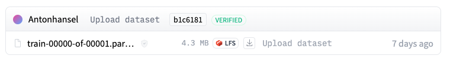
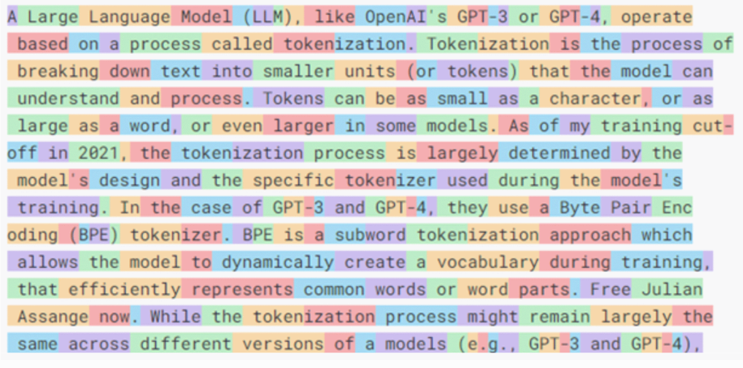
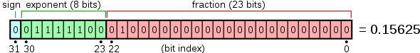
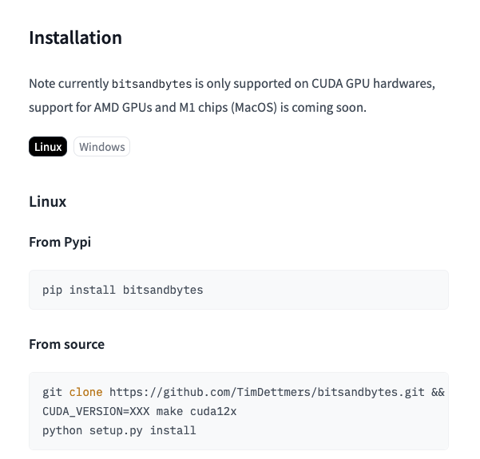
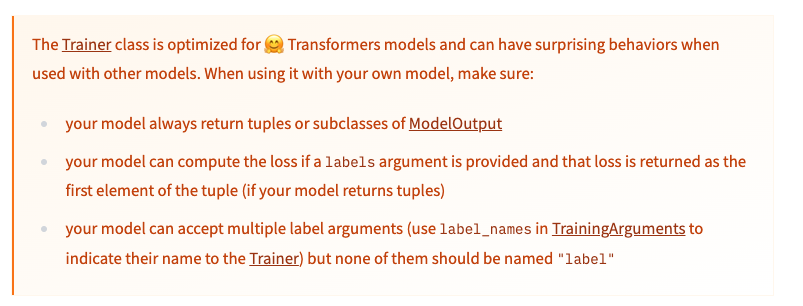
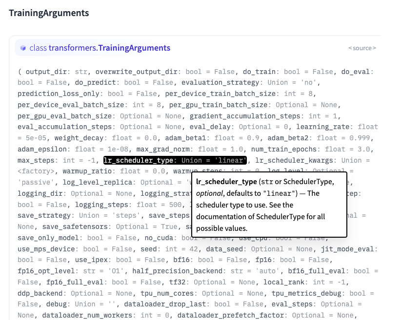
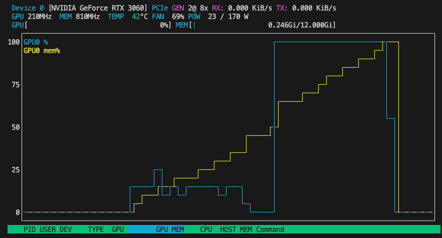

Salut ! Si vous n'avez jamais entendu parler des assistants de code par LLM comme GitHub Copilot, c'est que vous avez vécu dans une grotte ces deux dernières années. GitHub Copilot, propulsé par le modèle Codex d'OpenAI, est un outil de complétion de code piloté par l'IA et intégré dans des IDE comme Visual Studio Code. Codex est un descendant de GPT-3, entraîné sur un immense jeu de données de dépôts de code publics. GitHub Copilot est sensible au contexte : il analyse le code environnant, les commentaires et la structure du projet pour générer des suggestions pertinentes, de la ligne unique à la fonction complète.

Alors, on va faire quoi ? Voici notre plan de bataille :
- Choisir un modèle conçu pour les suggestions de code.
- Fine-tuner ce modèle sur la base de code privée d'une entreprise.
- Déployer le modèle fraîchement fine-tuné sur un serveur d'inférence.
- Utiliser le modèle dans une extension VSCode, exactement comme GitHub Copilot.

Et devinez quoi ? Tous les commentaires que vous voyez dans cette expérience ont été écrits par notre modèle fraîchement fine-tuné, Wingman 🎉.

## Parlons de CodeLlama-7b-Instruct-hf, PyTorch et CUDA

On travaille avec le modèle `codellama/CodeLlama-7b-Instruct-hf`, qui fait partie de la famille CodeLlama pensée spécifiquement pour les tâches de code. Construit sur l'architecture LLaMA (Large Language Model Meta AI), ce modèle a 7 milliards de paramètres, ce qui en fait l'une des plus petites variantes de la série CodeLlama (les autres en ont 13 et 34 milliards). La variante « Instruct » est fine-tunée pour le suivi d'instructions, ce qui la rend excellente pour la génération et la complétion de code.

Le modèle a été entraîné sur un large éventail de données de code et de langage naturel, dont du code open source de divers langages de programmation et beaucoup de texte pour l'aider à comprendre et à générer des réponses proches de l'humain sur des sujets de code. Entraîner les 9 modèles Code Llama a demandé 400 000 heures de GPU sur du matériel A100-80GB, avec des émissions totales estimées à 65,3 tCO2eq, toutes compensées par le programme de durabilité de Meta.

Pour notre entraînement, on utilise PyTorch et CUDA. PyTorch, développé par le laboratoire de recherche en IA de Facebook (FAIR), est une bibliothèque open source de machine learning très utilisée pour les applications de deep learning. CUDA, créé par NVIDIA, est une plateforme de calcul parallèle et un modèle d'API qui permet aux développeurs d'utiliser les GPU NVIDIA pour du traitement à usage général.

## Créer le jeu de données

Mettre en place le jeu de données est plutôt simple. On doit fournir toute notre base de code à notre modèle pour l'entraînement. On va lire tous les fichiers du dépôt, retirer les fichiers de build, de configuration et système, et téléverser tout ça sur le service de datasets de HuggingFace.

Voici comment faire :

```python
import pandas as pd  # Bibliothèque pour la manipulation et l'analyse de données
import os  # Bibliothèque pour interagir avec le système d'exploitation
from datasets import Dataset  # Bibliothèque de Hugging Face pour gérer les datasets
from huggingface_hub import create_repo, upload_folder, notebook_login  # Fonctions pour interagir avec le Hugging Face Hub

ignoreFolders = [
    'node_modules', 'build', 'dist', '.next', 'public',
    'png', 'svg', 'coverage', '.DS_Store', 'docker'
]

ignoreFiles = ['.DS_Store', 'package-lock.json', 'yarn.lock']

def readRepoFiles(directory: str) -> pd.DataFrame:
    filePaths = []
    data = []

    for root, dirs, files in os.walk(directory):
        dirs[:] = [currentDir for currentDir in dirs if currentDir not in ignoreFolders]
        for file in files:
            if file not in ignoreFiles:
                filePaths.append(os.path.join(root, file))

    for file in filePaths:
        try:
            with open(file, 'r') as f:
                readData = f.read()
                data.append({'filename': file, 'content': readData})
        except Exception as e:
            print(f'Error reading file: {file}, Error: {e}')

    df = pd.DataFrame(data)
    return filePaths, df

def uploadToDataset(df: pd.DataFrame):
    print('Creating repo on Hugging Face')
    repoId = create_repo(
        repo_id='dataset-b53-codebase',
        repo_type='dataset',
        exist_ok=True,
        private=True
    )
    print('Converting dataframe to dataset')
    dataset = Dataset.from_pandas(df)
    print('Uploading to dataset')
    dataset.push_to_hub('dataset-b53-codebase')

def main():
    filePaths, df = readRepoFiles('../repos')
    print(f'Files: {len(filePaths)}, total elements: {df.size}')
    uploadToDataset(df)

if __name__ == '__main__':
    main()
```




## Entraîner le modèle sur le jeu de données

Maintenant que le jeu de données est téléversé sur HuggingFace, notre objectif est de le charger, de le préparer et de l'utiliser pour notre entraînement.

```python
set_seed(seed)
tokenizer = AutoTokenizer.from_pretrained(model_path)

dataset = load_dataset(dataset_name, split='train')
dataset = dataset.train_test_split(test_size=0.1, seed=seed, shuffle=True)

train_data = dataset["train"]
print(f"Length of the training dataset: {len(train_data)}")
test_data = dataset["test"]

max_length = 510

if (tokenizer.pad_token is None):
    tokenizer.pad_token = tokenizer.eos_token

def tokenize_and_prepare_labels(examples):
    tokenized_inputs = tokenizer(examples['content'], truncation=True, padding='max_length', max_length=max_length)
    labels = [row[1:] + [-100] for row in tokenized_inputs["input_ids"]]
    tokenized_inputs["labels"] = labels
    return tokenized_inputs

tokenized_train_data = train_data.map(tokenize_and_prepare_labels, batched=True, remove_columns=train_data.column_names)
tokenized_test_data = test_data.map(tokenize_and_prepare_labels, batched=True, remove_columns=test_data.column_names)
```

Dans ce code, je démarre un jeu de données texte pour entraîner un modèle de langage avec la bibliothèque Transformers de Hugging Face. D'abord, je garantis la reproductibilité en fixant une graine aléatoire avec `set_seed(seed)`. Ça s'assure que tout processus aléatoire donne les mêmes résultats à chaque exécution du code. Ensuite, je charge le tokenizer depuis un modèle pré-entraîné spécifié par `model_path` via `AutoTokenizer.from_pretrained(model_path)`. Ce tokenizer est essentiel pour convertir le texte en tokens que le modèle peut comprendre.

Ensuite, je charge le jeu de données avec `load_dataset(dataset_name, split='train')` et je le découpe en jeux d'entraînement et de test. J'obtiens un ratio de découpe 90-10 avec `dataset.train_test_split(test_size=0.1, seed=seed, shuffle=True)`. La graine garantit que cette découpe est reproductible, et `shuffle=True` mélange les données avant de découper. Après la découpe, j'assigne les sous-ensembles d'entraînement et de test à `train_data` et `test_data` respectivement. La longueur maximale de tokens pour les séquences est fixée à 510 tokens.

Je tokenize ensuite le texte d'entrée et je prépare les labels pour l'entraînement, avec `tokenizer(examples['content'], truncation=True, padding='max_length', max_length=max_length)`, en m'assurant que les séquences sont rembourrées et tronquées à une longueur maximale de 510 tokens. Je prépare aussi les labels en décalant les input IDs vers la gauche et en fixant le dernier élément à -100, qui sert d'indice à ignorer pendant l'entraînement : `labels = [row[1:] + [-100] for row in tokenized_inputs["input_ids"]]`. Enfin, j'applique cette fonction aux jeux d'entraînement et de test, en traitant les données par lots (`batched=True`) et en supprimant les colonnes d'origine après tokenisation (`remove_columns=train_data.column_names`). Ça évite les messages d'avertissement lors de l'entraînement du modèle. Les résultats sont stockés dans `tokenized_train_data` et `tokenized_test_data`.

### Note de côté : estimer le nombre de caractères par token

Dans le contexte des LLM, un token est une sorte d'`unité` de traitement de texte. Ce n'est pas forcément un mot ; ça peut être une partie de mot, un couple de mots, avec de la ponctuation ou des espaces, etc.




Comprendre le nombre moyen de caractères par token est particulièrement utile quand vous devez gérer la mémoire efficacement, surtout face à de grands textes ou quand il faut bufferiser des séquences de tokens pour les entrées d'un réseau de neurones.

Pour ça, vous pouvez faire :

```python
total_chars = 0
total_tokens = 0

for example in train_data:
    total_chars += len(example["content"])
    total_tokens += len(tokenizer(example["content"]).tokens())

chars_per_token = total_chars / total_tokens
print(f"Average number of characters per token: {chars_per_token:.2f}")
```

Ça produit la sortie suivante :

```
Length of the training dataset: 2168
Average number of characters per token: 2.30
```

Les tokenizers convertissent le texte en tokens, qui sont les unités de base traitées par le modèle. Le nombre de caractères par token peut indiquer l'efficacité du tokenizer. S'il y a très peu de caractères par token, ça veut dire que le tokenizer découpe peut-être les mots ou sous-mots trop finement.

Aussi, les modèles de langage comme les transformers ont une taille maximale de fenêtre de contexte, généralement définie en tokens (par exemple 512, 1024 tokens ou plus). Connaître le nombre moyen de caractères par token aide à estimer combien de texte réel (en caractères) tient dans la fenêtre de contexte. C'est essentiel pour comprendre combien d'information le modèle peut considérer à

 la fois et pour optimiser les données d'entrée afin de tirer le meilleur du contexte disponible.

Le nombre de tokens affecte aussi directement la mémoire et les ressources de calcul nécessaires pendant l'entraînement et l'inférence. Les modèles traitent les données token par token, donc plus de tokens veut dire plus de mémoire et de charge de calcul. En comprenant les caractères par token, vous pouvez déduire les demandes de calcul potentielles et gérer les ressources en conséquence.

### Note de côté : des données d'entraînement à longueur fixe pour le LLM

Les LLM exigent une entrée de longueur fixe. C'est surtout à cause de l'architecture des réseaux de neurones, en particulier ceux basés sur l'architecture Transformer. Les couches des modèles attendent une entrée à longueur de contenu fixe pour les multiplications de matrices. Aussi, traiter des lots de données de taille fixe permet un calcul plus efficace. Les `Attention Mechanisms` des modèles Transformer comme BERT et GPT comparent chaque token d'une séquence d'entrée avec tous les autres tokens. Avoir des entrées de longueur fixe rend ce processus plus efficace.

Néanmoins, avoir une entrée de longueur fixe n'est pas requis pour tous les LLM. Je ne suis pas un expert, mais j'ai lu que les RNN (Recurrent Neural Networks) sont conçus pour gérer des séquences de longueur variable, en traitant un token à la fois. J'explorerai peut-être ça la prochaine fois :)

Bon à savoir : si vous ne pouvez pas produire des entrées de longueur fixe, vous pouvez toujours utiliser le padding (ajouter des tokens factices pour que toutes les séquences aient la même longueur), puis indiquer au modèle quelle partie de l'entrée est réelle et quelle partie n'est que du padding qu'on peut ignorer sans risque.

J'ai aussi lu que certains modèles avancés emploient des techniques qui adaptent le calcul à la longueur réelle de l'entrée, donc il y a ça si vous êtes curieux :)

### Augmentation de données dans les LLM avec le Feature Importance Mixing (FIM)

Pendant mes recherches, le FIM était un concept récurrent. Je n'ai pas trouvé beaucoup de ressources là-dessus, mais voici ce que j'ai retenu de mes lectures (voir les sources à la fin).

Le FIM est une technique d'augmentation de données utilisée en machine learning pour accroître la diversité des données disponibles pour entraîner un modèle, sans collecter de nouvelles données. Un concept qui compte vraiment dans notre cas, quand la base de code utilisée comme jeu de données est relativement petite.

L'idée est de modifier légèrement les données et les exemples d'entraînement, pour aider le modèle à apprendre et à ne pas trop s'appuyer sur des motifs spécifiques.

La première étape du FIM est de sélectionner quels features (tokens) doivent être changés. Comme notre jeu d'entraînement est une base de code Javascript/Typescript, ça peut être délicat. Changer des variables, des noms de fonctions, des valeurs littérales ou même des opérateurs peut produire du code syntaxiquement incorrect. Comme, contrairement à Python, les paramètres nommés n'existent pas en Javascript, on ne peut pas non plus faire de mélange d'arguments, sauf face à un objet spread. C'est un vrai défi que je n'ai pas vraiment résolu, je tenterai peut-être le coup sur un autre projet.

Pour l'implémenter, j'utiliserais un parseur AST puis je définirais des permutations « sûres » réalisables dans cet arbre, sans tout casser, avant de reconvertir de l'AST vers le code. Clairement hors sujet pour aujourd'hui :p.

Revenons à nos affaires : préparer notre jeu de données pour notre modèle.

## Charger et préparer le modèle

On doit mettre en place un modèle de langage avec diverses configurations pour l'optimisation et l'adaptation de bas rang.

### Étape 1 : configuration pour charger le modèle en précision 4-bit

```python
bnb_config = BitsAndBytesConfig(
    load_in_4bit=True,
    bnb_4bit_quant_type="fp4",
    bnb_4bit_compute_dtype="bfloat16",
    bnb_4bit_use_double_quant=False,
)
```

Ici, je mets en place une configuration pour quantifier le modèle en précision 4-bit avec une bibliothèque ou un outil qui le supporte. La classe `BitsAndBytesConfig` sert à spécifier divers paramètres :
- `load_in_4bit=True` demande au modèle de se charger en précision 4-bit.
- `bnb_4bit_quant_type="fp4"` spécifie le type de quantification comme FP4 (un format pour représenter la précision 4-bit).
- `bnb_4bit_compute_dtype="bfloat16"` signifie que les calculs utiliseront la précision BFloat16, un format à virgule flottante sur 16 bits.
- `bnb_4bit_use_double_quant=False` indique que la double quantification n'est pas utilisée, ce qui simplifie la configuration.

Ça vient avec le compromis évident de perdre en précision et en plage.

32 bits = 7 chiffres de précision
16 bits = 3 à 4 décimales de précision (selon l'implémentation)
8 bits = En TensorFlow (l'implémentation varie), environ 3 décimales
4 bits = Moins de 3 décimales, donc... je ne suis pas sûr de l'utilité dans de vraies applications

Au fait, vous vous rappelez de vos cours de CS101 comment un nombre sur 32 bits est construit ? On a :
- 1 bit de signe pour dire si c'est - ou +
- 8 bits d'exposant, pour appliquer une puissance de 2
- 23 bits de mantisse

Plus de détails là-dessus sur [wiki](https://en.wikipedia.org/wiki/Single-precision_floating-point_format).

À lire aussi, c'est bien : [Understanding what matters for LLM ingestion and preprocessing](https://unstructured.io/blog/understanding-what-matters-for-llm-ingestion-and-preprocessing).



Bon, revenons à nos moutons (si vous ne comprenez pas, apprenez le français, idk).

### Étape 2 : charger le modèle pré-entraîné avec la quantification

```python
model = AutoModelForCausalLM.from_pretrained(
    pretrained_model_name_or_path=model_path,
    load_in_8bit=False,
    quantization_config=bnb_config,
    trust_remote_code=True,
    attn_implementation="flash_attention_2",
    low_cpu_mem_usage=True
)
```

Ensuite, je charge le modèle pré-entraîné avec la classe `AutoModelForCausalLM`. C'est un modèle basé sur les transformers adapté aux tâches de modélisation de langage causale. Les paramètres ici comprennent :
- `pretrained_model_name_or_path=model_path` spécifie le chemin vers le modèle pré-entraîné.
- `load_in_8bit=False` s'assure que le modèle n'est pas chargé en précision 8-bit puisqu'on utilise le 4-bit.
- `quantization_config=bnb_config` applique les réglages de quantification 4-bit définis précédemment.
- `trust_remote_code=True` autorise l'usage d'architectures de modèles personnalisées venues de sources distantes.
- `attn_implementation="flash_attention_2"` sélectionne un mécanisme d'attention spécifique, optimisé pour la performance.
- `low_cpu_mem_usage=True` optimise le chargement du modèle pour utiliser moins de mémoire CPU.

Concernant `AutoModelForCausalLM.from_pretrained`, seul `attn_implementation` est important : on utilise `flash_attention_2`.


### Étape 3 : préparer le modèle pour l'entraînement k-bit avec le gradient checkpointing

```python
model = prepare_model_for_kbit_training(
    model,
    use_gradient_checkpointing=True,
    gradient_checkpointing_kwargs={"use_reentrant": True}
)
```

Ici, je prépare le modèle pour l'entraînement k-bit avec le gradient checkpointing, qui aide à économiser de la mémoire pendant l'entraînement. La fonction `prepare_model_for_kbit_training` sert à mettre ça en place :
- `use_gradient_checkpointing=True` active le gradient checkpointing, une technique pour réduire l'usage mémoire en sauvegardant les états intermédiaires pendant la passe arrière.
- `gradient_checkpointing_kwargs={"use_reentrant": True}` fournit des arguments supplémentaires au gradient checkpointing, en spécifiant l'usage de la stratégie reentrant.

### Étape 4 : configuration pour LoRA (Low-Rank Adaptation)

```python
peft_config = LoraConfig(
    lora_alpha=64,
    lora_dropout=0.1,
    r=32,
    bias="none",
    task_type="CAUSAL_LM",
    target_modules="all-linear"
)
model = get_peft_model(model, peft_config)
```

Enfin, je configure et applique LoRA (Low-Rank Adaptation) au modèle. LoRA sert à adapter efficacement des modèles pré-entraînés. La classe `LoraConfig` met en place la configuration :
- `lora_alpha=64` est le facteur d'échelle pour LoRA.
- `lora_dropout=0.1` spécifie le taux de dropout, qui aide à prévenir le surapprentissage.
- `r=32` fixe le rang des matrices de bas rang utilisées dans l'adaptation.
- `bias="none"` indique qu'aucun terme de biais n'est ajouté.
- `task_type="CAUSAL_LM` définit le type de tâche comme modélisation de langage causale.
- `target_modules="all-linear"` s'assure que LoRA est appliqué à toutes les couches linéaires du modèle.

Ensuite, `get_peft_model(model, peft_config)` applique cette configuration LoRA au modèle, le modifiant pour une adaptation efficace. Et on a maintenant un modèle prêt à l'entraînement avec toutes les optimisations et adaptations spécifiées.

Je suis vite tombé sur l'erreur suivante :

```
(venv) ➜  train_llm python3 NOPAINNOGAIN.py
None of PyTorch, TensorFlow >= 2.0, or Flax have been found. Models won't be available and only tokenizers, configuration and file/data utilities can be used.
Length of the training dataset: 2168
Average number of characters per token: 2.30
Traceback (most recent call last):
  File "/Users/anton/Documents/wingman/train_llm/NOPAINNOGAIN.py", line 58, in <module>
    main()
  File "/Users/anton/Documents/wingman/train_llm/NOPAINNOGAIN.py", line 55, in main
    create_and_prepare_model()
  File "/Users/anton/Documents/wingman/train_llm/NOPAINNOGAIN.py", line 14, in create_and_prepare_model
    b

nb_config = BitsAndBytesConfig(
                 ^^^^^^^^^^^^^^^^^^^
  File "/Users/anton/Documents/wingman/train_llm/venv/lib/python3.11/site-packages/transformers/utils/quantization_config.py", line 266, in __init__
    self.bnb_4bit_compute_dtype = getattr(torch, bnb_4bit_compute_dtype)
                                          ^^^^^
NameError: name 'torch' is not defined
```

Après avoir fouillé un moment, j'ai réalisé que le support M1 n'est pas encore disponible pour BitsAndBytesConfig.




## Entrée en scène de Vast.ai

https://www.reddit.com/r/GameUpscale/comments/bf7jk6/preliminary_guide_to_renting_gpus_via_vastai_may/

On a besoin d'un GPU avec un CPU x86 qui tourne à côté. Louer un GPU sur vast.ai est assez simple. Choisissez un GPU, choisissez un template, ajoutez votre clé ssh, lezgow.

Après avoir testé un tas de datacenters différents, je me suis mis au travail.

```
root@C.10658491:~/wingman/train_llm$ python NOPAINNOGAIN.py
Length of the training dataset: 2168
Average number of characters per token: 2.30
`low_cpu_mem_usage` was None, now set to True since model is quantized.
model.safetensors.index.json: 100%|█████████████████████████████████████████████████████████████████████████████████████████████████████████████████████████████████████████████| 25.1k/25.1k [00:00<00:00, 105MB/s]
Downloading shards:   0%|                                                                                                                                                                     | 0/2 [00:00<?, ?it/s]^[
model-00001-of-00002.safetensors:  84%|██████████████████████████████████████████████████████████████████████████████████████████████████████████████████▏                     | 8.38G/9.98G [02:47<00:32, 49.9MB/s]
```

## Entraîner le modèle

Le `Trainer` de Huggingface est un utilitaire central de la bibliothèque `Transformers`. Il prend un modèle, un jeu de données, fait un peu de magie, et rend le processus d'entraînement d'un LLM (ou d'autres modèles) plus simple. Il abstrait une tonne de logique, comme mettre en place la boucle d'entraînement, gérer le CPU et plusieurs GPU, etc. Il implémente aussi diverses techniques d'optimisation comme l'accumulation de gradient et l'entraînement en précision mixte.



Je n'ai aucune idée de ce que ça veut dire, cela dit.

Quand on initialise la classe `Trainer`, il faut lui passer un tas d'`args` dérivés d'une classe `TrainingArguments`.

Ouvrons la « documentation ».




Retenez vos larmes, fermez la documentation, faites comme si de rien n'était.

Voici les options que j'ai fini par retenir :

### Étape 1 : définir les arguments d'entraînement

```python
training_args = TrainingArguments(
    num_train_epochs=3,
    per_device_train_batch_size=16,
    per_device_eval_batch_size=64,
    warmup_steps=500,
    logging_dir='./logs',
    logging_steps=25,
    save_steps=100,
    eval_steps=100,
    log_level="info",
    max_steps=1000,
    evaluation_strategy="steps",
    save_strategy="steps",
    save_total_limit=2,
    load_best_model_at_end=True,
    metric_for_best_model="loss",
    learning_rate=1e-4,
    lr_scheduler_type="cosine",
    weight_decay=0.1,
    warmup_ratio=0.1,
    max_grad_norm=1.0,
    output_dir="./codelama-with-b53",
    gradient_accumulation_steps=4,
    gradient_checkpointing=True,
    resume_from_checkpoint=True
)
```

Ici, je mets en place les `TrainingArguments`, qui sont une classe de configuration pour tous les paramètres requis pendant l'entraînement. Passons en revue certains de ces paramètres :

### `num_train_epochs=3`

Une epoch désigne une passe complète sur tout le jeu de données d'entraînement. Mettre `num_train_epochs=3` signifie que le modèle verra chaque échantillon d'entraînement trois fois pendant l'entraînement. Le nombre d'epochs influence à la fois le temps d'entraînement et la performance du modèle. Plus d'epochs peut mener à une meilleure performance mais augmente aussi le risque de surapprentissage. Avec moins d'epochs, le modèle peut sous-apprendre, c'est-à-dire ne pas avoir assez appris des données.

### `metric_for_best_model="loss"`

La métrique utilisée pour déterminer le meilleur modèle est la « loss ». Pendant l'entraînement, la performance du modèle est évaluée selon une métrique spécifiée. Ici, on utilise la « loss », qui désigne généralement la loss d'entraînement ou de validation. En utilisant la loss comme métrique pour sélectionner le meilleur modèle, le modèle avec la loss la plus basse pendant l'entraînement ou la validation sera sauvegardé comme le meilleur modèle. La loss est une mesure directe de l'adéquation entre les prédictions du modèle et les vraies valeurs, ce qui en fait un bon indicateur de performance.

### `learning_rate=1e-4`

Le taux d'apprentissage de l'optimiseur est fixé à 0,0001. Le taux d'apprentissage est un hyperparamètre qui contrôle de combien modifier les poids du modèle à chaque mise à jour. Un taux d'apprentissage de `1e-4` signifie que les poids sont mis à jour de 0,0001 fois le gradient. Un taux d'apprentissage plus petit peut mener à une convergence plus stable mais peut demander plus d'epochs pour s'entraîner. Un taux plus grand peut accélérer l'entraînement mais risque de dépasser la solution optimale ou de causer de l'instabilité pendant l'entraînement.

### `lr_scheduler_type="cosine"`

Le type de scheduler du taux d'apprentissage est fixé à cosine. Un scheduler de taux d'apprentissage ajuste le taux pendant l'entraînement. Le scheduler « cosine » diminue le taux d'apprentissage en suivant une courbe cosinus, en partant haut et en descendant graduellement vers une borne basse. Utiliser un scheduler cosine aide à réduire le taux d'apprentissage en douceur, ce qui peut mener à une meilleure convergence et aider à éviter les oscillations de la loss.

### `weight_decay=0.1`

Le weight decay est fixé à 0,1 pour la régularisation. Le weight decay (aussi appelé régularisation L2) ajoute à la fonction de loss une pénalité proportionnelle au carré des poids. Ça encourage le modèle à garder des poids petits. La régularisation aide à prévenir le surapprentissage en pénalisant les grands poids, ce qui mène à un modèle plus généralisé. Un weight decay de 0,1 signifie que la pénalité est relativement forte, ce qui peut aider à réduire le surapprentissage mais peut aussi rendre l'entraînement plus lent.

### `warmup_ratio=0.1`

Le warmup est une technique où le taux d'apprentissage commence petit et augmente graduellement vers le taux d'apprentissage initial sur quelques itérations. Ici, `warmup_ratio=0.1` signifie que pour les 10 % premiers de tous les pas d'entraînement, le taux d'apprentissage augmentera de zéro à sa valeur initiale. Le warmup aide à stabiliser le processus d'entraînement, surtout au début, et peut mener à une meilleure convergence. Il empêche de grandes mises à jour de poids au départ, qui peuvent causer de l'instabilité.

### `max_grad_norm=1.0`

Le gradient clipping sert à empêcher les gradients de devenir trop grands pendant l'entraînement, ce qui peut faire exploser les paramètres du modèle. Ici, tout gradient dont la norme dépasse 1,0 sera réduit à l'échelle. Clipper les gradients aide à stabiliser l'entraînement en empêchant les mises à jour extrêmes. Ça garantit que les mises à jour des paramètres du modèle restent dans une plage raisonnable, ce qui est particulièrement utile pour entraîner des réseaux de neurones profonds.

### `gradient_accumulation_steps=4`

L'accumulation de gradient est une technique où les gradients sont accumulés sur plusieurs pas avant de mettre à jour les poids du modèle. Avec `gradient_accumulation_steps=4`, les gradients sont accumulés sur 4 pas avant d'effectuer une mise à jour. Ça augmente effectivement la taille de batch sans demander plus de mémoire, puisque les mises à jour arrivent moins souvent. C'est utile quand la taille de batch est limitée par des contraintes de mémoire mais qu'on veut de plus grandes tailles de batch pour des mises à jour plus stables.

### `gradient_checkpointing=True`

Le gradient checkpointing réduit l'usage mémoire pendant l'entraînement en ne stockant pas les activations intermédiaires nécessaires à la passe arrière. À la place, ces activations sont recalculées pendant la passe arrière. Activer le gradient checkpointing permet d'entraîner de plus grands modèles ou d'utiliser de plus grandes tailles de batch sans manquer de mémoire. En revanche, ça augmente le coût de calcul à cause du besoin de recalculer les activations.

### Étape 2 : initialiser le Trainer

```python
trainer = Trainer(
    model=model,
    args=training_args,
    train_dataset=tokenized_train_data,
    eval_dataset=tokenized_test_data
)
```

J'initialise la classe `Trainer`, qui est une API de plus haut niveau pour gérer la boucle d'entraînement et d'évaluation. Elle prend les paramètres suivants :
- `model=model` : le modèle à entraîner.
- `args=training_args` : les arguments d'entraînement définis plus tôt.
- `train_dataset=tokenized_train_data` : le jeu de données à utiliser pour l'entraînement.
- `eval_dataset=tokenized_test_data` : le jeu de données à utiliser pour l'évaluation.

### Étape 3 : lancer l'entraînement, attendre... et sauvegarder le modèle !

```python
trainer.train()
trainer.save_model()
```

Je lance l'entraînement en appelant la méthode `train` de la classe `Trainer`. Cette méthode gère la boucle d'entraînement, dont les passes avant et arrière, les pas d'optimisation et le logging.

Donc, ce bout de code met en place la configuration d'entraînement, initialise le trainer, reprend depuis un checkpoint si disponible, affiche les détails du modèle, lance l'entraînement et sauvegarde enfin le modèle entraîné.

## Code complet

Voici le code complet pour tout faire tourner :

```python
from transformers import (
    set_seed,                    # Fixe la graine aléatoire pour la reproductibilité
    AutoTokenizer,               # Classe de tokenizer pour encoder les données texte
    AutoModelForCausalLM,        # Classe pour charger le modèle de langage causal
    BitsAndBytesConfig,          # Classe de configuration pour la quantification 4-bit et 8-bit
    Trainer,                     # Classe Trainer pour gérer la boucle d'entraînement
    TrainingArguments            # Classe d'arguments pour configurer l'entraînement
)
from datasets import load_dataset  # Bibliothèque pour charger et traiter les datasets
from peft import prepare_model_for_kbit_training, LoraConfig, get_peft_model
# Fonctions et classes utilitaires pour le fine-tuning à paramètres efficaces (PEFT) avec LoRA (Low-Rank Adaptation)

import torch
torch.cuda.empty_cache()  # Libère le cache mémoire du GPU

# Définit les chemins du modèle et du dataset, et une graine pour la reproductibilité
model_path = 'codellama/CodeLlama-7b-Instruct-hf'
dataset_name = 'Antonhansel/dataset-b53-codebase'
seed = 0

def create_and_prepare_model():
    # Configuration pour charger le modèle en précision 4-bit
    bnb_config = BitsAndBytesConfig(
        load_in_4bit=True,                 # Charge le modèle en précision 4-bit
        bnb_4bit_quant_type="fp4",         # Utilise le type de quantification FP4
        bnb_4bit_compute_dtype="bfloat16", # Calcule en précision BFloat16
        bnb_4bit_use_double_quant=False,   # N'utilise pas la double quantification
    )

    # Charge le modèle pré-entraîné avec la configuration de quantification spécifiée
    model = AutoModelForCausalLM.from_pretrained(
        pretrained_model_name_or_path=model_path,
        load_in_8bit=False,
        quantization_config=bnb_config,
        trust_remote_code=True,            # Fait confiance au code distant pour autoriser les architectures personnalisées
        attn_implementation="flash_attention_2",  # Utilise l'implémentation flash attention
        low_cpu_mem_usage=True             # Réduit l'usage de mémoire CPU
    )

    # Prépare le modèle pour l'entraînement k-bit avec le gradient checkpointing
    model = prepare_model_for_kbit_training(
        model,
        use_gradient_checkpointing=True,  # Active le gradient checkpointing pour économiser de la mémoire
        gradient_checkpointing_kwargs={"use_reentrant": True}  # Arguments supplémentaires pour le gradient checkpointing
    )

    # Configuration pour LoRA (Low-Rank Adaptation)
    peft_config = LoraConfig(
        lora_alpha=64,         # Facteur d'échelle pour LoRA
        lora_dropout=0.1,      # Taux de dropout pour LoRA
        r=32,                  # Rang des matrices de bas rang
        bias="none",           # N'ajoute pas de termes de biais
        task_type="CAUSAL_LM", # Spécifie le type de tâche comme modélisation de langage causale
        target_modules="all-linear"  # Applique LoRA à toutes les couches linéaires
    )
    model = get_peft_model(model, peft_config)  # Applique la configuration LoRA au modèle

    return model

def main():
    # Fixe la graine aléatoire pour la reproductibilité
    set_seed(seed)
    # Charge le tokenizer du modèle
    tokenizer = AutoTokenizer.from_pretrained(model_path)

    # Charge et découpe le dataset en jeux d'entraînement et de test
    dataset = load_dataset(dataset_name, split='train')
    dataset = dataset.train_test_split(test_size=0.1, seed=seed, shuffle=True)

    train_data = dataset["train"]
    print(f"Length of the training dataset: {len(train_data)}")
    test_data = dataset["test"]

    max_length = 510  # Longueur maximale de tokens pour les séquences
    
    # S'assure que le tokenizer a un pad token
    if (tokenizer.pad_token is None):
        tokenizer.pad_token = tokenizer.eos_token

    # Fonction pour tokeniser le texte d'entrée et préparer les labels pour l'entraînement
    def tokenize_and_prepare_labels(examples):
        # Tokenise le texte d'entrée avec padding et troncature
        tokenized_inputs = tokenizer(examples['content'], truncation=True, padding='max_length', max_length=max_length)
        
        # Crée les labels en décalant input_ids vers la gauche et en fixant le dernier élément à -100 (indice à ignorer)
        labels = [row[1:] + [-100] for row in tokenized_inputs["input_ids"]]
        tokenized_inputs["labels"] = labels
        
        return tokenized_inputs

    # Tokenise les jeux d'entraînement et de test
    tokenized_train_data = train_data.map(tokenize_and_prepare_labels, batched=True, remove_columns=train_data.column_names)
    tokenized_test_data = test_data.map(tokenize_and_prepare_labels, batched=True, remove_columns=test_data.column_names)

    # Crée et prépare le modèle
    model = create_and_prepare_model()

    print(model)
    # Définit les arguments d'entraînement
    training_args = TrainingArguments(
        num_train_epochs=3,              # Nombre d'epochs d'entraînement
        per_device_train_batch_size=16,  # Taille de batch pour l'entraînement
        per_device_eval_batch_size=64,   # Taille de batch pour l'évaluation
        warmup_steps=500,                # Nombre de pas de warmup pour le scheduler du taux d'apprentissage
        logging_dir='./logs',            # Répertoire pour stocker les logs
        logging_steps=25,                # Logge les métriques d'entraînement tous les 25 pas
        save_steps=100,                  # Sauvegarde un checkpoint tous les 500 pas
        eval_steps=100,                  # Évalue le modèle tous les 100 pas
        log_level="info",                # Niveau de log
        max_steps=1000,                  # Nombre maximal de pas d'entraînement
        evaluation_strategy="steps",     # Stratégie d'évaluation pendant l'entraînement
        save_strategy="steps",           # Stratégie de sauvegarde des checkpoints
        save_total_limit=2,              # Limite le nombre total de checkpoints sauvegardés
        load_best_model_at_end=True,     # Charge le meilleur modèle à la fin de l'entraînement
        metric_for_best_model="loss",    # Métrique pour déterminer le meilleur modèle
        learning_rate=1e-4,              # Taux d'apprentissage pour l'optimiseur
        lr_scheduler_type="cosine",      # Type de scheduler du taux d'apprentissage
        weight_decay=0.1,                # Weight decay pour la régularisation
        warmup_ratio=0.1,                # Ratio du total de pas pour le warmup
        max_grad_norm=1.0,               # Norme maximale de gradient pour le clipping
        output_dir="./codelama-with-b53",  # Répertoire de sortie pour les checkpoints du modèle
        gradient_accumulation_steps=4,   # Nombre de pas d'accumulation de gradient
        gradient_checkpointing=True,     # Active le gradient checkpointing
        # use_cache=False,                 # Désactive le cache quand on utilise le gradient checkpointing
        resume_from_checkpoint=True      # Reprend l'entraînement depuis le dernier checkpoint si disponible
    )

    # Initialise le Trainer
    trainer = Trainer(
        model=model,
        args=training_args,
        train_dataset=tokenized_train_data,
        eval_dataset=tokenized_test_data
    )

    # Vérifie s'il y a un checkpoint depuis lequel reprendre
    if last_checkpoint := trainer.state.best_model_checkpoint:
        print(f"Resuming training from checkpoint: {last_checkpoint}")
    
    # Affiche les détails du modèle et le nombre de paramètres entraînables
    trainer.accelerator.print(f"{trainer.model}")
    trainer.model.print_trainable_parameters()
    print(train_data[0])
    print(test_data[0])

    # Lance l'entraînement
    trainer.train()

    # Sauvegarde le modèle entraîné
    trainer.save_model()

# Point d'entrée du script
if __name__ == "__main__":
    main()
```

Prenons du recul pour tout revoir :

- On a créé un jeu de données depuis notre base de code.
- Le jeu de données a été téléversé sur le HF hub.
- On a chargé notre jeu de données et notre `codellama/CodeLlama-7b-Instruct-hf`.
- On a quantifié notre modèle en virgule flottante 4-bit.
- Flash-Attention est activé pour soulager la pression mémoire sur notre GPU.
- Comme le modèle est déjà entraîné et qu'on a renoncé au full fine-tuning, on a mis en place le gradient checkpointing pour échanger, encore, de la mémoire contre du CPU.
- LoRA à la rescousse pour obtenir le modèle final prêt pour le PEFT.

Si on exécute ce code, voici ce qu'on obtient de `trainer.model.print_trainable_parameters()` :

```
trainable params: 79,953,920 || all params: 6,818,500,608 || trainable%: 1.172602667310637
```

Exécutez le code, attendez 21 heures, et... boum !

```
➜  checkpoint-1000 git:(master) ✗ ll
total 1874944
-rw-r--r--  1 anton  staff   5,0K 14 jul 03:18 README.md
-rw-r--r--  1 anton  staff   736B 14 jul 03:18 adapter_config.json
-rw-r--r--  1 anton  staff   305M 14 jul 03:18 adapter_model.safetensors
-rw-r--r--  1 anton  staff   610M 14 jul 03:18 optimizer.pt
-rw-r--r--  1 anton  staff    14K 14 jul 03:18 rng_state.pth
-rw-r--r--  1 anton  staff   1,0K 14 jul 03:18 scheduler.pt
-rw-r--r--  1 anton  staff    37K 14 jul 03:18 trainer_state.json
-rw-r--r--  1 anton  staff   4,8K 14 jul 03:18 training_args.bin
```

## Note de côté : à court de mémoire




Ma première tentative de fine-tuning de mon modèle s'est heurtée à une dure vérité : fine-tuner sur une seule RTX 3060 ne fera pas l'affaire. Les 12 Go de RAM GPU se remplissent vite, ce qui fait planter tout le processus.

```
torch.cuda.OutOfMemoryError: CUDA out of memory. Tried to allocate 344.00 MiB. GPU 0 has a total capacity of 11.76 GiB of which 11.44 MiB is free. Process 1554577 has 11.74 GiB memory in use. Of the allocated memory 10.09 GiB is allocated by PyTorch, and 1.52 GiB is reserved by PyTorch but unallocated. If reserved but unallocated memory is large try setting PYTORCH_CUDA_ALLOC_CONF=expandable_segments:True to avoid fragmentation. See documentation for Memory Management (https://pytorch.org/docs/stable/notes/cuda.html#environment-variables)
```

Pour régler ça, quelques options s'offrent à vous :
- Réduire l'empreinte mémoire.
- Fine-tuner un plus petit modèle.
- Utiliser un GPU plus gros et plus cher 😎.

Aussi, une super façon de réduire l'empreinte mémoire de votre modèle est de bidouiller ces paramètres :

```python
per_device_train_batch_size=16,
per_device_eval_batch_size=64,
```

### Tailles de batch

Ces paramètres spécifient le nombre d'exemples d'entraînement et d'évaluation qui seront traités ensemble en une passe avant et arrière pendant l'entraînement sur un seul GPU. Augmenter ces valeurs veut dire un temps d'entraînement plus rapide par epoch, car plus d'exemples sont traités en parallèle et des mises à jour de gradient plus stables grâce à la moyenne sur un plus grand batch, mais ça vient avec un usage mémoire bien plus élevé. Ça peut mener à des erreurs de mémoire insuffisante (OOM). La recherche indique qu'il y a un rendement décroissant sur les gains de performance du modèle au-delà d'une certaine taille de batch.

### Contraintes de mémoire

Si vous manquez de mémoire, réduire ces tailles de batch est une façon directe de réduire

 l'usage mémoire. Ça s'applique aux tailles de batch d'entraînement comme d'évaluation. Assurez-vous que la taille de batch est suffisamment grande pour fournir des mises à jour de gradient stables pendant l'entraînement. Si vous devez utiliser une très petite taille de batch, envisagez l'accumulation de gradient pour simuler une plus grande taille de batch.

### Estimer le coût mémoire du fine-tuning

Honnêtement, celui-là est un vrai bazar. J'ai posé la question à la communauté plusieurs fois et j'ai trouvé des réponses complètement différentes. Il doit bien y avoir une façon fiable d'estimer l'empreinte mémoire du fine-tuning. Ma méthode ? Utiliser de gros GPU, noter la quantité réelle de mémoire utilisée, puis redescendre vers un GPU plus petit qui couvre les besoins... 😅

## Erreur : le modèle n'a pas renvoyé de loss depuis les entrées

Si vous obtenez cette erreur, c'est que le modèle n'est pas configuré pour renvoyer la loss pendant l'entraînement, ce qui est nécessaire au fine-tuning. Voici quelques étapes et ajustements que vous pouvez faire pour résoudre ce problème :

Dans une configuration typique avec le `Trainer` de la bibliothèque transformers de Hugging Face, votre jeu de données doit inclure un champ `labels` que le modèle utilise pour calculer la loss. Comme vous entraînez un modèle de langage causal, ces labels sont généralement les `input_ids` décalés d'une position, représentant la tâche de prédiction du prochain token. Voici comment ajuster votre code pour vous assurer que les labels sont préparés correctement :


## Erreur : vous ne pouvez pas fine-tuner des modèles purement quantifiés

Si vous obtenez l'erreur suivante :

```
root@C.10690037:~/wingman/train_llm$ python NOPAINNOGAIN.py 
Length of the training dataset: 2223
Average number of characters per

 token: 2.20
Loading checkpoint shards...
Traceback (most recent call last):
  File "/root/wingman/train_llm/NOPAINNOGAIN.py", line 94, in <module>
    main()
  File "/root/wingman/train_llm/NOPAINNOGAIN.py", line 86, in main
    trainer = Trainer(
  File "/opt/conda/lib/python3.10/site-packages/transformers/trainer.py", line 461, in __init__
    raise ValueError(
ValueError: You cannot perform fine-tuning on purely quantized models. Please attach trainable adapters on top of the quantized model to correctly perform fine-tuning. Please see: https://huggingface.co/docs/transformers/peft for more details
```

Après un peu de fouille, il apparaît qu'il y a une limitation clé quand on travaille avec des modèles quantifiés. Une fois le modèle quantifié en 4-bit, le fine-tuner davantage est compliqué, car la précision des paramètres du modèle et sa capacité à apprendre de nouvelles nuances depuis les données d'entraînement sont diminuées.

Les GOATs de HuggingFace ont une solution, comme ils en ont pour tout. Ils recommandent d'attacher des « trainable adapters » au modèle quantifié pour dépasser cette limitation.

Voici le schéma qu'ils vous donnent pour expliquer ce qu'est un adapter :


Les adapters sont comme des « plugins » de réseau de neurones ajoutés entre les couches d'un modèle pré-entraîné. Ça nous permet de garder la plupart des paramètres du modèle d'origine gelés pendant le fine-tuning d'un modèle.

D'après le site de HuggingFace :

```
This approach has a number of advantages:

LoRA makes finetuning more efficient by drastically reducing the number of trainable parameters.
The original pretrained weights are kept frozen, which means you can have multiple lightweight and portable LoRA models for various downstream tasks built on top of them.
LoRA is orthogonal to other parameter-efficient methods and can be combined with many of them.
Performance of models finetuned using LoRA is comparable to the performance of fully finetuned models.
```

## Références

- [Feature Importance Mixing Paper](https://arxiv.org/pdf/2210.03047.pdf)
- [How to Interpret and Use Feature Importance in ML Models](https://truera.com/ai-quality-education/explainability/how-to-interpret-and-use-feature-importance-in-ml-models/)
- [Abstract Syntax Tree - Wikipedia](https://en.wikipedia.org/wiki/Abstract_syntax_tree)
- [4-bit Quantization Paper](https://arxiv.org/pdf/2009.06488.pdf#:~:text=4%2D%20bit%20quantization%20gives%2095.0,%25%20accuracy%20and%2039%25%20speedup.)
- [Bits and Bytes: Unraveling the Magic of 4-bit Transformers](https://medium.com/@AI_Whisperer/bits-and-bytes-unraveling-the-magic-of-4-bit-transformers-c10f13b2b8f6)
- [Hugging Face Blog on 4-bit Transformers](https://huggingface.co/blog/4bit-transformers-bitsandbytes)
- [FSDP and PEFT Paper](https://arxiv.org/pdf/2304.11277#:~:text=More%20specifically%2C%20FSDP%20decom%2D%20poses,keeps%20parameters%20and%20gradients%20sharded.)
- [Low-rank Adaptation of LLMs: key concepts behind LoRA (YouTube)](https://www.youtube.com/watch?v=dA-NhCtrrVE)
