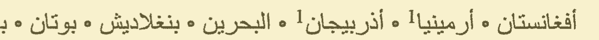
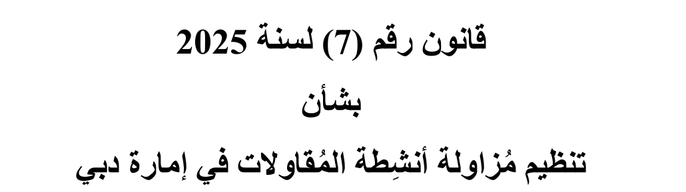
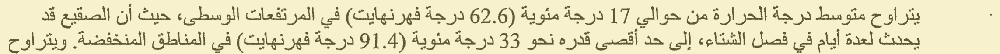
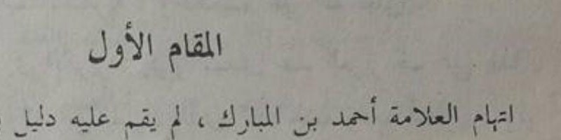
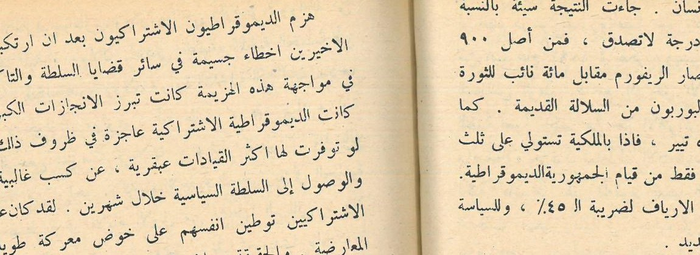

One printed line from an Arabic Wikipedia page, scanned at 300 dpi: a list of Asian countries with a dot between the names. Surya returned it exactly. Tesseract, the engine inside many free OCR tools, turned the dots into Arabic zeros.

_A line from a printed and scanned Wikipedia article (NOD dataset, CC BY 4.0)._

I ran 7 OCR engines on 152 Arabic page images: pages from two UAE laws, the same laws typeset again, and 96 real scans and phone photos of printed pages that people transcribed. I stopped the run before the slowest engine had read every real page. The comparison on real pages uses the 44 pages that six engines all finished, and all ten phone photos are among them. Seven paid AI models, Gemini, Claude and GPT among them, read 10 of them.

**On those 44 pages, Surya got 3.9% of characters wrong, Apple Live Text 5.0% and Tesseract 19.7%. On 10 of them, Gemini 3.5 Flash got 1.6%, the best of all, and Gemini 3.8 Flash 1.9% for a third of a cent a page. On clean pages from the law PDFs, Apple Vision got 0.3% wrong.**

## The test pages: UAE laws, scanned books and phone photos

**UAE laws, from the official PDFs.** Eight pages of Dubai Law No. (7) of 2025 on contracting activities, a Word export in Times New Roman with harakat on many words. Eight pages of Federal Decree-Law No. (33) of 2021 on labour relations, the Ministry of Human Resources and Emiratisation booklet, laid out in InDesign. I rendered each page at 300 and at 150 dpi: 32 images. The ground truth is the text the PDF itself carries, which I had to rebuild glyph by glyph: the usual extractors (pdftotext, PyMuPDF) return many Arabic ligatures reversed, so <bdi lang="ar">الأمر</bdi> comes out as <bdi lang="ar">األمر</bdi> ([more on PDFs](/guides/arabic-pdf-to-text/)).

_From the official PDF of Dubai Law No. (7) of 2025, rendered at 300 dpi._

**The same laws, typeset again.** Four passages from the two laws, set in Noto Naskh Arabic, Tahoma and Times New Roman, once clean and once with a light scan effect (a slight tilt, blur, grey paper, JPEG): 24 synthetic images. I report them apart from the rest.

**Real scans and photos: 96 pages.** 49 Arabic Wikipedia articles, printed and then scanned in colour at 300 dpi, from the NOD dataset (Hegghammer, CC BY 4.0). 47 pages from Misraj-DocOCR (Apache-2.0): 37 scans of books, journals and magazines, and 10 photos of printed pages, four of them open books. People transcribed every one of them, about 37,000 words in all. Misraj says its 400 pages mix real and synthetic ones, so I went through all 400 by eye and kept only the pages with scanner or camera marks.

_A printed Wikipedia article, scanned at 300 dpi (NOD dataset, CC BY 4.0)._

_A photo of a printed book page (Misraj-DocOCR, Apache-2.0)._

## Surya and Apple lead the free engines, Tesseract gets 1 character in 5 wrong

These are the 44 real pages that six engines all finished: 17 Wikipedia scans, 17 scans of books and journals, 6 photos of one page and 4 photos of an open book. Speed is the median time per page on an Apple M5 Pro, once the model is loaded.

| Engine | Characters wrong | Words found, any order | Seconds per page |
|---|---|---|---|
| Surya 0.22 | 3.9% | 96.1% | 14.7 |
| Apple Live Text (macOS 26.5) | 5.0% | 95.2% | 0.3 |
| Apple Vision | 8.1% | 96.4% | 0.5 |
| EasyOCR 1.7 | 18.7% | 80.9% | 3.6 |
| Tesseract 5.5 | 19.7% | 76.5% | 0.8 |
| PaddleOCR 3.7 | 33.5% | 61.7% | 16.0 |

Five of these engines finished all 96 real pages. There, Live Text got 4.8% wrong, Apple Vision 5.9%, Tesseract 19.8%, EasyOCR 20.0% and PaddleOCR 36.8%: the same three groups, with Tesseract and EasyOCR swapping places.

Split by kind of page, the gaps move:

| Engine | Wikipedia scans (17) | Book and journal scans (17) | Photos, one page (6) | Photos, open book (4) |
|---|---|---|---|---|
| Surya | 0.6% | 3.3% | 15.7% | 2.0% |
| Apple Live Text | 3.9% | 4.2% | 9.9% | 5.3% |
| Apple Vision | 1.9% | 3.6% | 8.5% | 52.5% |
| EasyOCR | 15.9% | 12.4% | 19.8% | 55.2% |
| Tesseract | 18.5% | 11.8% | 38.1% | 30.9% |
| PaddleOCR | 51.1% | 13.5% | 26.1% | 55.0% |

Surya's 15.7% on single photos comes mostly from one page, a poem printed with each verse in two halves: it read the halves as separate blocks ([more on Surya](/guides/surya-ocr-arabic/)). Apple Vision's 52.5% on open books comes from my own code, two sections down.

## Seven paid AI models, on 10 of the real pages

Paid models cost money per page and the pages leave your machine, so they only read the 10 real pages I set aside before the run: 4 Wikipedia scans, 4 scans of books and journals, and 2 phone photos. Gemini 3.5 Flash went through Google's API, the other six through OpenRouter, all with the same instruction: transcribe the page exactly, in reading order, as plain text. The cost is what each call cost; for Gemini 3.5 Flash, I priced Google's token counts at its list price.

| Engine | Characters wrong, 10 real pages | Seconds per page | Cost per page |
|---|---|---|---|
| Gemini 3.5 Flash | 1.6% | 9.2 | 1.8 cents |
| Gemini 3.8 Flash | 1.9% | 7.9 | 0.3 cents |
| Claude Opus 5.5 | 2.8% | 11.8 | 3.3 cents |
| Gemini 3.1 Pro | 3.1% | 7.2 | 0.9 cents |
| Apple Vision | 3.5% | 0.4 | free |
| Qwen3.8 Max | 4.0% | 16.5 | 1.7 cents |
| GPT-6.1 Sol | 4.3% | 17.7 | 2.0 cents |
| Surya | 4.3% | 11.7 | free |
| Apple Live Text | 4.9% | 0.3 | free |
| Tesseract | 20.7% | 0.6 | free |
| Mistral Medium 3.5 | 41.6% | 57.7 | 5.8 cents |

Gemini leads. Gemini 3.8 Flash comes within 0.3 points of 3.5 Flash for a sixth of the price: a third of a cent a page, about $3 per 1,000 pages. Claude Opus 5.5 is third. GPT-6.1 Sol and Qwen3.8 Max land at Surya's level, and Surya runs for free on your own machine.

The lead comes from the harder pages. On one book page, Apple and Surya got 8.6% to 17.6% of the characters wrong, and Gemini 3.5 Flash 1.7%. On the four clean Wikipedia scans, the best engines were within a fraction of a percent of each other.

Mistral is the exception. Mistral Medium 3.5 often stopped after a few lines: on one Wikipedia page it wrote 266 characters out of 2,490. Mistral Large 4, which I tried first, wrote nothing on my test page: it used its whole budget of 16,384 tokens without returning a line. Mistral also sells a dedicated OCR API, which is not available through OpenRouter, and I did not test it.

On the free tier of Google's own API, Google may use what you send to improve its products; on the paid tier it says it does not (pricing page, October 2026).

On the 32 law page images, every engine does better, and Apple Vision is almost perfect:

| Engine | Characters wrong, law pages (32 images) |
|---|---|
| Apple Vision | 0.3% |
| Surya | 1.6% |
| Apple Live Text | 1.8% |
| EasyOCR | 5.4% |
| PaddleOCR | 6.4% |
| Tesseract | 10.6% |
| Docling with Tesseract | 11.9% |
| Docling with RapidOCR | 23.5% |
| Docling with EasyOCR | 47.8% |

Gemini 3.5 Flash read 10 of these law and typeset images: 0.4% wrong at 7.8 seconds a page, where Apple Vision and Live Text got 0.2% and Surya 0.9% on the same images. On clean printed pages, Apple's free engines are as good.

## Tesseract reads the list dots as Arabic zeros

The Arabic-Indic zero, ٠, is a small dot. Tesseract reads the dots between list items as that zero, the middle dots of Wikipedia's navigation boxes and the bullets of the line above alike. Here is the start of that line, as each engine returned it:

<table>
<thead><tr><th>Engine</th><th>Output</th></tr></thead>
<tbody>
<tr><td>Transcription</td><td dir="rtl" lang="ar">أفغانستان • أرمينيا1 • أذربيجان1 • البحرين • بنغلاديش • بوتان</td></tr>
<tr><td>Surya</td><td dir="rtl" lang="ar">أفغانستان • أرمينيا1 • أذربيجان1 • البحرين • بنغلاديش • بوتان</td></tr>
<tr><td>Apple Live Text</td><td dir="rtl" lang="ar">أفغانستان • أرمينيا! • أذربيجان1 • البحرين • بنغلاديش • بوتان</td></tr>
<tr><td>Apple Vision</td><td dir="rtl" lang="ar">أفغانستان • أرمينيا! • أذربيجان1 • البحرين • بنغلاديش • بوتان</td></tr>
<tr><td>Tesseract</td><td dir="rtl" lang="ar">أفغانستان ٠ أرمينيا! ٠ أذربيجان1 ٠ البحرين ٠ بنغلاديش ٠ بوتان</td></tr>
<tr><td>EasyOCR</td><td dir="rtl" lang="ar">أفغانستان ار مينيا 1 أذربيجان | 1 البحرين بنغلاديش بوتان</td></tr>
<tr><td>PaddleOCR</td><td dir="rtl" lang="ar">أفغانستان أرمينياأذربيجانالبحرين بنغلاديش بوتان</td></tr>
</tbody>
</table>

Surya is exact. Apple's two engines read the small 1 after أرمينيا as an exclamation mark. Tesseract puts a zero for each dot, wrapped in invisible direction marks, except one dot further along the line that it reads as the letter ه. EasyOCR drops the dots and splits أرمينيا in two. PaddleOCR drops the dots and the spaces, and glues three names into one word.

It is not a one-off. On 38 of the 96 real pages, Tesseract added ten or more of these zeros. On one page with a long list of towns it wrote 361 of them. If you search the output for numbers, or hand it to a model that extracts amounts, those zeros come along.

## On an open book, the words are right and the order is wrong

_A phone photo of an open book, cropped at the fold (Misraj-DocOCR, Apache-2.0)._

Four of the phone photos show an open book. On them, Apple Vision found 96.9% of the words and still got 52.5% of the characters wrong.

That one is my mistake. Apple Vision returns each piece of text as a box, with no page order, and my code puts the boxes in order with a simple rule: boxes at about the same height form a line, lines go from top to bottom, boxes from right to left. The rule knows nothing about pages or columns. On a photo of an open book the lines curve and the two pages tilt in different directions, so boxes from different lines meet at the same height and the rule joins them. On the page above, the first line it returned starts with the end of a sentence from lower down:

الزراعية المخربة لسادة العهد الجديد . الاقتراع حوالي ثمانية ملايين انسان ...

Apple has a second API for the same job, the one behind Live Text, and it puts the text in Apple's own reading order. On the same four photos it got 5.3% wrong, and 1.1% on this page. Surya got 2.0%. If you call Apple's recognizer yourself, use the Live Text API (VisionKit's ImageAnalyzer), or photograph one page at a time.

## One engine returned blank pages and no error

PaddleOCR 3.7, with its default settings for Arabic, returned nothing at all on 15 of the 49 Wikipedia scans. No error, no warning: an empty string.

I looked at what its text detector saw on two of those pages. It had found the lines of text. It had also taken the blank paper at the bottom of the page for text, and that broke its map into thousands of small pieces. The step that turns the map into boxes only reads the first 1,000 pieces, and the real lines came after them.

Shrinking the page so its long side is 960 pixels before detection removes every blank page. On the 96 real pages, PaddleOCR then got 22.1% of characters wrong instead of 36.8%, three times faster. It stays far behind Surya and Apple. The diagnosis and the code are in [PaddleOCR on Arabic scans: blank pages and the fix](/guides/paddleocr-arabic/).

## The same engine inside Docling did ten times worse

Docling, the open-source document converter from IBM Research, runs an OCR engine and then rebuilds the page with its own layout model. With EasyOCR inside, it got 47.9% of characters wrong on the 56 law and typeset pages, where EasyOCR alone got 4.3%.

It kept most of the words and lost their order. The first line of a page of the Dubai law, <bdi lang="ar">نصدر القانون التالي</bdi>, came out of Docling as <bdi lang="ar">القانون نصدر التالي</bdi>. It also dropped words: it found 72.8% of them, against 89.8% for EasyOCR alone. One setting differs between the two runs. Docling's EasyOCR backend drops every word read with a confidence under 0.5, and plain EasyOCR keeps them all. I did not test Docling with that threshold at zero.

With Tesseract inside, Docling stayed close to Tesseract alone: 11.9% against 10.6% on the law pages. Docling read only 9 of the real pages, in a test run. There, with EasyOCR inside, it got 61.3% wrong, and EasyOCR alone 17.7%.

## How I scored it

The main number is the character error rate (CER): how many characters you would have to add, delete or change to turn the engine's text into the transcription, divided by the length of the transcription. 1% is one wrong character in a hundred. A page the engine fails on counts as 100%, and so does a blank page.

The second number is word recall: the share of the transcription's words that appear anywhere in the engine's text, in any order. High recall with a high CER means the engine read the words and put them in the wrong order.

Before scoring, both texts go through the same cleanup: invisible characters out, kashida (ـ) and harakat out, the alef forms أ إ آ turned into ا, ى into ي, Arabic-Indic digits into 0-9, punctuation into one form. Without it the numbers mean little. The MOHRE booklet stretches words with kashida to justify its lines, and its PDF text holds 1,435 of them on eight pages; the OCR engines return almost none, since a reader does not see them as letters. On the 32 law images, Apple Vision gets 7.9% of characters wrong without the cleanup and 0.3% with it, and kashida explain nearly all of the gap. Harakat weigh less: keeping them moves Apple from 0.3% to 1%. If harakat matter in your documents (Quran, poetry, quoted law), score with them.

## What this test does not cover

- **Printed text only.** No handwriting, no ID cards, no invoices or stamped forms. I looked for public sets of those with full-page transcriptions and a license that lets me publish results, and I found none.
- **A stopped run.** Surya read 44 of the 96 real pages, Docling 9, and the paid models 10. I stopped the run to publish what I had measured, and every comparison above only uses pages that all its engines finished.
- **Default settings.** Each engine ran with its documented defaults for Arabic, plus one PaddleOCR variant. Tuning can help a lot, as the PaddleOCR section shows.
- **One machine.** An Apple M5 Pro with 64 GB of memory. Your seconds per page will differ. PaddleOCR ran on the CPU, since it has no Apple GPU backend.
- **The paid models saw 10 real pages each**, because each page costs money and leaves your machine; Gemini 3.5 Flash also read 10 law and typeset images. Their numbers rest on the fewest pages. Mistral's dedicated OCR API was not tested.
- **The scans are mostly clean.** The Wikipedia pages are recent prints on a good scanner. The old books and the photos, where the engines split apart, are 27 of the 44 pages.

## Which Arabic OCR to use

- **When the pages may go to a cloud API:** Gemini 3.8 Flash. 1.9% wrong on the 10 real pages, at a third of a cent a page. Gemini 3.5 Flash did slightly better (1.6%) for about 1.8 cents.
- **On a Mac:** Apple's Live Text API. 5.0% wrong on real pages, 0.3 seconds a page, free, and the pages never leave the machine. On clean single-column pages, Apple Vision does even better (0.3% on the law pages), as long as you sort out the reading order.
- **On your own server:** Surya. The fewest errors of the free engines on real pages (3.9%), about 15 seconds a page on an Apple M5 Pro, and a license to check: free for research, personal use and startups under $5M in funding or revenue, paid above.
- **What I would not use on Arabic with default settings:** Tesseract, and the tools built on it; PaddleOCR 3 without shrinking the page; Docling with EasyOCR.

Whichever you pick, run it on twenty of your own pages and read the output next to the page. That is how I found the zeros.
