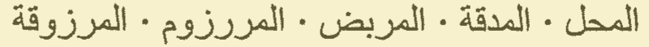

Gemini made the fewest mistakes of the 13 OCR engines and AI models that read my 10 real scans and photos of printed Arabic pages. Gemini 3.5 Flash got 1.6% of the characters wrong, about one in 60, and Gemini 3.8 Flash 1.9%. On the same pages, Apple Vision got 3.5%, Surya 4.3%, Apple Live Text 4.9% and Tesseract 20.7%. Ten pages is a small sample, and my benchmark's own notes say to treat a gap of a few points between close engines as noise.

The pages come from my [Arabic OCR benchmark](/arabic-ocr/): 4 printed and scanned Wikipedia articles, 4 scans of books and journals, and 2 photos of printed pages, all transcribed by people. I ran three Gemini models on them on October 7, 2026, with the same instruction: 3.5 Flash through Google's API, 3.8 Flash and 3.1 Pro through OpenRouter. The next day, Google deprecated 3.5 Flash and started sending its requests to Gemini 3.6 Flash, which I did not test. Of the three, 3.8 Flash is Google's current Flash model and the one I would call today.

**On the 10 pages, Gemini 3.8 Flash got 1.9% of characters wrong, for 0.3 cents a page. A few of its mistakes are real Arabic words that are not on the page.**

## Gemini and the other engines, on the same 10 pages

Characters wrong is the character error rate: the share of characters you would have to add, delete or change to get the human transcription, after the same cleanup for every engine (harakat and kashida out, one form of alef). Seconds are the median per page; for the AI models, they include the trip over the network.

| Engine | Characters wrong | Words found, any order | Seconds per page |
|---|---|---|---|
| Gemini 3.5 Flash | 1.6% | 97.3% | 9.2 |
| Gemini 3.8 Flash | 1.9% | 97.6% | 7.9 |
| Claude Opus 5.5 | 2.8% | 97.7% | 11.8 |
| Gemini 3.1 Pro | 3.1% | 97.7% | 7.2 |
| Apple Vision | 3.5% | 96.2% | 0.4 |
| GPT-6.1 Sol | 4.3% | 91.0% | 17.7 |
| Surya | 4.3% | 95.4% | 11.7 |
| Apple Live Text | 4.9% | 94.2% | 0.3 |
| Tesseract | 20.7% | 72.5% | 0.6 |

Qwen3.8 Max (4.0%), EasyOCR (17.3%), Mistral Medium 3.5 (41.6%) and PaddleOCR (42.9%) read the same pages; the [full benchmark](/arabic-ocr/) has the details.

By kind of page, for the Gemini models, Claude, Apple Vision and Surya:

| Engine | Wikipedia scans (4) | Book and journal scans (4) | Photos (2) |
|---|---|---|---|
| Gemini 3.5 Flash | 0.5% | 1.0% | 5.2% |
| Gemini 3.8 Flash | 0.7% | 1.7% | 4.6% |
| Gemini 3.1 Pro | 0.3% | 5.0% | 4.9% |
| Claude Opus 5.5 | 0.3% | 4.2% | 5.0% |
| Apple Vision | 1.3% | 3.8% | 7.4% |
| Surya | 0.5% | 7.0% | 6.5% |

On the clean Wikipedia scans, the best engines are within a point of each other. The larger differences are on the book scans, and one page accounts for much of them.

That page is a scan from a book of Quran commentary with a watermark: the name of a trust at the top and a "This file was downloaded from" line at the bottom. The transcription leaves the watermark out. Gemini 3.1 Pro, Claude Opus 5.5, GPT-6.1 Sol and Surya wrote it out, and every character of it counts as an error. Both Gemini Flash models left it out, although my instruction asked for all the text. Without that page, the other nine give Gemini 3.5 Flash 1.6%, Gemini 3.8 Flash 1.7%, Claude Opus 5.5 and Gemini 3.1 Pro 1.9%, Surya 2.8% and Apple Vision 2.9%.

The photo scores look worse than they are. On one of the two, the transcription writes the printed rule beside the page header as a line of 45 dashes. None of the engines wrote the dashes, so each loses those characters on that page.

## Where Gemini wrote words that are not on the page

Most of the other differences between Gemini's output and the transcriptions are small, such as a space or a dot. A few are whole words, and those read as correct Arabic.

On the first page of Dubai Law No. (7) of 2025, rendered from the official PDF at 300 dpi, Gemini 3.5 Flash changed one word of the title.


_From the official PDF of Dubai Law No. (7) of 2025, rendered at 300 dpi._

<table>
<thead><tr><th>Engine</th><th>Third line of the title</th></tr></thead>
<tbody>
<tr><td>Printed</td><td dir="rtl" lang="ar">تنظيم مُزاولة أنشِطة المُقاولات في إمارة دبي</td></tr>
<tr><td>Gemini 3.5 Flash, 300 dpi</td><td dir="rtl" lang="ar">تنظيم ممارسة أنشطة المقاولات في إمارة دبي</td></tr>
<tr><td>Gemini 3.5 Flash, 150 dpi</td><td dir="rtl" lang="ar">تنظيم مزاولة أنشطة المقاولات في إمارة دبي</td></tr>
<tr><td>Apple Vision, both sizes</td><td dir="rtl" lang="ar">تنظيم مُزاولة أنشِطة المُقاولات في إمارة دبي</td></tr>
</tbody>
</table>

<bdi lang="ar">مزاولة</bdi> and <bdi lang="ar">ممارسة</bdi> both mean carrying on an activity, so the title still reads well and nothing in the output looks wrong. On the same page at 150 dpi, Gemini kept the printed word. Apple Vision, Apple Live Text, Surya and Tesseract read it right at both sizes.

The second case is a printed Wikipedia page that lists village names. All three Gemini models changed the same name on this line:


_A line from a printed and scanned Wikipedia article (NOD dataset, CC BY 4.0)._

<table>
<thead><tr><th>Engine</th><th>Output</th></tr></thead>
<tbody>
<tr><td>Transcription</td><td dir="rtl" lang="ar">المحل · المدقة · المربض · المررزوم · المرزوقة</td></tr>
<tr><td>Gemini 3.8 Flash</td><td dir="rtl" lang="ar">المحل • المدقة • المريض • المرزوق • المرزوقة</td></tr>
<tr><td>Gemini 3.5 Flash</td><td dir="rtl" lang="ar">المحل • المدقة • المريض . المرزوم • المرزوقة</td></tr>
<tr><td>Gemini 3.1 Pro</td><td dir="rtl" lang="ar">المحل • المدقة • المريض • المرززوم • المرزوقة</td></tr>
<tr><td>Claude Opus 5.5</td><td dir="rtl" lang="ar">المحل • المدقة • المربض • المررزوم • المرزوقة</td></tr>
<tr><td>Apple Vision</td><td dir="rtl" lang="ar">المحل . المدقة . المربض . المررزوم . المرزوقة</td></tr>
<tr><td>Surya</td><td dir="rtl" lang="ar">المحل · المدقة · المربض · المررزوم · المرزوقة</td></tr>
</tbody>
</table>

The three Gemini models wrote <bdi lang="ar">المريض</bdi>, "the sick", for the village <bdi lang="ar">المربض</bdi>: a <bdi lang="ar">ب</bdi>, with one dot below, became a <bdi lang="ar">ي</bdi>, with two. Gemini 3.8 Flash also turned <bdi lang="ar">المررزوم</bdi>, printed with a doubled <bdi lang="ar">ر</bdi>, into the name <bdi lang="ar">المرزوق</bdi>. Claude Opus 5.5, Apple Vision, Apple Live Text and Surya copied both names as printed. On another page of village names, the Gemini models also wrote <bdi lang="ar">ذي الهيكل</bdi> ("of the temple") for the printed <bdi lang="ar">ذي الحيكل</bdi>.

Gemini is a language model: it writes likely text, and a common word is more likely than a rare name or a misprint. My instruction said "exactly as written" and "no corrections", and Gemini changed these words anyway. Since the output reads as correct Arabic, neither a reader skimming it nor a spell checker will flag them.

## On clean law pages, Apple was as good

Gemini 3.5 Flash also read 10 images of two UAE laws, rendered from their PDFs or typeset again. It got 0.4% of characters wrong, at 7.8 seconds a page. Apple Vision and Apple Live Text got 0.2% on the same images in under half a second, and Surya 0.9%. Seven of the ten came back from Gemini with nothing wrong after the cleanup; the page with the changed title word is one of the other three. On clean printed pages, I see no reason to pay for Gemini.

On those law pages, Gemini 3.5 Flash also dropped many of the harakat (short-vowel marks) that the PDF prints, all of them on the first page, where Apple Vision kept most. The cleanup removes harakat for every engine, so the scores above do not show it. If your documents need the harakat, test for them.

## How I ran it

My benchmark called Gemini 3.5 Flash with a plain REST request, one page at a time: the page image first, then the instruction, which is also the order Google's document guide recommends for a single page. This is that call, without the retries:

```python
import base64, json, os, urllib.request

MODEL = "gemini-3.5-flash"
URL = ("https://generativelanguage.googleapis.com/v1beta/models/"
       f"{MODEL}:generateContent")
PROMPT = ("Transcribe all the text in this document image exactly as written, "
          "in natural reading order (Arabic is read right to left). Output plain "
          "text only: no markdown, no translation, no commentary, no corrections. "
          "Keep one output line per printed line.")

with open("page.png", "rb") as f:
    image = base64.b64encode(f.read()).decode()
body = {
    "contents": [{"parts": [
        {"inline_data": {"mime_type": "image/png", "data": image}},
        {"text": PROMPT},
    ]}],
    "generationConfig": {"maxOutputTokens": 8192,
                         "thinkingConfig": {"thinkingLevel": "low"}},
}
headers = {"Content-Type": "application/json",
           "x-goog-api-key": os.environ["GEMINI_API_KEY"]}
request = urllib.request.Request(URL, data=json.dumps(body).encode(),
                                 headers=headers, method="POST")
with urllib.request.urlopen(request, timeout=180) as response:
    answer = json.loads(response.read())
parts = answer["candidates"][0]["content"]["parts"]
# keep the text parts, skip any part marked as thinking
text = "".join(p.get("text", "") for p in parts if not p.get("thought"))
```

For Gemini 3.8 Flash, the model name is `gemini-3.8-flash`. I did not send 3.8 Flash through this exact code: it went through OpenRouter, with the same instruction, reasoning effort set to low and up to 16,384 output tokens.

I set thinking to low. Gemini 3.8 Flash uses the medium level unless you set another, and returns an error for the minimal level (Google's model guide). I did not set a temperature: my first try at temperature 0 ran past 240 seconds on one page and timed out, and Google deprecated the temperature setting in July 2026 (release notes, July 21, 2026).

Google counts an image as about 1,120 input tokens at the default resolution (media resolution guide). Gemini 3.5 Flash used 11,385 input tokens for my 10 pages, and 18,003 output tokens, thinking included.

## What it costs

Gemini 3.8 Flash cost me 0.3 cents a page through OpenRouter, about $3 for 1,000 pages. Google's own price for it is $0.75 per million input tokens and $3.75 per million output tokens until December 31, 2026, and $1.50 and $7.50 from January 1, 2027 (pricing page, read on October 10, 2026). In 2027, the same pages would cost about twice as much. Google lists its Batch API at half the standard rate; I did not test it.

Gemini 3.5 Flash cost about 1.8 cents a page at Google's list price on the day of my run, about six times more. Google bills thinking tokens as output tokens, so a higher thinking level costs more per page.

Gemini 3.1 Pro is a preview model with no free tier, at $2.00 per million input tokens and $12.00 per million output tokens for prompts up to 200,000 tokens. On my pages it did not beat the two Flash models.

## What Google does with your pages

On the free tier, Google's terms say it uses what you send, and its answers, to improve its products, and that human reviewers may read them. The same terms say: "Do not submit sensitive, confidential, or personal information to the Unpaid Services."

The paid tier means an API key from a Google Cloud project with billing turned on. There, Google says it does not use what you send, or its answers, to improve its products. It still logs them for a limited time, to detect abuse and for disclosures required by law, and that data may be stored or cached in any country where Google or its agents have facilities (Gemini API terms, read on October 10, 2026). My runs of 3.8 Flash and 3.1 Pro also passed through OpenRouter, a second company with its own terms.

## How I would use Gemini for Arabic OCR

- **When the pages may go to Google:** Gemini 3.8 Flash on a paid key, thinking set to low, the image first and a strict instruction.
- **For names:** run a second engine on the same pages, Apple Vision on a Mac or Surya, and read the words where the two disagree. I have not measured how many errors this catches.
- **For clean pages exported to PDF:** try the PDF's own text or Apple Vision first. Copying text out of an Arabic PDF has its own traps ([Arabic PDF to Word or text](/guides/arabic-pdf-to-text/)).
- **When the pages must stay on your machine:** Apple Live Text or [Surya](/guides/surya-ocr-arabic/).
- **Every time Google changes the model:** run twenty of your own pages again, with a checked transcription. The model I tested first was replaced the day after my run.

## What I did not test

- **PDFs.** I sent PNG images. Google accepts PDFs of up to 50 MB or 1,000 pages, and says Gemini 3 also extracts the text layer of a PDF and passes it to the model. On the two law PDFs of my test, common extraction tools return some letters in the wrong order, and I did not test what Google's extraction does.
- **Other models and settings.** Gemini 3.6 Flash, where requests for 3.5 Flash now go, and Gemini 3.8 Flash with thinking set to medium or high, or with images at a higher resolution than the default.
- **Handwriting, ID cards, forms and stamps.** None in the test set.
- **Volume.** Ten real pages, plus ten law images for Gemini 3.5 Flash, one run each, one call at a time.
